# Nuzo Lang 调用图文档 (CALL_GRAPH)

> 自动生成于 2026-08-06 | 源码版本: 0.6.0

---

## 1. 系统架构概览

### 1.1 关键指标

| 指标 | 数值 |
|------|------|
| 总函数数 | 1527 |
| 总调用边 | 1070 |
| 未解析调用 | 2163 |
| 跨 Crate 依赖边 | 297 (27.8%) |
| Crate 数量 | 23 |

### 1.2 Crate 规模分布

| Crate | 函数数 | 调用边 | 密度 |
|-------|--------|--------|------|
| nuzo_vm | 467 | 305 | 0.65 |
| nuzo_values | 176 | 138 | 0.78 |
| nuzo_proc_core | 153 | 69 | 0.45 |
| nuzo_core | 117 | 101 | 0.86 |
| nuzo_error | 105 | 97 | 0.92 |
| nuzo_run | 80 | 89 | 1.11 |
| nuzo_compiler | 60 | 25 | 0.42 |
| nuzo_bytecode | 51 | 23 | 0.45 |
| nuzo_signal | 49 | 17 | 0.35 |
| nuzo_helpers | 44 | 89 | 2.02 |
| nuzo_config | 40 | 40 | 1.00 |
| nuzo_ir | 40 | 17 | 0.42 |
| nuzo_gui | 33 | 30 | 0.91 |
| nuzo_frontend | 25 | 3 | 0.12 |
| nuzo | 20 | 10 | 0.50 |
| nuzo_abi | 18 | 0 | 0.00 |
| nuzo_playground_wasm | 14 | 4 | 0.29 |
| nuzo_proc | 10 | 0 | 0.00 |
| nuzo_codegen | 8 | 3 | 0.38 |
| nuzo_class_macros | 7 | 0 | 0.00 |
| nuzo_explore | 5 | 0 | 0.00 |
| perf_codegen | 3 | 10 | 3.33 |
| nuzo_opcode | 2 | 0 | 0.00 |

### 1.3 核心热点函数 (Top 15)

> 按总连接数（被调用+调用）排序，反映函数在系统中的中心度。

| 函数 | Crate | 被调用 | 调用 | 总连接 |
|------|-------|--------|------|--------|
| NuzoError::invalid_argument_count | nuzo_core | 27 | 0 | 27 |
| NuzoError::internal | nuzo_core | 18 | 0 | 18 |
| Value::into_raw_bits | nuzo_core | 18 | 0 | 18 |
| ValidationResult::ok | nuzo_proc_core | 14 | 0 | 14 |
| Value::is_smi | nuzo_core | 13 | 0 | 13 |
| Value::as_number | nuzo_core | 10 | 2 | 12 |
| Value::from_bool | nuzo_core | 12 | 0 | 12 |
| Value::add | nuzo_core | 10 | 1 | 11 |
| Engine::new_session_with | nuzo_run | 5 | 6 | 11 |
| NuzoError::type_mismatch | nuzo_core | 10 | 0 | 10 |
| xx_hash_map_new | nuzo_core | 10 | 0 | 10 |
| Value::is_number | nuzo_core | 9 | 1 | 10 |
| Value::from_number | nuzo_core | 9 | 1 | 10 |
| Value::tag | nuzo_core | 3 | 7 | 10 |
| ErrorCollector::print_full_report | nuzo_error | 1 | 9 | 10 |

### 1.4 跨 Crate 依赖热点 (Top 10)

> 跨 crate 边意味着架构耦合，需要重点关注。

| 调用方 Crate | 被调用方 Crate | 边数 |
|-------------|---------------|------|
| nuzo_vm | nuzo_core | 100 |
| nuzo_helpers | nuzo_core | 33 |
| nuzo_gui | nuzo_core | 26 |
| nuzo_values | nuzo_core | 26 |
| nuzo_error | nuzo_core | 23 |
| nuzo_run | nuzo_vm | 12 |
| nuzo | nuzo_run | 10 |
| nuzo_compiler | nuzo_signal | 10 |
| nuzo_bytecode | nuzo_core | 9 |
| nuzo_vm | nuzo_bytecode | 7 |

### 1.5 被调用最多函数 (Top 10)

> 这些函数是系统的关键依赖点，修改时需谨慎评估影响范围。

| 函数 | Crate | 被调用次数 |
|------|-------|-----------|
| NuzoError::invalid_argument_count | nuzo_core | 27 |
| NuzoError::internal | nuzo_core | 18 |
| Value::into_raw_bits | nuzo_core | 18 |
| ValidationResult::ok | nuzo_proc_core | 14 |
| Value::is_smi | nuzo_core | 13 |
| Value::from_bool | nuzo_core | 12 |
| NuzoError::type_mismatch | nuzo_core | 10 |
| xx_hash_map_new | nuzo_core | 10 |
| Value::as_number | nuzo_core | 10 |
| Value::add | nuzo_core | 10 |

---

## 2. 模块依赖图

```mermaid
graph TB
    subgraph nuzo_vm["nuzo_vm"]
        arena["arena"]
        builtin_registration["builtin_registration"]
        cache["cache"]
        call_dispatch["call_dispatch"]
        dispatch["dispatch"]
        dispatch_cold_path["cold_path"]
        dispatch_table["dispatch_table"]
        elastic_register_file["elastic_register_file"]
        gc["gc"]
        gc_alloc["alloc"]
        gc_heap["heap"]
        gc_mark["mark"]
        gc_sweep["sweep"]
        object["object"]
        tracer_state["tracer_state"]
        trf["trf"]
        variable_ops["variable_ops"]
        vm["vm"]
        vm_hot_trace["vm_hot_trace"]
        vm_lic["vm_lic"]
        zero_unbox["zero_unbox"]
    end

    subgraph nuzo["nuzo"]
        lib["lib"]
        testkit_baseline["baseline"]
        testkit_perf_regression["perf_regression"]
    end

    subgraph nuzo_abi["nuzo_abi"]
        error_ext["error_ext"]
        index["index"]
    end

    subgraph nuzo_bytecode["nuzo_bytecode"]
        opcode["opcode"]
        scope["scope"]
        serialization["serialization"]
    end

    subgraph nuzo_codegen["nuzo_codegen"]
        builtin_gen["builtin_gen"]
        dispatch_gen["dispatch_gen"]
        opcode_gen["opcode_gen"]
        py_test["py_test"]
    end

    subgraph nuzo_compiler["nuzo_compiler"]
        allocator["allocator"]
        builder["builder"]
        codegen["codegen"]
        compiler["compiler"]
    end

    subgraph nuzo_config["nuzo_config"]
        config["config"]
        source["source"]
        toml_parser["toml_parser"]
    end

    subgraph nuzo_core["nuzo_core"]
        encoding["encoding"]
        error["error"]
        hash["hash"]
        source_location["source_location"]
        tag["tag"]
        value["value"]
    end

    subgraph nuzo_error["nuzo_error"]
        classifier["classifier"]
        collector["collector"]
        diagnostic["diagnostic"]
        formatter["formatter"]
        renderer["renderer"]
        similar["similar"]
        sink["sink"]
        types["types"]
    end

    subgraph nuzo_explore["nuzo_explore"]
        report["report"]
        tests["tests"]
    end

    subgraph nuzo_frontend["nuzo_frontend"]
        ast["ast"]
        lexer["lexer"]
        parser["parser"]
    end

    subgraph nuzo_gui["nuzo_gui"]
        cli_nuzo_gui["nuzo_gui"]
        theme["theme"]
        widgets["widgets"]
    end

    subgraph nuzo_helpers["nuzo_helpers"]
        array["array"]
        builtins["builtins"]
        convert["convert"]
        debug["debug"]
        io["io"]
        math["math"]
        string["string"]
        sys["sys"]
        time["time"]
    end

    subgraph nuzo_ir["nuzo_ir"]
        display["display"]
        module_resolver["module_resolver"]
        optimize["optimize"]
    end

    subgraph nuzo_proc_core["nuzo_proc_core"]
        attr["attr"]
        crate_meta["crate_meta"]
        diag["diag"]
        discover["discover"]
        error_kind["error_kind"]
        expr_visitor_derive["expr_visitor_derive"]
        hardcode_env["env"]
        hardcode_export["export"]
        hardcode_registry["registry"]
        hardcode_types["types"]
        hardcode_validate["validate"]
        match_sync["match_sync"]
        nuzo["nuzo"]
        opcode_sync_derive["opcode_sync_derive"]
        parse_utils["parse_utils"]
        path["path"]
        test_attr["test_attr"]
        token["token"]
        trace_derive["trace_derive"]
        validate["validate"]
    end

    subgraph nuzo_run["nuzo_run"]
        bench["bench"]
        cli["cli"]
        engine["engine"]
        output["output"]
        output_sink["output_sink"]
        session["session"]
        test_harness["test_harness"]
    end

    subgraph nuzo_signal["nuzo_signal"]
        bus["bus"]
        log["log"]
        signal["signal"]
        slot["slot"]
        slot_stats["slot_stats"]
    end

    subgraph nuzo_values["nuzo_values"]
        context["context"]
        function["function"]
        generic_any_map["any_map"]
        generic_const_array["const_array"]
        generic_hlist["hlist"]
        heap["heap"]
        inspector["inspector"]
        layout["layout"]
        nuzo_dict["nuzo_dict"]
        tag_registry["tag_registry"]
        turboslab["turboslab"]
        turboslab_cache["cache"]
        turboslab_cpu_cache["cpu_cache"]
        turboslab_remote_free["remote_free"]
        turboslab_slab["slab"]
    end

    allocator -.->|cross-crate| signal
    arena -.->|cross-crate| value
    array -.->|cross-crate| error
    array -.->|cross-crate| value
    bench --> engine
    builder --> types
    builtin_registration -.->|cross-crate| builtins
    builtin_registration --> gc_alloc
    builtin_registration -.->|cross-crate| value
    builtins -.->|cross-crate| bus
    builtins -.->|cross-crate| signal
    bus -.->|cross-crate| hash
    bus --> signal
    cache -.->|cross-crate| hash
    cache --> vm_lic
    call_dispatch --> arena
    call_dispatch -.->|cross-crate| error
    call_dispatch -.->|cross-crate| opcode
    call_dispatch --> tracer_state
    call_dispatch --> variable_ops
    classifier -.->|cross-crate| error
    classifier --> types
    cli --> bench
    cli --> engine
    cli -.->|cross-crate| opcode
    cli --> output
    cli -.->|cross-crate| renderer
    cli --> session
    cli --> test_harness
    cli -.->|cross-crate| variable_ops
    cli_nuzo_gui -.->|cross-crate| vm
    codegen -.->|cross-crate| opcode
    collector --> diagnostic
    collector --> formatter
    collector -.->|cross-crate| hash
    compiler -.->|cross-crate| bus
    compiler -.->|cross-crate| signal
    config --> error
    config --> source
    context -.->|cross-crate| error
    context -.->|cross-crate| slot
    diagnostic --> classifier
    dispatch_cold_path -.->|cross-crate| error
    dispatch_table -.->|cross-crate| error
    dispatch_table -.->|cross-crate| opcode
    dispatch_table --> trf
    dispatch_table -.->|cross-crate| value
    elastic_register_file -.->|cross-crate| value
    engine -.->|cross-crate| builtin_registration
    engine -.->|cross-crate| builtins
    engine -.->|cross-crate| compiler
    engine -.->|cross-crate| gc
    engine -.->|cross-crate| module_resolver
    engine --> output
    engine --> session
    engine --> test_harness
    engine -.->|cross-crate| vm
    error_kind --> diag
    expr_visitor_derive --> diag
    gc --> gc_sweep
    gc_alloc --> gc
    gc_alloc --> gc_heap
    gc_alloc --> gc_sweep
    gc_alloc -.->|cross-crate| heap
    gc_alloc -.->|cross-crate| value
    gc_alloc --> zero_unbox
    gc_heap --> gc
    gc_mark --> gc
    gc_sweep --> gc
    gc_sweep --> gc_heap
    gc_sweep --> gc_mark
    gc_sweep -.->|cross-crate| value
    generic_any_map -.->|cross-crate| hardcode_validate
    hardcode_env --> hardcode_validate
    hardcode_types --> hardcode_validate
    hardcode_validate --> hardcode_env
    hardcode_validate --> hardcode_types
    heap -.->|cross-crate| error
    heap -.->|cross-crate| value
    inspector --> layout
    inspector -.->|cross-crate| value
    layout -.->|cross-crate| error
    layout -.->|cross-crate| value
    lib --> builtins
    lib -.->|cross-crate| engine
    lib -.->|cross-crate| module_resolver
    match_sync --> diag
    match_sync --> validate
    nuzo_dict -.->|cross-crate| value
    opcode_gen -.->|cross-crate| parse_utils
    parser --> lexer
    renderer --> classifier
    renderer -.->|cross-crate| error
    renderer --> formatter
    renderer -.->|cross-crate| opcode
    renderer --> types
    scope -.->|cross-crate| hash
    serialization -.->|cross-crate| error
    serialization --> opcode
    session -.->|cross-crate| compiler
    session -.->|cross-crate| hardcode_validate
    session -.->|cross-crate| vm
    signal --> log
    source --> toml_parser
    source --> value
    sys -.->|cross-crate| error
    sys -.->|cross-crate| hardcode_validate
    sys -.->|cross-crate| nuzo_dict
    sys -.->|cross-crate| value
    test_attr --> parse_utils
    theme -.->|cross-crate| error
    trace_derive --> diag
    trace_derive --> validate
    trf -.->|cross-crate| value
    trf --> zero_unbox
    turboslab --> turboslab_cache
    turboslab --> turboslab_slab
    turboslab_cache --> turboslab_cpu_cache
    turboslab_cache --> turboslab_slab
    turboslab_cpu_cache --> heap
    value --> error
    value -.->|cross-crate| hardcode_validate
    variable_ops -.->|cross-crate| collector
    variable_ops -.->|cross-crate| error
    vm --> arena
    vm --> call_dispatch
    vm --> elastic_register_file
    vm -.->|cross-crate| error
    vm --> object
    vm -.->|cross-crate| scope
    vm --> tracer_state
    vm -.->|cross-crate| value
    vm --> variable_ops
    vm --> vm_hot_trace
    vm --> vm_lic
    vm_hot_trace -.->|cross-crate| hash
    vm_hot_trace -.->|cross-crate| opcode
    widgets -.->|cross-crate| error
    widgets -.->|cross-crate| formatter
    widgets -.->|cross-crate| value
    zero_unbox -.->|cross-crate| error
    zero_unbox -.->|cross-crate| tag
    zero_unbox -.->|cross-crate| value
```



---

## 3. 各模块详细调用图

### allocator `src/allocator.rs`

> # RegisterAllocator -- 基于信号槽的寄存器分配器

`nuzo_compiler` | 45 fn | E:16 out / 12 in | xmod:6 (x-crate:6)

Structs: RegisterSlot { start: u16, count: u16, owner: SlotOwner, status: SlotStatus, depth: usize }, SlotHandle { field_0: usize }, RegisterAllocator { slots: Vec, next_reg: u16, peak_reg: u16, free_heap: BinaryHeap, free_set: HashSet, current_depth: usize, signal_reserved: Signal, signal_released: Signal, signal_conflicted: Signal }, Interval { vreg: u16, start: usize, end: usize, reg: Option, spill_slot: Option, loop_depth: u8, lease_remaining: u8, use_frequency: u8 }, NudConfig { phys_reg_limit: u16, loop_immunity_factor: u8, lease_length: u8, cold_branch_penalty: u8, enabled: bool }, LsraAllocator { free_regs: _, max_regs: u16, active: BinaryHeap, handled: Vec, vreg_to_preg: _, spill_next: u16, spill_slot_ends: Vec, nud_config: NudConfig }

```
239 RegisterAllocator::new →[Signal::named]  pub fn new() -> Self
254 RegisterAllocator::with_depth  pub fn with_depth(initial_depth: usize) -> Self
292 RegisterAllocator::reserve_slot →[Signal::emit] ←[RegisterAllocator::alloc_single]  pub fn reserve_slot(&mut self, count: u16, owner: SlotOwner) -> Result
547 RegisterAllocator::release_slot →[Signal::emit] ←[RegisterAllocator::release_slots_by_depth,RegisterAllocator::try_release_slot]  pub fn release_slot(&mut self, handle: SlotHandle)
584 RegisterAllocator::try_release_slot →[RegisterAllocator::release_slot]  pub fn try_release_slot(&mut self, handle: SlotHandle) -> bool
615 RegisterAllocator::release_slots_by_depth →[RegisterAllocator::release_slot] ←[RegisterAllocator::end_scope]  pub fn release_slots_by_depth(&mut self, target_depth: usize)
657 RegisterAllocator::slot_range ←[RegisterAllocator::alloc_single]  pub fn slot_range(&self, handle: SlotHandle) -> (u16, u16)
672 RegisterAllocator::slot_start  pub fn slot_start(&self, handle: SlotHandle) -> u16
687 RegisterAllocator::slot_count  pub fn slot_count(&self, handle: SlotHandle) -> u16
702 RegisterAllocator::slot_owner  pub fn slot_owner(&self, handle: SlotHandle) -> SlotOwner
722 RegisterAllocator::try_slot_range  pub fn try_slot_range(&self, handle: SlotHandle) -> Option
727 RegisterAllocator::try_slot_start  pub fn try_slot_start(&self, handle: SlotHandle) -> Option
732 RegisterAllocator::try_slot_count  pub fn try_slot_count(&self, handle: SlotHandle) -> Option
737 RegisterAllocator::try_slot_owner  pub fn try_slot_owner(&self, handle: SlotHandle) -> Option
743 RegisterAllocator::current_depth  pub fn current_depth(&self) -> usize
752 RegisterAllocator::peak_reg  pub fn peak_reg(&self) -> u16
758 RegisterAllocator::active_slot_count  pub fn active_slot_count(&self) -> usize
764 RegisterAllocator::free_count  pub fn free_count(&self) -> usize
770 RegisterAllocator::is_register_free  pub fn is_register_free(&self, reg: u16) -> bool
790 RegisterAllocator::begin_scope  pub fn begin_scope(&mut self)
802 RegisterAllocator::end_scope →[RegisterAllocator::release_slots_by_depth]  pub fn end_scope(&mut self)
841 RegisterAllocator::alloc_single →[RegisterAllocator::reserve_slot,RegisterAllocator::slot_range]  pub fn alloc_single(&mut self, owner: SlotOwner) -> Result
868 RegisterAllocator::reserve_remote →[Signal::emit]  pub fn reserve_remote(&mut self, count: u16, owner: SlotOwner) -> R...
1048 Interval::new ←[build_intervals]  pub fn new(vreg: u16, start: usize, end: usize) -> Self
1070 Interval::len  pub fn len(&self) -> usize
1076 Interval::is_empty  pub fn is_empty(&self) -> bool
1085 Interval::overlaps  pub fn overlaps(&self, other: &Self) -> bool
1206 NudConfig::disabled ←[LsraAllocator::new]  pub fn disabled() -> Self
1228 NudConfig::effective_nud  pub fn effective_nud(&self, interval: &Interval) -> u64
1356 LsraAllocator::new →[NudConfig::disabled]  pub fn new(max_regs: u16) -> Self
1390 LsraAllocator::with_max_locals  pub fn with_max_locals() -> Self
1402 LsraAllocator::with_nud_config  pub fn with_nud_config(nud_config: NudConfig) -> Self
1448 LsraAllocator::alloc_one ←[LsraAllocator::allocate]  pub fn alloc_one(&mut self) -> Option
1480 LsraAllocator::free ←[LsraAllocator::allocate,LsraAllocator::expire_old_intervals]  pub fn free(&mut self, reg: u16)
1505 LsraAllocator::has_free ←[LsraAllocator::allocate]  pub fn has_free(&self) -> bool
1513 LsraAllocator::free_count  pub fn free_count(&self) -> u16
1519 LsraAllocator::active_count  pub fn active_count(&self) -> usize
1550 LsraAllocator::expire_old_intervals →[LsraAllocator::free] ←[LsraAllocator::allocate]  pub fn expire_old_intervals(&mut self, current_pos: usize)
1600 LsraAllocator::allocate →[LsraAllocator::alloc_one,LsraAllocator::expire_old_intervals,LsraAllocator::free,LsraAllocator::has_free]  pub fn allocate(&mut self, intervals: &mut [Interval]) -> Result
1822 LsraAllocator::get_phys_reg  pub fn get_phys_reg(&self, vreg: u16) -> Option
1832 LsraAllocator::handled_intervals  pub fn handled_intervals(&self) -> &[Interval]
1838 LsraAllocator::spill_slot_count  pub fn spill_slot_count(&self) -> u16
1845 LsraAllocator::reset  pub fn reset(&mut self)
1901 build_intervals →[Interval::new]  pub fn build_intervals(def_ips: &[Option], use_ips: &[Option]) -> R...
1965 enhance_intervals  pub fn enhance_intervals(intervals: &mut [Interval], config: &NudCo...
```

---

### arena `src/arena.rs`

> # Arena / Region 函数作用域级内存分配器

`nuzo_vm` | 20 fn | E:2 out / 5 in | xmod:1 (x-crate:1)

Structs: ArenaFrameState { start: usize, top: usize, has_escaped: bool, obj_start: usize, obj_count: usize }, RegionAllocator { data: Vec, global_top: usize, frame_stack: Vec, config: RegionConfig, objects: Vec }, RegionConfig { max_frame_arena_size: usize, max_region_size: usize, enabled: bool }, PromoteRequest { arena_offset: usize, size: usize }

```
103 RegionConfig::from_arena_config  pub fn from_arena_config(config: ArenaConfig) -> Self
154 RegionAllocator::new  pub fn new(config: RegionConfig) -> Self
167 RegionAllocator::with_default  pub fn with_default() -> Self
179 RegionAllocator::begin_frame ←[VM::push_frame,VM::push_frame_with_base]  pub fn begin_frame(&mut self) -> usize
203 RegionAllocator::allocate ←[RegionAllocator::allocate_object]  pub fn allocate(&mut self, frame_idx: usize, size: usize, align: us...
270 RegionAllocator::allocate_object →[RegionAllocator::allocate,Value::from_arena_index]  pub fn allocate_object(&mut self, frame_idx: usize, obj: HeapObject...
311 RegionAllocator::get_arena_object  pub fn get_arena_object(&self, arena_obj_idx: u32) -> Option
317 RegionAllocator::get_arena_object_mut  pub fn get_arena_object_mut(&mut self, arena_obj_idx: u32) -> Option
330 RegionAllocator::mark_escaped  pub fn mark_escaped(&mut self, frame_idx: usize)
350 RegionAllocator::end_frame ←[VM::pop_frame]  pub fn end_frame(&mut self, frame_idx: usize, has_escape: bool) -> ...
389 RegionAllocator::take_arena_object  pub fn take_arena_object(&mut self, arena_obj_idx: u32) -> Option
405 RegionAllocator::frame_objects  pub fn frame_objects(&self, frame_idx: usize) -> Option
416 RegionAllocator::objects_len  pub fn objects_len(&self) -> usize
426 RegionAllocator::as_slice  pub fn as_slice(&self, offset: usize, len: usize) -> &[u8]
436 RegionAllocator::as_mut_slice  pub fn as_mut_slice(&mut self, offset: usize, len: usize) -> &mut [u8]
443 RegionAllocator::global_usage  pub fn global_usage(&self) -> usize
450 RegionAllocator::depth  pub fn depth(&self) -> usize
458 RegionAllocator::reset ←[ExecutionContext::reset_registers_and_frames]  pub fn reset(&mut self)
468 RegionAllocator::config  pub fn config(&self) -> &RegionConfig
477 RegionAllocator::frame_state  pub fn frame_state(&self, frame_idx: usize) -> Option
```

---

### array `src/array.rs`

> # 数组辅助函数

`nuzo_helpers` | 6 fn | E:9 out / 0 in | xmod:10 (x-crate:10)

```
77 register  pub fn register(reg: &mut BuiltinRegistry)
269 dict_keys →[NuzoError::invalid_argument_count,Value::from_string_index]  pub fn dict_keys(args: &[Value]) -> Result
282 dict_values →[NuzoError::invalid_argument_count]  pub fn dict_values(args: &[Value]) -> Result
294 dict_has_key →[NuzoError::invalid_argument_count,Value::from_bool,Value::string_index]  pub fn dict_has_key(args: &[Value]) -> Result
309 dict_has_value →[NuzoError::invalid_argument_count,Value::from_bool]  pub fn dict_has_value(args: &[Value]) -> Result
321 dict_extend →[NuzoError::invalid_argument_count]  pub fn dict_extend(args: &[Value]) -> Result
```

---

### ast `src/ast.rs`

> # Nuzo 抽象语法树（AST）模块

`nuzo_frontend` | 3 fn | E:0 out / 0 in | xmod:0 (x-crate:0)

Structs: Span { line: usize, column: usize }, Program { statements: Vec }, CatchClause { binding: Identifier, exception_type: Option, body: Block }, MatchArm { pattern: MatchPattern, body: Expr }

```
128 Span::new  pub fn new(line: usize, column: usize) -> Self
1171 Expr::span  pub fn span(&self) -> &Span
1345 default_visit_expr  pub fn default_visit_expr<V>(visitor: &mut V, expr: &Expr)
```

---

### attr `src/attr.rs`

> 声明式属性解析框架

`nuzo_proc_core` | 26 fn | E:11 out / 11 in | xmod:0 (x-crate:0)

Structs: AttrStruct { name: str, fields: Vec }, AttrField { name: str, required: bool }, AttrValues { values: HashMap }

```
377 AttrStruct::new  pub fn new(name: &str) -> Self
381 AttrStruct::field  pub fn field(self, name: &str) -> Self
386 AttrStruct::optional_field  pub fn optional_field(self, name: &str) -> Self
391 AttrStruct::parse →[AttrValues::get_ident,find_attr]  pub fn parse(&self, attrs: &[Attribute]) -> syn::Result
458 AttrValues::get_raw  pub fn get_raw(&self, name: &str) -> Option
462 AttrValues::get_string ←[AttrValues::require_string]  pub fn get_string(&self, name: &str) -> syn::Result
469 AttrValues::get_bool ←[AttrValues::require_bool]  pub fn get_bool(&self, name: &str) -> syn::Result
479 AttrValues::get_usize ←[AttrValues::require_usize]  pub fn get_usize(&self, name: &str) -> syn::Result
486 AttrValues::get_i64 ←[AttrValues::require_i64]  pub fn get_i64(&self, name: &str) -> syn::Result
493 AttrValues::get_ident ←[AttrStruct::parse,AttrValues::require_ident]  pub fn get_ident(&self, name: &str) -> syn::Result
500 AttrValues::get_path ←[AttrValues::require_path]  pub fn get_path(&self, name: &str) -> syn::Result
507 AttrValues::get_vec  pub fn get_vec<T>(&self, name: &str) -> syn::Result
514 AttrValues::get_f32 ←[AttrValues::require_f32]  pub fn get_f32(&self, name: &str) -> syn::Result
521 AttrValues::get_f64 ←[AttrValues::require_f64]  pub fn get_f64(&self, name: &str) -> syn::Result
528 AttrValues::get_char ←[AttrValues::require_char]  pub fn get_char(&self, name: &str) -> syn::Result
535 AttrValues::require_string →[AttrValues::get_string]  pub fn require_string(&self, name: &str) -> syn::Result
544 AttrValues::require_bool →[AttrValues::get_bool]  pub fn require_bool(&self, name: &str) -> syn::Result
553 AttrValues::require_usize →[AttrValues::get_usize]  pub fn require_usize(&self, name: &str) -> syn::Result
562 AttrValues::require_i64 →[AttrValues::get_i64]  pub fn require_i64(&self, name: &str) -> syn::Result
571 AttrValues::require_ident →[AttrValues::get_ident]  pub fn require_ident(&self, name: &str) -> syn::Result
580 AttrValues::require_path →[AttrValues::get_path]  pub fn require_path(&self, name: &str) -> syn::Result
589 AttrValues::require_f32 →[AttrValues::get_f32]  pub fn require_f32(&self, name: &str) -> syn::Result
598 AttrValues::require_f64 →[AttrValues::get_f64]  pub fn require_f64(&self, name: &str) -> syn::Result
607 AttrValues::require_char →[AttrValues::get_char]  pub fn require_char(&self, name: &str) -> syn::Result
621 find_attr ←[AttrStruct::parse]  pub fn find_attr<'a>(attrs: &[Attribute], name: &str) -> Option
649 expand_from_meta_derive  pub fn expand_from_meta_derive(input: &syn::DeriveInput) -> syn::Re...
```

---

### bench `src/bench.rs`

> Nuzo 性能基准测试 — 测量编译和执行时间

`nuzo_run` | 7 fn | E:2 out / 4 in | xmod:3 (x-crate:0)

Structs: BenchConfig { warmup: u32, iterations: u32, iter_timeout: Duration, total_timeout: Duration }, BenchHarness { engine: Engine, config: BenchConfig }, BenchResult { name: String, mean_ns: u64, p50_ns: u64, p99_ns: u64, ops_per_sec: f64 }

```
59 BenchHarness::warmup ←[cmd_bench]  pub fn warmup(self, n: u32) -> Self
63 BenchHarness::iterations ←[cmd_bench]  pub fn iterations(self, n: u32) -> Self
73 BenchHarness::run_script_mode →[BenchHarness::run_script] ←[cmd_bench]  pub fn run_script_mode(self, name: &str, source: &str, mode: BenchM...
73 BenchHarness::run_script →[Engine::new_session_with] ←[BenchHarness::run_script_mode]  pub fn run_script(self, name: &str, source: &str) -> NuzoResult
226 BenchHarness::run_custom  pub fn run_custom<F>(self, name: &str, f: F) -> NuzoResult
312 BenchResult::format  pub fn format(&self) -> String
34 run_all  pub fn run_all()
```

---

### builder `src/builder.rs`

> IR Builder — 将 AST 转换为与目标无关的三地址码中间表示

`nuzo_compiler` | 8 fn | E:3 out / 1 in | xmod:2 (x-crate:0)

Structs: CompilerBuilder { source: Option, source_file: Option }

```
35 CompilerBuilder::source  pub fn source(self, source: _) -> Self
44 CompilerBuilder::source_file  pub fn source_file(self, file: _) -> Self
54 CompilerBuilder::build  pub fn build(self) -> nuzo_bytecode::Chunk
163 IrBuilder::new →[IrModule::add_function,IrModule::new]  pub fn new() -> Self
202 IrBuilder::build  pub fn build(program: &ast::Program, global_fn_names: &[&str]) -> R...
228 IrBuilder::build_with_resolver  pub fn build_with_resolver(program: &ast::Program, global_fn_names:...
867 IrBuilder::build_expr →[IrBuilder::build_expr] ←[IrBuilder::build_expr]  pub fn build_expr(&mut self, expr: &Expr) -> Result
2550 IrBuilder::into_module  pub fn into_module(self) -> IrModule
```

---

### builtin_gen `src/builtin_gen.rs`

> `define_builtins!` 核心展开逻辑

`nuzo_codegen` | 1 fn | E:0 out / 0 in | xmod:0 (x-crate:0)

Structs: BuiltinDoc { name: str, arity: u8, signature: str, description: str }, BuiltinEntry { name: String, fn_path: Path, arity: u8, signature: String, desc: String, doc_lines: Vec }, BuiltinEntries { field_0: Vec }

```
185 expand_define_builtins  pub fn expand_define_builtins(input: TokenStream) -> syn::Result
```

---

### builtin_registration `src/builtin_registration.rs`

> # Builtin 函数注册 — VM 内置函数绑定

`nuzo_vm` | 1 fn | E:3 out / 1 in | xmod:3 (x-crate:2)

```
36 VM::register_builtins_from →[BuiltinRegistry::get_arity,Gc::alloc_with_size,Value::from_gc_index] ←[Engine::new_session_with]  pub fn register_builtins_from(&mut self, registry: &BuiltinRegistry)
```

---

### builtins `src/builtins.rs`

> # Nuzo 内置函数模块

`nuzo_helpers` | 13 fn | E:6 out / 7 in | xmod:2 (x-crate:2)

Structs: OutputCaptureGuard { _private: _ }, BuiltinRegistry { functions: Vec, bus: Arc }

```
169 push_output_capture ←[OutputCaptureGuard::new]  pub fn push_output_capture(capture: Option)
179 pop_output_capture  pub fn pop_output_capture()
230 OutputCaptureGuard::new →[push_output_capture]  pub fn new(capture: Option) -> Self
251 configure_output_capture  pub fn configure_output_capture(capture: Option)
417 BuiltinRegistry::new →[BuiltinRegistry::register,Signal::named,SignalBus::scoped] ←[Engine::with_registry,builtin_names]  pub fn new() -> Self
540 BuiltinRegistry::register ←[BuiltinRegistry::new]  pub fn register(&mut self, name: &str, func: BuiltinFn, arity: usize)
577 BuiltinRegistry::get  pub fn get(&self, name: &str) -> Option
617 BuiltinRegistry::call →[BuiltinRegistry::is_empty,BuiltinRegistry::len]  pub fn call(&self, name: &str, args: &[Value]) -> Option
639 BuiltinRegistry::get_arity ←[VM::register_builtins_from]  pub fn get_arity(&self, name: &str) -> Option
671 BuiltinRegistry::names  pub fn names(&self) -> Vec
680 BuiltinRegistry::len ←[BuiltinRegistry::call]  pub fn len(&self) -> usize
690 BuiltinRegistry::is_empty ←[BuiltinRegistry::call]  pub fn is_empty(&self) -> bool
717 BuiltinRegistry::bus  pub fn bus(&self) -> Arc
```

---

### bus `src/bus.rs`

> # 事件总线模块（作用域限定发布-订阅中心）

`nuzo_signal` | 8 fn | E:5 out / 4 in | xmod:3 (x-crate:1)

Structs: SignalBus { scope: BusScope, signals: SignalRegistry, names: RwLock }

```
176 SignalBus::scoped →[xx_hash_map_new] ←[BuiltinRegistry::new,compiler_bus]  pub fn scoped(scope: BusScope) -> Self
176 SignalBus::scope  pub fn scope(&self) -> BusScope
195 SignalBus::new  pub fn new() -> Self
225 SignalBus::register →[Signal::clone_handle]  pub fn register<Args>(&self, key: &crate::types::SignalKey, signal:...
260 SignalBus::register_legacy →[Signal::clone_handle]  pub fn register_legacy<Args>(&self, signal: &Signal) -> Result
314 SignalBus::get →[SignalBus::get] ←[SignalBus::get]  pub fn get<Args>(&self, key: &crate::types::SignalKey) -> Result
384 SignalBus::list_signals  pub fn list_signals(&self) -> Vec
409 SignalBus::clear →[SignalBus::clear] ←[SignalBus::clear]  pub fn clear(&self)
```

---

### cache `src/cache.rs`

> # Nuzo VM 缓存系统 - 统一缓存管理架构

`nuzo_vm` | 69 fn | E:29 out / 22 in | xmod:7 (x-crate:5)

Structs: StringConstantPool { pool: XxHashMap, next_idx: u32, max_capacity: usize, lookups: usize, hits: usize }, InlineCache { state: ICState, total_lookups: usize, cache_hits: usize, state_transitions: usize }, SourceHash { field_0: u64 }, CacheEntry { chunk: Chunk, last_accessed: Instant, access_count: usize }, BytecodeCache { cache: XxHashMap, max_entries: usize, lookups: usize, hits: usize, invalidations: usize, evictions: usize }, CacheManager { strings: StringConstantPool, bytecode: BytecodeCache, inline_caches: XxHashMap }, CacheGlobalStats { string_pool_size: usize, string_pool_lookups: usize, string_pool_hits: usize, string_pool_hit_rate: f64, bytecode_cache_entries: usize, bytecode_cache_lookups: usize, bytecode_cache_hits: usize, bytecode_cache_hit_rate: f64, bytecode_cache_invalidations: usize, bytecode_cache_evictions: usize, inline_cache_count: usize, inline_cache_total_lookups: usize, inline_cache_total_hits: usize, inline_cache_hit_rate: f64, inline_cache_state_transitions: usize, inline_cache_monomorphic_count: usize, inline_cache_polymorphic_count: usize, inline_cache_megamorphic_count: usize, inline_cache_uninitialized_count: usize }

```
143 StringConstantPool::new ←[CacheManager::new]  pub fn new() -> Self
147 StringConstantPool::with_capacity →[xx_hash_map_new] ←[CacheManager::with_config]  pub fn with_capacity(max_capacity: usize) -> Self
161 StringConstantPool::intern  pub fn intern(&mut self, s: &str) -> Result
185 StringConstantPool::contains  pub fn contains(&self, s: &str) -> Option
191 StringConstantPool::len  pub fn len(&self) -> usize
197 StringConstantPool::is_empty  pub fn is_empty(&self) -> bool
202 StringConstantPool::hit_rate ←[StringConstantPool::stats]  pub fn hit_rate(&self) -> f64
207 StringConstantPool::stats →[StringConstantPool::hit_rate] ←[CacheManager::global_stats]  pub fn stats(&self) -> (usize, usize, usize, f64)
212 StringConstantPool::clear ←[CacheManager::clear_all]  pub fn clear(&mut self)
221 StringConstantPool::max_capacity ←[CacheManager::string_pool_capacity]  pub fn max_capacity(&self) -> usize
226 StringConstantPool::max_capacity_mut ←[CacheManager::string_pool_capacity_mut,StringConstantPool::with_max_capacity]  pub fn max_capacity_mut(&mut self, capacity: usize)
233 StringConstantPool::with_max_capacity →[StringConstantPool::max_capacity_mut]  pub fn with_max_capacity(&mut self, capacity: usize)
278 ICState::name ←[InlineCache::stats]  pub fn name(&self) -> &str
287 ICState::is_uninitialized  pub fn is_uninitialized(&self) -> bool
291 ICState::is_monomorphic  pub fn is_monomorphic(&self) -> bool
295 ICState::is_polymorphic  pub fn is_polymorphic(&self) -> bool
299 ICState::is_megamorphic  pub fn is_megamorphic(&self) -> bool
303 ICState::entry_count  pub fn entry_count(&self) -> usize
345 InlineCache::new  pub fn new() -> Self
357 InlineCache::lookup_or_update →[CallSite::update_cache]  pub fn lookup_or_update<F>(&mut self, shape_id: ShapeId, lookup_fn:...
396 InlineCache::update →[CallSite::update_cache]  pub fn update(&mut self, shape_id: ShapeId, offset: PropertyOffset)
452 InlineCache::reset  pub fn reset(&mut self)
457 InlineCache::state ←[CacheManager::global_stats]  pub fn state(&self) -> &ICState
461 InlineCache::state_mut  pub fn state_mut(&mut self) -> &mut ICState
465 InlineCache::hit_rate ←[InlineCache::stats]  pub fn hit_rate(&self) -> f64
473 InlineCache::stats →[ICState::name,InlineCache::hit_rate]  pub fn stats(&self) -> (&str, usize, usize, f64, usize)
483 InlineCache::invalidate  pub fn invalidate(&mut self)
488 InlineCache::reset_stats  pub fn reset_stats(&mut self)
539 SourceHash::compute →[xxh3_64]  pub fn compute(source: &[u8]) -> Self
543 SourceHash::compute_str  pub fn compute_str(source: &str) -> Self
547 SourceHash::value  pub fn value(&self) -> u64
575 BytecodeCache::new ←[CacheManager::new]  pub fn new() -> Self
579 BytecodeCache::with_capacity →[xx_hash_map_new] ←[CacheManager::with_config]  pub fn with_capacity(max_entries: usize) -> Self
594 BytecodeCache::cache  pub fn cache(&mut self, hash: &SourceHash, chunk: Chunk) -> Result
611 BytecodeCache::lookup  pub fn lookup(&mut self, hash: &SourceHash) -> Option
624 BytecodeCache::lookup_mut  pub fn lookup_mut(&mut self, hash: &SourceHash) -> Option
638 BytecodeCache::invalidate  pub fn invalidate(&mut self, hash: &SourceHash) -> Result
644 BytecodeCache::invalidate_batch  pub fn invalidate_batch(&mut self, hashes: &[SourceHash]) -> usize
656 BytecodeCache::clear ←[CacheManager::clear_all]  pub fn clear(&mut self)
663 BytecodeCache::contains  pub fn contains(&self, hash: &SourceHash) -> bool
668 BytecodeCache::len  pub fn len(&self) -> usize
673 BytecodeCache::is_empty  pub fn is_empty(&self) -> bool
678 BytecodeCache::hit_rate ←[BytecodeCache::stats]  pub fn hit_rate(&self) -> f64
683 BytecodeCache::stats →[BytecodeCache::hit_rate] ←[CacheManager::global_stats]  pub fn stats(&self) -> (usize, usize, usize, f64, usize, usize)
695 BytecodeCache::top_accessed  pub fn top_accessed(&self, n: usize) -> Vec
705 BytecodeCache::max_capacity_mut ←[BytecodeCache::with_max_capacity,CacheManager::bytecode_cache_capacity_mut]  pub fn max_capacity_mut(&mut self, capacity: usize)
712 BytecodeCache::with_max_capacity →[BytecodeCache::max_capacity_mut]  pub fn with_max_capacity(&mut self, capacity: usize)
705 BytecodeCache::max_capacity ←[CacheManager::bytecode_cache_capacity]  pub fn max_capacity(&self) -> usize
722 BytecodeCache::reset_stats ←[CacheManager::reset_all_stats]  pub fn reset_stats(&mut self)
776 CacheManager::new →[BytecodeCache::new,StringConstantPool::new,xx_hash_map_new]  pub fn new() -> Self
785 CacheManager::with_config →[BytecodeCache::with_capacity,StringConstantPool::with_capacity,xx_hash_map_new]  pub fn with_config(string_pool_capacity: usize, bytecode_cache_capa...
798 CacheManager::strings  pub fn strings(&self) -> &StringConstantPool
803 CacheManager::strings_mut  pub fn strings_mut(&mut self) -> &mut StringConstantPool
812 CacheManager::bytecode  pub fn bytecode(&self) -> &BytecodeCache
817 CacheManager::bytecode_mut  pub fn bytecode_mut(&mut self) -> &mut BytecodeCache
826 CacheManager::get_inline_cache  pub fn get_inline_cache(&mut self, property_name: &str) -> &mut Inl...
831 CacheManager::invalidate_inline_cache  pub fn invalidate_inline_cache(&mut self, property_name: &str) -> bool
841 CacheManager::invalidate_all_inline_caches ←[CacheManager::clear_all]  pub fn invalidate_all_inline_caches(&mut self)
848 CacheManager::inline_cache_count  pub fn inline_cache_count(&self) -> usize
857 CacheManager::clear_all →[BytecodeCache::clear,CacheManager::invalidate_all_inline_caches,StringConstantPool::clear]  pub fn clear_all(&mut self)
864 CacheManager::reset_all_stats →[BytecodeCache::reset_stats]  pub fn reset_all_stats(&mut self)
879 CacheManager::global_stats →[BytecodeCache::stats,InlineCache::state,StringConstantPool::stats] ←[CacheManager::print_stats_report]  pub fn global_stats(&self) -> CacheGlobalStats
942 CacheManager::print_stats_report →[CacheManager::global_stats]  pub fn print_stats_report(&self) -> String
991 CacheManager::string_pool_capacity →[StringConstantPool::max_capacity]  pub fn string_pool_capacity(&self) -> usize
996 CacheManager::string_pool_capacity_mut →[StringConstantPool::max_capacity_mut]  pub fn string_pool_capacity_mut(&mut self, capacity: usize)
1001 CacheManager::bytecode_cache_capacity →[BytecodeCache::max_capacity]  pub fn bytecode_cache_capacity(&self) -> usize
1006 CacheManager::bytecode_cache_capacity_mut →[BytecodeCache::max_capacity_mut]  pub fn bytecode_cache_capacity_mut(&mut self, capacity: usize)
1074 CacheGlobalStats::is_healthy  pub fn is_healthy(&self) -> bool
1088 CacheGlobalStats::estimated_memory_usage  pub fn estimated_memory_usage(&self) -> usize
```

---

### call_dispatch `src/call_dispatch.rs`

> # 调用派发 — 函数调用链路

`nuzo_vm` | 9 fn | E:11 out / 1 in | xmod:18 (x-crate:4)

```
105 VM::push_frame →[Chunk::get_source_location,RegionAllocator::begin_frame,VM::push]  pub fn push_frame(&mut self, closure: Option, argc: usize) -> Result
167 VM::push_frame_with_base →[Chunk::get_source_location,RegionAllocator::begin_frame,VM::push] ←[VM::call_global_function]  pub fn push_frame_with_base(&mut self, return_address: usize, base:...
227 VM::pop_frame →[NuzoError::internal,RegionAllocator::end_frame,VM::pop]  pub fn pop_frame(&mut self) -> Result
299 VM::call_depth  pub fn call_depth(&self) -> usize
302 VM::frame_pager_stats  pub fn frame_pager_stats(&self) -> &crate::frame_paging::FramePager...
503 VM::take_tracer_result →[TracerState::instruction_counter]  pub fn take_tracer_result(&mut self) -> Option
511 VM::current_ip  pub fn current_ip(&self) -> usize
515 VM::instruction_count →[TracerState::instruction_counter]  pub fn instruction_count(&self) -> usize
519 VM::build_call_stack_for_debug  pub fn build_call_stack_for_debug(&self) -> Option
```

---

### classifier `src/classifier.rs`

> Nuzo Error Classifier - Automatic Error Categorization and Fix Suggestions

`nuzo_error` | 10 fn | E:3 out / 9 in | xmod:16 (x-crate:15)

Structs: ErrorClassifier { }

```
79 ErrorClassifier::classify ←[DiagnosticError::from_nuzo_error,DiagnosticError::new,DiagnosticRenderer::render_nuzo_error]  pub fn classify(error: &NuzoError) -> (ErrorSeverity, ErrorCategory)
137 ErrorClassifier::root_cause  pub fn root_cause(error: &InternalError) -> String
327 ErrorClassifier::generate_root_cause  pub fn generate_root_cause(error: &NuzoError) -> String
363 ErrorClassifier::fix_suggestion  pub fn fix_suggestion(error: &NuzoError) -> String
473 ErrorClassifier::generate_fix_suggestion ←[DiagnosticError::from_nuzo_error,DiagnosticError::new]  pub fn generate_fix_suggestion(error: &NuzoError) -> Vec
555 ErrorClassifier::generate_structured_suggestions ←[DiagnosticError::from_nuzo_error,DiagnosticError::new]  pub fn generate_structured_suggestions(error: &NuzoError) -> Vec
662 ErrorClassifier::fix_suggestion_with_lang →[LangMode::select]  pub fn fix_suggestion_with_lang(error: &NuzoError, lang: LangMode) ...
760 ErrorClassifier::generate_fix_suggestion_with_lang ←[DiagnosticRenderer::render_nuzo_error]  pub fn generate_fix_suggestion_with_lang(error: &NuzoError, lang: L...
900 ErrorClassifier::generate_structured_suggestions_with_lang  pub fn generate_structured_suggestions_with_lang(error: &NuzoError,...
1082 ErrorClassifier::generate_structured_suggestions_with_candidates →[LangMode::select,StructuredSuggestion::with_replacement] ←[DiagnosticRenderer::render_nuzo_error]  pub fn generate_structured_suggestions_with_candidates(error: &Nuzo...
```

---

### cli `src/main.rs`

> Precise codegen performance benchmark for Nuzo Lang.

`nuzo_run` | 22 fn | E:40 out / 14 in | xmod:26 (x-crate:7)

Structs: Cli { help: bool, version: bool, command: Option, eval: Option, trace: bool, verbose: bool, std_path: Option, filter: Option, timeout: Option, lang: Option, file: Option }

```
19 parse_lang_mode  fn parse_lang_mode(input: &str) -> Result
116 main  fn main()
136 diagnostic_renderer →[DiagnosticRenderer::new,DiagnosticRenderer::with_lang] ←[render_compile_error,render_nuzo_error]  fn diagnostic_renderer(lang: Option) -> DiagnosticRenderer
144 render_nuzo_error →[diagnostic_renderer] ←[cmd_eval,cmd_repl,cmd_run_file]  fn render_nuzo_error(err: &NuzoError, stack: &[StackFrameInfo], lan...
149 render_compile_error →[Chunk::lines,DiagnosticRenderer::with_source_context,diagnostic_renderer] ←[cmd_check,cmd_compile]  fn render_compile_error(err: &NuzoError, file: &str, source: &str, ...
171 run  fn run(cli: Cli) -> Result
231 is_nil ←[cmd_eval,cmd_repl,cmd_run_file]  fn is_nil(v: &nuzo_run::Value) -> bool
235 cmd_eval →[Engine::new_session_with,OutputSink::new_capture,Session::vm_mut,VM::last_call_stack,is_nil,render_nuzo_error]  fn cmd_eval(engine: &Engine, code: &str, lang: Option) -> Result
260 cmd_run_file →[Engine::run_file,is_nil,render_nuzo_error]  fn cmd_run_file(engine: &Engine, path: &std::path::Path, lang: Opti...
283 cmd_compile →[Chunk::constants,Engine::compile_file,render_compile_error]  fn cmd_compile(engine: &Engine, path: &std::path::Path, disassemble...
323 cmd_check →[Engine::compile_file,render_compile_error]  fn cmd_check(engine: &Engine, path: &std::path::Path, lang: Option)...
341 cmd_bench →[BenchHarness::iterations,BenchHarness::run_script_mode,BenchHarness::warmup,Engine::bench]  fn cmd_bench(engine: &Engine, path: &std::path::Path) -> Result
352 cmd_test →[run_test_harness]  fn cmd_test(engine: &Engine, paths: &[PathBuf], filter: Option, tim...
374 cmd_e2e →[run_test_harness]  fn cmd_e2e(engine: &Engine, paths: &[PathBuf], filter: Option, time...
400 run_test_harness →[Engine::test,TestHarness::run_dir,TestHarness::run_files,TestHarness::timeout,TestHarness::verbose,TestSummary::failed,TestSummary::timeouts] ←[cmd_e2e,cmd_test]  fn run_test_harness(engine: &Engine, dirs: &[PathBuf], filter: Opti...
435 cmd_repl →[Engine::new_session,Session::vm_mut,VM::last_call_stack,is_nil,render_nuzo_error]  fn cmd_repl(engine: &Engine, lang: Option) -> Result
477 print_help  fn print_help()
5 main  fn main()
11 run  fn run()
9 make_array_code ←[main]  fn make_array_code(n: usize) -> String
14 benchmark_compile ←[main]  fn benchmark_compile(name: &str, code: &str, engine: &Engine, runs:...
51 main →[benchmark_compile,make_array_code]  fn main()
```

---

### cli::nuzo_gui `src/bin/nuzo_gui.rs`

> nuzo_gui — Launch a nuzo script as an egui GUI application.

`nuzo_gui` | 4 fn | E:1 out / 0 in | xmod:1 (x-crate:1)

Structs: NuzoGuiApp { vm: Rc }

```
36 NuzoGuiApp::new  fn new(vm: VM) -> Self
42 NuzoGuiApp::update →[VM::call_global_function]  fn update(&mut self, ctx: &egui::Context, _frame: &mut eframe::Frame)
71 setup_cjk_fonts  fn setup_cjk_fonts(cc: &eframe::CreationContext)
106 main  fn main() -> eframe::Result
```

---

### codegen `src/codegen.rs`

> Code Generator — 将 IR 模块转换为目标字节码 (Chunk)

`nuzo_compiler` | 5 fn | E:1 out / 0 in | xmod:1 (x-crate:1)

Structs: JumpFixup { pos: usize, target_block: u32, instr_size: usize }, OperandField { kind: OperandKind, offset: usize }, CodeGenerator { chunk: Chunk, reg_manager: Option, block_starts: HashMap, jump_fixups: Vec, def_ips: _, use_ips: _, is_main_function: bool, closure_indices: HashMap, local_map: HashMap, init_flag_slots: HashMap, next_init_flag_slot: u16, lazy_symbol_map: HashMap, emitted_lazy_modules: HashSet, eager_imports: Vec, sub_module_chunks: Vec }

```
352 CodeGenerator::new →[Chunk::new]  pub fn new() -> Self
394 CodeGenerator::generate  pub fn generate(&mut self, module: &IrModule) -> Result
506 CodeGenerator::take_sub_module_chunks  pub fn take_sub_module_chunks(&mut self) -> Vec
642 CodeGenerator::into_chunk  pub fn into_chunk(self) -> Chunk
652 CodeGenerator::chunk  pub fn chunk(&self) -> &Chunk
```

---

### collector `src/collector.rs`

> # 错误收集器 (Error Collector) - 诊断系统的核心引擎

`nuzo_error` | 32 fn | E:39 out / 14 in | xmod:34 (x-crate:5)

Structs: ErrorCollector { enabled: bool, errors: Vec, error_counter: usize, instruction_counter: usize, max_errors: usize, stop_on_fatal: bool, stats: ErrorStatistics, warning_dedup: XxHashMap, sunk_events: SegQueue }, ErrorStatistics { total_errors: usize, severity_counts: XxHashMap, category_counts: XxHashMap, error_prone_instructions: XxHashMap }

```
328 ErrorCollector::new →[xx_hash_map_new]  pub fn new() -> Self
343 ErrorCollector::enable  pub fn enable(&mut self)
349 ErrorCollector::disable  pub fn disable(&mut self)
354 ErrorCollector::is_enabled  pub fn is_enabled(&self) -> bool
359 ErrorCollector::max_errors ←[VM::with_max_diagnostic_errors]  pub fn max_errors(&mut self, max: usize)
364 ErrorCollector::stop_on_fatal ←[ErrorCollector::with_stop_on_fatal]  pub fn stop_on_fatal(&mut self, stop: bool)
370 ErrorCollector::record_instruction  pub fn record_instruction(&mut self)
395 ErrorCollector::drain_sunk  pub fn drain_sunk(&mut self) -> Vec
410 ErrorCollector::sunk_pending  pub fn sunk_pending(&self) -> usize
427 ErrorCollector::print_warning_summary →[xx_hash_map_new]  pub fn print_warning_summary(&self)
504 ErrorCollector::collect_error →[AnsiStyle::apply_to,DiagnosticError::new,DiagnosticFormatter::new,DiagnosticFormatter::severity_emoji,DiagnosticFormatter::severity_label,DiagnosticFormatter::severity_style]  pub fn collect_error(&mut self, error: NuzoError, context: Executio...
560 ErrorCollector::collect_nuzo_error →[AnsiStyle::apply_to,DiagnosticError::from_nuzo_error,DiagnosticError::is_internal_error,DiagnosticFormatter::new,DiagnosticFormatter::severity_emoji,DiagnosticFormatter::severity_label,DiagnosticFormatter::severity_style] ←[ErrorCollector::handle_error_in_diagnostic_mode]  pub fn collect_nuzo_error(&mut self, error: NuzoError, context: Exe...
645 ErrorCollector::handle_error_in_diagnostic_mode →[ErrorCollector::collect_nuzo_error]  pub fn handle_error_in_diagnostic_mode<F>(&mut self, error: NuzoErr...
695 ErrorCollector::errors  pub fn errors(&self) -> &[DiagnosticError]
700 ErrorCollector::error_count  pub fn error_count(&self) -> usize
705 ErrorCollector::has_errors  pub fn has_errors(&self) -> bool
710 ErrorCollector::statistics  pub fn statistics(&self) -> &ErrorStatistics
715 ErrorCollector::clear  pub fn clear(&mut self)
727 ErrorCollector::print_full_report →[AnsiStyle::apply_to,DiagnosticFormatter::fatal_style,DiagnosticFormatter::new,DiagnosticFormatter::severity_style,DiagnosticFormatter::warning_style,ErrorCollector::cluster_errors_simple,ErrorCollector::detect_repeating_patterns,ErrorCollector::get_practical_fix_priority,ErrorCollector::smart_deduplicate] ←[VM::print_diagnostic_report]  pub fn print_full_report(&self)
1052 ErrorCollector::print_compact_report →[AnsiStyle::apply_to,DiagnosticFormatter::new,DiagnosticFormatter::severity_emoji,DiagnosticFormatter::severity_label,DiagnosticFormatter::severity_style,ErrorCollector::get_practical_fix_priority]  pub fn print_compact_report(&self)
1132 ErrorCollector::export_json_pretty ←[ErrorCollector::export_json,ErrorCollector::export_to_file]  pub fn export_json_pretty(&self) -> String
1155 ErrorCollector::export_json_compact  pub fn export_json_compact(&self) -> String
1132 ErrorCollector::export_json →[ErrorCollector::export_json_pretty]  pub fn export_json(&self) -> String
1195 ErrorCollector::export_to_file →[ErrorCollector::export_json_pretty]  pub fn export_to_file(&self, path: &str) -> Result
1216 ErrorCollector::get_json_stats ←[ErrorCollector::export_full_report]  pub fn get_json_stats(&self) -> JsonValue
1243 ErrorCollector::export_full_report →[ErrorCollector::get_json_stats]  pub fn export_full_report(&self) -> String
1287 ErrorCollector::calculate_similarity ←[ErrorCollector::cluster_errors_simple,ErrorCollector::smart_deduplicate]  pub fn calculate_similarity(&self, a: &DiagnosticError, b: &Diagnos...
1397 ErrorCollector::smart_deduplicate →[ErrorCollector::calculate_similarity] ←[ErrorCollector::print_full_report]  pub fn smart_deduplicate(&self) -> DeduplicationReport
1448 ErrorCollector::detect_repeating_patterns →[xx_hash_map_new] ←[ErrorCollector::print_full_report]  pub fn detect_repeating_patterns(&self) -> Vec
1528 ErrorCollector::cluster_errors_simple →[ErrorCollector::calculate_similarity,xx_hash_map_new] ←[ErrorCollector::print_full_report]  pub fn cluster_errors_simple(&self) -> Vec
1610 ErrorCollector::get_practical_fix_priority ←[ErrorCollector::print_compact_report,ErrorCollector::print_full_report]  pub fn get_practical_fix_priority(&self) -> Vec
1786 ErrorCollector::with_stop_on_fatal →[ErrorCollector::stop_on_fatal]  pub fn with_stop_on_fatal(&mut self, stop: bool)
```

---

### compiler `src/compiler.rs`

> # Nuzo 编译器 — IR 路径编译入口

`nuzo_compiler` | 5 fn | E:3 out / 4 in | xmod:4 (x-crate:4)

Structs: Compiler { }

```
53 compiler_bus →[Signal::named,SignalBus::scoped] ←[Compiler::compile]  pub fn compiler_bus() -> Arc
73 Compiler::builder  pub fn builder() -> CompilerBuilder
80 Compiler::compile →[compiler_bus]  pub fn compile(source: &str) -> Result
99 Compiler::compile_with_bus ←[Engine::compile,Session::compile]  pub fn compile_with_bus(source: &str, bus: Arc) -> Result
121 Compiler::compile_with_bus_and_resolver ←[Session::compile]  pub fn compile_with_bus_and_resolver(source: &str, bus: Arc, resolv...
```

---

### config `src/config.rs`

> Config loading utilities.

`nuzo_config` | 11 fn | E:18 out / 12 in | xmod:6 (x-crate:0)

Structs: VmConfig { max_stack_size: usize, max_call_frames: usize, initial_registers: usize, initial_frame_capacity: usize, diagnostic_register_window: usize, execution_timeout_ms: Option }, GcConfig { min_threshold: usize, threshold: usize, survival_ratio_threshold: f64, growth_factor: usize, mark_rate: usize, sweep_rate: usize, chunk_shift: u32, nursery_threshold: usize, tenured_multiplier: usize, promote_survival_ratio: f64, cold_age_threshold: u8, deep_gc_interval: u8 }, CompilerConfig { max_locals: u16, max_function_locals: u16 }, ArenaConfig { max_frame_arena_size: usize, max_region_size: usize, enabled: bool }, FramePagingConfig { capacity: usize, low_watermark: usize, spill_batch: usize }, Config { vm: VmConfig, gc: GcConfig, compiler: CompilerConfig, arena: ArenaConfig, frame_paging: FramePagingConfig, std_path: Option }, ConfigBuilder { sources: Vec }

```
268 Config::builder →[ConfigBuilder::new]  pub fn builder() -> ConfigBuilder
273 Config::from_toml_str →[ConfigBuilder::build,ConfigBuilder::new,ConfigBuilder::with_toml_str]  pub fn from_toml_str(input: &str) -> ConfigResult
278 Config::from_toml_file →[ConfigBuilder::build,ConfigBuilder::new,ConfigBuilder::with_toml_file] ←[load_config_file]  pub fn from_toml_file(path: &std::path::Path) -> ConfigResult
283 Config::from_env →[ConfigBuilder::build,ConfigBuilder::new,ConfigBuilder::with_env] ←[load_env_config]  pub fn from_env() -> Self
298 ConfigBuilder::new ←[Config::builder,Config::from_env,Config::from_toml_file,Config::from_toml_str]  pub fn new() -> Self
303 ConfigBuilder::with_toml_str →[ConfigSource::from_toml_str] ←[Config::from_toml_str]  pub fn with_toml_str(self, input: &str) -> Self
313 ConfigBuilder::with_toml_file →[ConfigSource::from_toml_file] ←[Config::from_toml_file]  pub fn with_toml_file(self, path: _) -> Self
321 ConfigBuilder::with_env →[ConfigSource::from_env] ←[Config::from_env]  pub fn with_env(self) -> Self
329 ConfigBuilder::build →[ConfigSource::as_table,ConfigSource::new] ←[Config::from_env,Config::from_toml_file,Config::from_toml_str]  pub fn build(self) -> ConfigResult
8 load_config_file →[Config::from_toml_file,internal_err]  pub fn load_config_file(path: _) -> NuzoResult
14 load_env_config →[Config::from_env]  pub fn load_env_config() -> NuzoResult
```

---

### context `src/context.rs`

> Thread-local egui Ui context for builtin functions.

`nuzo_values` | 14 fn | E:3 out / 0 in | xmod:3 (x-crate:3)

Structs: RuntimeContext { strings: RwLock, string_reverse: RwLock, string_counter: AtomicU64, heap: RwLock, boxes: RwLock }

```
90 RuntimeContext::new  pub fn new() -> Self
111 RuntimeContext::intern_string  pub fn intern_string(&mut self, s: &str) -> u32
136 RuntimeContext::get_string  pub fn get_string(&self, idx: u32) -> Result
142 RuntimeContext::string_count  pub fn string_count(&self) -> Result
151 RuntimeContext::alloc_heap  pub fn alloc_heap(&mut self, obj: HeapObject) -> u64
164 RuntimeContext::heap  pub fn heap(&self, idx: u64) -> Result
170 RuntimeContext::heap_count  pub fn heap_count(&self) -> Result
179 RuntimeContext::alloc_box  pub fn alloc_box(&mut self, val: Value) -> usize
191 RuntimeContext::get_box  pub fn get_box(&self, idx: usize) -> Result
199 RuntimeContext::set_box →[NuzoError::index_out_of_bounds]  pub fn set_box(&mut self, idx: usize, val: Value) -> Result
210 RuntimeContext::box_count  pub fn box_count(&self) -> Result
103 set_ui →[Connection::id]  pub fn set_ui(ui: &mut egui::Ui) -> GuiFrameGuard
117 clear_ui  pub fn clear_ui()
143 with_ui →[Connection::id]  pub fn with_ui<F, R>(f: F) -> R
```

---

### convert `src/convert.rs`

> # 类型转换辅助函数

`nuzo_helpers` | 1 fn | E:0 out / 0 in | xmod:0 (x-crate:0)

```
132 register  pub fn register(reg: &mut BuiltinRegistry)
```

---

### crate_meta `src/crate_meta.rs`

> `#[crate_meta]` 内层属性宏核心展开逻辑

`nuzo_proc_core` | 1 fn | E:0 out / 0 in | xmod:0 (x-crate:0)

Structs: CrateMeta { layer: u8, description: str, entry_type: str }, CrateMetaInput { layer: u8, description: String, entry_type: String }

```
185 expand_crate_meta  pub fn expand_crate_meta(input: TokenStream) -> syn::Result
```

---

### debug `src/debug.rs`

> ## 调试辅助函数

`nuzo_helpers` | 1 fn | E:0 out / 0 in | xmod:0 (x-crate:0)

```
126 register  pub fn register(reg: &mut BuiltinRegistry)
```

---

### diag `src/diag.rs`

> 精确错误报告工具（span-aware 诊断）

`nuzo_proc_core` | 26 fn | E:8 out / 12 in | xmod:0 (x-crate:0)

Structs: Diagnostic { level: DiagnosticLevel, message: String, span: Option, help: Option, note: Option }, SpannedError { inner: Error }, MultiDiagnostic { diags: Vec }

```
57 Diagnostic::new ←[error,error_at,warning]  pub fn new(level: DiagnosticLevel, message: _) -> Self
61 Diagnostic::with_span ←[error_at]  pub fn with_span(self, span: Span) -> Self
66 Diagnostic::with_help  pub fn with_help(self, help: _) -> Self
71 Diagnostic::with_note  pub fn with_note(self, note: _) -> Self
77 Diagnostic::emit →[Diagnostic::to_compile_error]  pub fn emit(&self) -> proc_macro2::TokenStream
88 Diagnostic::to_compile_error →[Diagnostic::to_compile_error] ←[Diagnostic::emit,Diagnostic::to_compile_error]  pub fn to_compile_error(&self) -> proc_macro2::TokenStream
95 Diagnostic::level  pub fn level(&self) -> &DiagnosticLevel
99 Diagnostic::message  pub fn message(&self) -> &str
103 Diagnostic::span  pub fn span(&self) -> Option
107 Diagnostic::help  pub fn help(&self) -> Option
111 Diagnostic::note  pub fn note(&self) -> Option
141 SpannedError::new  pub fn new(span: Span, message: _) -> Self
146 SpannedError::new_spanned ←[expand_error_kind,expand_expr_visitor,expand_match_sync,expand_trace]  pub fn new_spanned(spanned: _, message: _) -> Self
151 SpannedError::to_compile_error →[SpannedError::to_compile_error] ←[SpannedError::to_compile_error]  pub fn to_compile_error(&self) -> proc_macro2::TokenStream
155 SpannedError::into_inner  pub fn into_inner(self) -> syn::Error
189 MultiDiagnostic::new  pub fn new() -> Self
193 MultiDiagnostic::add  pub fn add(&mut self, diag: Diagnostic)
197 MultiDiagnostic::is_empty  pub fn is_empty(&self) -> bool
201 MultiDiagnostic::has_errors ←[MultiDiagnostic::into_result]  pub fn has_errors(&self) -> bool
206 MultiDiagnostic::emit_all  pub fn emit_all(&self) -> proc_macro2::TokenStream
215 MultiDiagnostic::into_result →[MultiDiagnostic::has_errors]  pub fn into_result(self) -> Result
219 MultiDiagnostic::len  pub fn len(&self) -> usize
223 MultiDiagnostic::iter  pub fn iter(&self) -> _
233 error →[Diagnostic::new]  pub fn error(msg: _) -> Diagnostic
238 error_at →[Diagnostic::new,Diagnostic::with_span]  pub fn error_at(span: Span, msg: _) -> Diagnostic
243 warning →[Diagnostic::new]  pub fn warning(msg: _) -> Diagnostic
```

---

### diagnostic `src/diagnostic.rs`

`nuzo_error` | 6 fn | E:6 out / 3 in | xmod:6 (x-crate:0)

Structs: DiagnosticError { id: usize, error: NuzoError, severity: ErrorSeverity, category: ErrorCategory, context: ExecutionContext, call_stack: Vec, instruction_count: usize, fix_suggestions: Vec, structured_suggestions: Vec, nuzo_error: Option, diagnosis: Option }

```
65 DiagnosticError::new →[ErrorClassifier::classify,ErrorClassifier::generate_fix_suggestion,ErrorClassifier::generate_structured_suggestions] ←[ErrorCollector::collect_error]  pub fn new(id: usize, error: NuzoError, context: ExecutionContext, ...
119 DiagnosticError::from_nuzo_error →[ErrorClassifier::classify,ErrorClassifier::generate_fix_suggestion,ErrorClassifier::generate_structured_suggestions] ←[ErrorCollector::collect_nuzo_error]  pub fn from_nuzo_error(id: usize, nuzo_error: NuzoError, context: E...
165 DiagnosticError::is_nuzo_error  pub fn is_nuzo_error(&self) -> bool
174 DiagnosticError::is_internal_error ←[ErrorCollector::collect_nuzo_error]  pub fn is_internal_error(&self) -> bool
183 DiagnosticError::as_nuzo_error  pub fn as_nuzo_error(&self) -> Option
192 DiagnosticError::diagnosis  pub fn diagnosis(&self) -> Option
```

---

### discover `src/discover.rs`

> `test_bind::discover!` 宏核心逻辑

`nuzo_proc_core` | 1 fn | E:0 out / 0 in | xmod:0 (x-crate:0)

```
86 expand_discover  pub fn expand_discover(path_lit: &LitStr) -> syn::Result
```

---

### dispatch `src/dispatch.rs`

`nuzo_vm` | 1 fn | E:0 out / 0 in | xmod:0 (x-crate:0)

```
54 VM::execute  pub fn execute(&mut self, opcode: Opcode) -> Result
```

---

### dispatch::cold_path `src/dispatch/cold_path.rs`

> # 冷路径辅助函数

`nuzo_vm` | 3 fn | E:3 out / 0 in | xmod:3 (x-crate:3)

```
19 err_compiler_bug →[NuzoError::internal]  pub(super) fn err_compiler_bug(msg: &str, diagnosis: Option) -> Nuz...
25 err_const_out_of_bounds →[NuzoError::internal]  pub(super) fn err_const_out_of_bounds(idx: usize, len: usize, _ip: ...
39 err_stack_overflow →[NuzoError::internal]  pub(super) fn err_stack_overflow(depth: usize, max: usize, is_tco: ...
```

---

### dispatch_gen `src/dispatch_gen.rs`

> `define_dispatch_auto!` 核心展开逻辑

`nuzo_codegen` | 1 fn | E:0 out / 0 in | xmod:0 (x-crate:0)

Structs: DispatchInput { entries: Vec }, DispatchItem { entry: DispatchEntry }

```
47 expand_define_dispatch_auto  pub fn expand_define_dispatch_auto(input: proc_macro2::TokenStream)...
```

---

### dispatch_table `src/dispatch_table.rs`

> Opcode Direct Dispatch Table -- `define_dispatch_auto!` 自动生成

`nuzo_vm` | 4 fn | E:8 out / 0 in | xmod:17 (x-crate:10)

```
989 _op_loadk_arith →[Chunk::constants,NuzoError::internal,RegTag::is_f64_like,TypedRegFile::infer_tag,Value::into_raw_bits]  pub(super) fn _op_loadk_arith<OpFn, SmiFn, SlowFn>(vm: &mut super::...
1081 _op_getlocal_add →[RegTag::is_f64_like]  pub(super) fn _op_getlocal_add(vm: &mut super::VM) -> Result
1152 _op_mov_binaryop →[NuzoError::division_by_zero,RegTag::is_f64_like]  pub(super) fn _op_mov_binaryop<OpFn, SmiFn, SlowFn>(vm: &mut super:...
1248 dispatch_opcode_fast  pub fn dispatch_opcode_fast(vm: &mut super::VM, opcode: Opcode) -> ...
```

---

### display `src/display.rs`

> IR 显示格式化与合法性验证

`nuzo_ir` | 4 fn | E:2 out / 2 in | xmod:0 (x-crate:0)

Structs: ValidationResult { errors: Vec, warnings: Vec }

```
206 ValidationResult::is_valid  pub fn is_valid(&self) -> bool
211 ValidationResult::into_result ←[IrModule::validate]  pub fn into_result(self) -> Result
230 IrModule::validate →[IrModule::validate_full,ValidationResult::into_result]  pub fn validate(&self) -> Result
238 IrModule::validate_full ←[IrModule::validate]  pub fn validate_full(&self) -> ValidationResult
```

---

### elastic_register_file `src/elastic_register_file.rs`

> Elastic Register File — Memory-mapped register storage with guard-page auto...

`nuzo_vm` | 79 fn | E:15 out / 9 in | xmod:15 (x-crate:15)

Structs: ElasticRegisterFileInner { base: Value, len: usize, committed_end: UnsafeCell, reserved_end: Value, reserved_slots: usize, page_size: usize, values_per_page: usize, veh_handle: Option }, ElasticRegisterFile { inner: ElasticRegisterFileInner }, ElasticRegisterFile { inner: Vec, inner: Vec }

```
196 ElasticRegisterFileInner::new ←[ElasticRegisterFile::new,ElasticRegisterFile::with_capacity]  pub fn new(reserve_slots: usize, initial_slots: usize) -> Self
320 ElasticRegisterFileInner::len  pub fn len(&self) -> usize
325 ElasticRegisterFileInner::is_empty  pub fn is_empty(&self) -> bool
330 ElasticRegisterFileInner::capacity  pub fn capacity(&self) -> usize
336 ElasticRegisterFileInner::get →[Value::add] ←[ElasticRegisterFileInner::deactivate]  pub fn get(&self, index: usize) -> Option
350 ElasticRegisterFileInner::get_unchecked →[Value::add]  pub unsafe fn get_unchecked(&self, index: usize) -> Value
314 ElasticRegisterFileInner::set →[Value::add] ←[ElasticRegisterFileInner::activate,ElasticRegisterFileInner::deactivate]  pub fn set(&mut self, index: usize, value: Value)
381 ElasticRegisterFileInner::set_unchecked →[Value::add]  pub unsafe fn set_unchecked(&mut self, index: usize, value: Value)
390 ElasticRegisterFileInner::push →[Value::add]  pub fn push(&mut self, value: Value)
400 ElasticRegisterFileInner::pop →[Value::add]  pub fn pop(&mut self) -> Option
410 ElasticRegisterFileInner::truncate →[Value::add]  pub fn truncate(&mut self, new_len: usize)
432 ElasticRegisterFileInner::resize →[Value::add]  pub fn resize(&mut self, new_len: usize, value: Value)
455 ElasticRegisterFileInner::clear →[Value::add]  pub fn clear(&mut self)
468 ElasticRegisterFileInner::copy_within →[Value::add]  pub fn copy_within(&mut self, src_start: usize, src_end: usize, des...
496 ElasticRegisterFileInner::as_slice  pub fn as_slice(&self) -> &[Value]
503 ElasticRegisterFileInner::as_mut_slice  pub fn as_mut_slice(&mut self) -> &mut [Value]
509 ElasticRegisterFileInner::first  pub fn first(&self) -> Option
622 ElasticRegisterFileInner::activate →[ElasticRegisterFileInner::set]  pub fn activate(&self)
627 ElasticRegisterFileInner::deactivate →[ElasticRegisterFileInner::get,ElasticRegisterFileInner::set]  pub fn deactivate(&self)
884 ElasticRegisterFile::new  pub fn new() -> Self
889 ElasticRegisterFile::with_capacity  pub fn with_capacity(initial_slots: usize) -> Self
894 ElasticRegisterFile::len  pub fn len(&self) -> usize
899 ElasticRegisterFile::is_empty  pub fn is_empty(&self) -> bool
904 ElasticRegisterFile::capacity  pub fn capacity(&self) -> usize
909 ElasticRegisterFile::get  pub fn get(&self, index: usize) -> Option
916 ElasticRegisterFile::get_unchecked  pub unsafe fn get_unchecked(&self, index: usize) -> Value
922 ElasticRegisterFile::set  pub fn set(&mut self, index: usize, value: Value)
929 ElasticRegisterFile::set_unchecked  pub unsafe fn set_unchecked(&mut self, index: usize, value: Value)
936 ElasticRegisterFile::push  pub fn push(&mut self, value: Value)
940 ElasticRegisterFile::pop  pub fn pop(&mut self) -> Option
944 ElasticRegisterFile::truncate  pub fn truncate(&mut self, new_len: usize)
948 ElasticRegisterFile::resize  pub fn resize(&mut self, new_len: usize, value: Value)
952 ElasticRegisterFile::clear  pub fn clear(&mut self)
958 ElasticRegisterFile::copy_within  pub fn copy_within(&mut self, src: std::ops::Range, dest_start: usize)
963 ElasticRegisterFile::as_slice  pub fn as_slice(&self) -> &[Value]
968 ElasticRegisterFile::as_mut_slice  pub fn as_mut_slice(&mut self) -> &mut [Value]
972 ElasticRegisterFile::first  pub fn first(&self) -> Option
977 ElasticRegisterFile::activate  pub fn activate(&self)
982 ElasticRegisterFile::deactivate  pub fn deactivate(&self)
884 ElasticRegisterFile::new  pub fn new() -> Self
889 ElasticRegisterFile::with_capacity  pub fn with_capacity(initial_slots: usize) -> Self
894 ElasticRegisterFile::len  pub fn len(&self) -> usize
899 ElasticRegisterFile::is_empty  pub fn is_empty(&self) -> bool
904 ElasticRegisterFile::capacity  pub fn capacity(&self) -> usize
909 ElasticRegisterFile::get  pub fn get(&self, index: usize) -> Option
916 ElasticRegisterFile::get_unchecked  pub unsafe fn get_unchecked(&self, index: usize) -> Value
922 ElasticRegisterFile::set  pub fn set(&mut self, index: usize, value: Value)
929 ElasticRegisterFile::set_unchecked  pub unsafe fn set_unchecked(&mut self, index: usize, value: Value)
936 ElasticRegisterFile::push  pub fn push(&mut self, value: Value)
940 ElasticRegisterFile::pop  pub fn pop(&mut self) -> Option
944 ElasticRegisterFile::truncate  pub fn truncate(&mut self, new_len: usize)
948 ElasticRegisterFile::resize  pub fn resize(&mut self, new_len: usize, value: Value)
952 ElasticRegisterFile::clear  pub fn clear(&mut self)
958 ElasticRegisterFile::copy_within  pub fn copy_within(&mut self, src: std::ops::Range, dest_start: usize)
963 ElasticRegisterFile::as_slice  pub fn as_slice(&self) -> &[Value]
968 ElasticRegisterFile::as_mut_slice  pub fn as_mut_slice(&mut self) -> &mut [Value]
972 ElasticRegisterFile::first  pub fn first(&self) -> Option
977 ElasticRegisterFile::activate  pub fn activate(&self)
982 ElasticRegisterFile::deactivate  pub fn deactivate(&self)
884 ElasticRegisterFile::new →[ElasticRegisterFileInner::new]  pub fn new() -> Self
889 ElasticRegisterFile::with_capacity →[ElasticRegisterFileInner::new] ←[ExecutionContext::with_capacity]  pub fn with_capacity(initial_slots: usize) -> Self
894 ElasticRegisterFile::len ←[ExecutionContext::reset_registers_and_frames]  pub fn len(&self) -> usize
899 ElasticRegisterFile::is_empty  pub fn is_empty(&self) -> bool
904 ElasticRegisterFile::capacity  pub fn capacity(&self) -> usize
909 ElasticRegisterFile::get  pub fn get(&self, index: usize) -> Option
916 ElasticRegisterFile::get_unchecked  pub unsafe fn get_unchecked(&self, index: usize) -> Value
922 ElasticRegisterFile::set  pub fn set(&mut self, index: usize, value: Value)
929 ElasticRegisterFile::set_unchecked  pub unsafe fn set_unchecked(&mut self, index: usize, value: Value)
936 ElasticRegisterFile::push  pub fn push(&mut self, value: Value)
940 ElasticRegisterFile::pop  pub fn pop(&mut self) -> Option
944 ElasticRegisterFile::truncate  pub fn truncate(&mut self, new_len: usize)
948 ElasticRegisterFile::resize ←[ExecutionContext::reset_registers_and_frames]  pub fn resize(&mut self, new_len: usize, value: Value)
952 ElasticRegisterFile::clear ←[ExecutionContext::reset_registers_and_frames]  pub fn clear(&mut self)
958 ElasticRegisterFile::copy_within  pub fn copy_within(&mut self, src: std::ops::Range, dest_start: usize)
963 ElasticRegisterFile::as_slice  pub fn as_slice(&self) -> &[Value]
968 ElasticRegisterFile::as_mut_slice  pub fn as_mut_slice(&mut self) -> &mut [Value]
972 ElasticRegisterFile::first  pub fn first(&self) -> Option
977 ElasticRegisterFile::activate  pub fn activate(&self)
982 ElasticRegisterFile::deactivate  pub fn deactivate(&self)
```

---

### encoding `src/encoding.rs`

> # 多编码支持与字符处理工具

`nuzo_core` | 18 fn | E:3 out / 3 in | xmod:0 (x-crate:0)

Structs: StringIndexCache { offsets: Vec, built: bool, cached_len: usize }, EncodedChar { bytes: _, len: u8 }

```
196 StringIndexCache::new  pub fn new() -> Self
200 StringIndexCache::ensure_built ←[StringIndexCache::char_at_fast,StringIndexCache::char_slice_fast,StringIndexCache::char_to_byte_index_fast]  pub fn ensure_built(&mut self, s: &str)
209 StringIndexCache::is_built  pub fn is_built(&self) -> bool
213 StringIndexCache::char_len_cached  pub fn char_len_cached(&self) -> usize
218 StringIndexCache::char_at_fast →[StringIndexCache::ensure_built]  pub fn char_at_fast(&mut self, s: &str, index: usize) -> Option
232 StringIndexCache::char_slice_fast →[StringIndexCache::ensure_built]  pub fn char_slice_fast<'a>(&mut self, s: &str, start: usize, end: u...
258 StringIndexCache::char_to_byte_index_fast →[StringIndexCache::ensure_built]  pub fn char_to_byte_index_fast(&mut self, s: &str, char_index: usiz...
285 Encoding::name  pub fn name(self) -> &str
297 Encoding::from_name  pub fn from_name(name: &str) -> Option
310 Encoding::detect  pub fn detect(bytes: &[u8]) -> Encoding
213 char_len  pub fn char_len(s: &str) -> usize
218 char_at  pub fn char_at(s: &str, index: usize) -> Option
232 char_slice  pub fn char_slice(s: &str, start: usize, end: usize) -> Cow
258 char_to_byte_index  pub fn char_to_byte_index(s: &str, char_index: usize) -> Option
500 char_to_byte_offset  pub fn char_to_byte_offset(s: &str, char_pos: usize) -> Option
529 utf8_truncate  pub fn utf8_truncate(s: &str, max_chars: usize) -> &str
537 encode_to_bytes  pub fn encode_to_bytes(s: &str, encoding: Encoding) -> Result
624 decode_from_bytes  pub fn decode_from_bytes(bytes: &[u8], encoding: Encoding) -> Result
```

---

### engine `src/engine.rs`

> Engine — long-lived runtime engine (Arc-shared, immutable after build).

`nuzo_run` | 24 fn | E:27 out / 28 in | xmod:14 (x-crate:9)

Structs: Engine { inner: Arc }, EngineInner { config: Config, plugins: Vec, tracer_config: Option, bus: Arc, module_cache: RwLock, extra_builtins: Option, resolver: Arc }, WantsConfig { }, Ready { }, EngineBuilder { config: Option, tracer_config: Option, plugins: Vec, resolver: Option, _state: PhantomData }

```
100 EngineBuilder::with_default_config ←[Engine::quick,Playground::run,eval,run_file]  pub fn with_default_config(self) -> EngineBuilder
111 EngineBuilder::with_config ←[EngineBuilder::with_config_file,EngineBuilder::with_env_config]  pub fn with_config(self, config: Config) -> EngineBuilder
125 EngineBuilder::with_config_file →[EngineBuilder::with_config]  pub fn with_config_file(self, path: _) -> NuzoResult
134 EngineBuilder::with_env_config →[EngineBuilder::with_config]  pub fn with_env_config(self) -> NuzoResult
142 EngineBuilder::trace  pub fn trace(self) -> Self
149 EngineBuilder::with_std_path  pub fn with_std_path(self, std_path: PathBuf) -> Self
157 EngineBuilder::trace_registers  pub fn trace_registers(self, register_window: usize) -> Self
166 EngineBuilder::plugin  pub fn plugin(self, plugin: _) -> Self
179 EngineBuilder::with_resolver  pub fn with_resolver(self, resolver: Arc) -> Self
187 EngineBuilder::build →[StandardResolver::new] ←[Engine::quick]  pub fn build(self) -> NuzoResult
224 Engine::builder ←[Playground::run,eval,run_file]  pub fn builder() -> EngineBuilder
231 Engine::quick →[EngineBuilder::build,EngineBuilder::with_default_config]  pub fn quick() -> NuzoResult
239 Engine::bus  pub fn bus(&self) -> &Arc
244 Engine::new_session →[Engine::new_session_with] ←[Engine::compile_file,Engine::run,cmd_repl]  pub fn new_session(&self) -> Session
251 Engine::new_session_with →[Gc::with_bus,Gc::with_default_threshold,VM::init_gc_with_config,VM::init_gc_with_config_and_tracer,VM::register_builtins_from,VM::set_output_capture] ←[BenchHarness::run_script,Engine::eval,Engine::new_session,Engine::run_file,cmd_eval]  pub fn new_session_with(&self, sink: OutputSink) -> Session
279 Engine::run →[Engine::new_session,Engine::run] ←[Engine::run]  pub fn run(&self, source: &str) -> NuzoResult
284 Engine::eval →[Engine::eval,Engine::new_session_with,OutputSink::new_capture] ←[Engine::eval,Engine::run_file]  pub fn eval(&self, source: &str) -> NuzoResult
301 Engine::run_file →[Engine::eval,Engine::new_session_with,OutputSink::new_capture,Session::set_module_path] ←[cmd_run_file,run_file]  pub fn run_file(&self, path: &Path) -> NuzoResult
330 Engine::with_registry →[BuiltinRegistry::new]  pub fn with_registry<F>(&mut self, f: F)
352 Engine::with_resolver  pub fn with_resolver(&mut self, resolver: Arc)
362 Engine::compile_file →[Engine::compile,Engine::new_session,Session::set_module_path] ←[cmd_check,cmd_compile]  pub fn compile_file(&self, path: &Path) -> NuzoResult
362 Engine::compile →[Compiler::compile_with_bus] ←[Engine::compile_file]  pub fn compile(&self, source: &str) -> NuzoResult
375 Engine::bench ←[cmd_bench]  pub fn bench(&self) -> BenchHarness
380 Engine::test →[TestHarness::new] ←[run_test_harness]  pub fn test(&self) -> TestHarness
```

---

### error `src/error.rs`

> Unified error types for nuzo_run.

`nuzo_core` | 28 fn | E:4 out / 75 in | xmod:0 (x-crate:0)

Structs: VmDiagnosis { disassembly: String, error_ip: Option, register_snapshot: Vec, call_stack_depth: usize, root_cause_analysis: String }, NuzoError { kind: NuzoErrorKind, source_location: Option, code: ErrorCode }

```
665 NuzoError::type_mismatch ←[HeapObject::get_index,VM::call_global_function,Value::modulo,Value::pow,generic_add_slow,generic_neg_slow,generic_ord_slow,set_box,sys_exit,sys_getenv]  pub fn type_mismatch(expected: _, actual: _) -> Self
674 NuzoError::index_out_of_bounds ←[HeapObject::get_index,RuntimeContext::set_box,set_box]  pub fn index_out_of_bounds(index: _, length: _) -> Self
683 NuzoError::division_by_zero ←[Value::modulo,Value::rem,_op_mov_binaryop]  pub fn division_by_zero() -> Self
692 NuzoError::arithmetic_overflow ←[HeapObject::get_index]  pub fn arithmetic_overflow() -> Self
701 NuzoError::assert_failed  pub fn assert_failed(message: _) -> Self
710 NuzoError::expected_number ←[Value::neg,Value::rem]  pub fn expected_number(got: _) -> Self
719 NuzoError::invalid_argument_count ←[VM::call_global_function,dict_extend,dict_has_key,dict_has_value,dict_keys,dict_values,gui_button,gui_checkbox,gui_collapse,gui_heading,gui_input,gui_label,gui_menu,gui_menu_item,gui_progress,gui_radio,gui_slider,gui_textarea,gui_theme,gui_tooltip,sys_exists,sys_exit,sys_getenv,sys_list_dir,sys_mkdir,sys_remove,sys_rename]  pub fn invalid_argument_count(expected: usize, got: usize) -> Self
728 NuzoError::undefined_variable  pub fn undefined_variable(name: _) -> Self
737 NuzoError::unsupported_operation ←[HeapObject::get_index,HeapObject::set_index,HeapObject::set_index_mut,HeapObject::set_prop_mut]  pub fn unsupported_operation(operation: _, type_name: _) -> Self
752 NuzoError::internal ←[DiagnosticRenderer::render_compile_error,VM::call_global_function,VM::peek,VM::pop,VM::pop_frame,VM::push,Value::heap_idx_or_err,_op_loadk_arith,diagnose_opcode_byte,err_compiler_bug,err_const_out_of_bounds,err_stack_overflow,internal_err,io_err,load_chunk,resolve_err,save_chunk,sys_rename]  pub fn internal(err: InternalError, diagnosis: Option) -> Self
761 NuzoError::execution_timeout  pub fn execution_timeout(limit_ms: u64) -> Self
783 NuzoError::with_source_location  pub fn with_source_location(self, loc: SourceLocation) -> Self
793 NuzoError::with_code ←[DiagnosticRenderer::render_compile_error,load_chunk]  pub fn with_code(self, code: ErrorCode) -> Self
799 NuzoError::code  pub fn code(&self) -> ErrorCode
816 NuzoError::format_with_lang ←[NuzoError::to_string_with_lang]  pub fn format_with_lang(&self, lang: LangMode) -> String
835 NuzoError::to_string_with_lang →[NuzoError::format_with_lang]  pub fn to_string_with_lang(&self, lang: LangMode) -> String
897 LangMode::from_env ←[DiagnosticRenderer::new]  pub fn from_env() -> Self
906 LangMode::select ←[ErrorClassifier::fix_suggestion_with_lang,ErrorClassifier::generate_structured_suggestions_with_candidates]  pub fn select(self, zh: &str, en: &str) -> String
409 CompileError::line  pub fn line(&self) -> usize
436 CompileError::column  pub fn column(&self) -> Option
38 IrErrorSeverity::as_str  pub fn as_str(&self) -> &str
78 IrErrorCategory::as_str  pub fn as_str(&self) -> &str
220 IrBuildError::to_single_line  pub fn to_single_line(&self) -> String
536 IrValidationError::to_single_line  pub fn to_single_line(&self) -> String
774 ValidationWarning::to_single_line  pub fn to_single_line(&self) -> String
9 internal_err →[NuzoError::internal] ←[load_config_file]  pub fn internal_err(msg: _) -> NuzoError
20 io_err →[NuzoError::internal]  pub fn io_err(err: std::io::Error) -> NuzoError
34 resolve_err →[NuzoError::internal]  pub fn resolve_err(e: nuzo_ir::module_resolver::ResolveError) -> Nu...
```

---

### error_ext `src/error_ext.rs`

> NuzoError 工厂方法扩展，统一错误构造模式。

`nuzo_abi` | 9 fn | E:0 out / 0 in | xmod:0 (x-crate:0)

Structs: NuzoErrorExt { }

```
39 NuzoErrorExt::type_mismatch  pub fn type_mismatch(expected: _, actual: _) -> NuzoError
44 NuzoErrorExt::index_out_of_bounds  pub fn index_out_of_bounds(index: _, length: _) -> NuzoError
49 NuzoErrorExt::undefined_variable  pub fn undefined_variable(name: _) -> NuzoError
54 NuzoErrorExt::unsupported_operation  pub fn unsupported_operation(op: _, on_type: _) -> NuzoError
59 NuzoErrorExt::arity_mismatch  pub fn arity_mismatch(expected: usize, got: usize) -> NuzoError
64 NuzoErrorExt::expected_number  pub fn expected_number(got: _) -> NuzoError
69 NuzoErrorExt::assert_failed  pub fn assert_failed(message: _) -> NuzoError
74 NuzoErrorExt::division_by_zero  pub fn division_by_zero() -> NuzoError
79 NuzoErrorExt::arithmetic_overflow  pub fn arithmetic_overflow() -> NuzoError
```

---

### error_kind `src/error_kind.rs`

> # ErrorKind 核心展开逻辑

`nuzo_proc_core` | 1 fn | E:1 out / 0 in | xmod:2 (x-crate:0)

Structs: ErrorAttr { category: String, severity: String, message: String }

```
261 expand_error_kind →[SpannedError::new_spanned]  pub fn expand_error_kind(input: &DeriveInput) -> syn::Result
```

---

### expr_visitor_derive `src/expr_visitor_derive.rs`

> # ExprVisitor 核心展开逻辑

`nuzo_proc_core` | 1 fn | E:1 out / 0 in | xmod:1 (x-crate:0)

```
64 expand_expr_visitor →[SpannedError::new_spanned]  pub fn expand_expr_visitor(input: &DeriveInput) -> syn::Result
```

---

### formatter `src/formatter.rs`

> 诊断输出格式化器 -- 统一颜色、宽度、样式管理

`nuzo_error` | 26 fn | E:10 out / 37 in | xmod:0 (x-crate:0)

Structs: AnsiStyle { active: bool, fg: Option, attr: Option }, StyledText { raw: String, styled: String }, DiagnosticFormatter { width: usize, colorize: bool }

```
115 AnsiStyle::apply_to ←[DiagnosticFormatter::bottom_border,DiagnosticFormatter::separator,DiagnosticFormatter::top_border,DiagnosticRenderer::render_diagnostic,ErrorCollector::collect_error,ErrorCollector::collect_nuzo_error,ErrorCollector::print_compact_report,ErrorCollector::print_full_report]  pub fn apply_to(&self, text: _) -> StyledText
153 StyledText::raw  pub fn raw(&self) -> &str
158 StyledText::styled  pub fn styled(&self) -> &str
209 DiagnosticFormatter::new ←[DiagnosticRenderer::new,ErrorCollector::collect_error,ErrorCollector::collect_nuzo_error,ErrorCollector::print_compact_report,ErrorCollector::print_full_report]  pub fn new() -> Self
218 DiagnosticFormatter::no_color  pub fn no_color() -> Self
223 DiagnosticFormatter::no_color_with_width  pub fn no_color_with_width(width: usize) -> Self
228 DiagnosticFormatter::with_width ←[DiagnosticRenderer::with_width]  pub fn with_width(self, width: usize) -> Self
233 DiagnosticFormatter::with_color ←[DiagnosticRenderer::no_color,DiagnosticRenderer::with_color]  pub fn with_color(self, colorize: bool) -> Self
242 DiagnosticFormatter::width  pub fn width(&self) -> usize
247 DiagnosticFormatter::should_colorize  pub fn should_colorize(&self) -> bool
258 DiagnosticFormatter::fatal_style ←[DiagnosticFormatter::severity_style,ErrorCollector::print_full_report]  pub fn fatal_style(&self) -> AnsiStyle
265 DiagnosticFormatter::error_style ←[DiagnosticFormatter::severity_style]  pub fn error_style(&self) -> AnsiStyle
272 DiagnosticFormatter::warning_style ←[DiagnosticFormatter::severity_style,ErrorCollector::print_full_report]  pub fn warning_style(&self) -> AnsiStyle
279 DiagnosticFormatter::info_style ←[DiagnosticFormatter::severity_style]  pub fn info_style(&self) -> AnsiStyle
291 DiagnosticFormatter::compile_style  pub fn compile_style(&self) -> AnsiStyle
299 DiagnosticFormatter::internal_style  pub fn internal_style(&self) -> AnsiStyle
308 DiagnosticFormatter::dim_style ←[DiagnosticFormatter::bottom_border,DiagnosticFormatter::separator,DiagnosticFormatter::top_border]  pub fn dim_style(&self) -> AnsiStyle
313 DiagnosticFormatter::success_style  pub fn success_style(&self) -> AnsiStyle
318 DiagnosticFormatter::cyan_style  pub fn cyan_style(&self) -> AnsiStyle
329 DiagnosticFormatter::separator →[AnsiStyle::apply_to,DiagnosticFormatter::dim_style] ←[gui_separator]  pub fn separator(&self) -> String
336 DiagnosticFormatter::top_border →[AnsiStyle::apply_to,DiagnosticFormatter::dim_style]  pub fn top_border(&self) -> String
343 DiagnosticFormatter::bottom_border →[AnsiStyle::apply_to,DiagnosticFormatter::dim_style]  pub fn bottom_border(&self) -> String
354 DiagnosticFormatter::section_header  pub fn section_header(&self, emoji: &str, title: &str) -> String
366 DiagnosticFormatter::severity_style →[DiagnosticFormatter::error_style,DiagnosticFormatter::fatal_style,DiagnosticFormatter::info_style,DiagnosticFormatter::warning_style] ←[DiagnosticRenderer::render_diagnostic,ErrorCollector::collect_error,ErrorCollector::collect_nuzo_error,ErrorCollector::print_compact_report,ErrorCollector::print_full_report]  pub fn severity_style(&self, severity: ErrorSeverity) -> AnsiStyle
376 DiagnosticFormatter::severity_emoji ←[ErrorCollector::collect_error,ErrorCollector::collect_nuzo_error,ErrorCollector::print_compact_report]  pub fn severity_emoji(&self, severity: ErrorSeverity) -> &str
386 DiagnosticFormatter::severity_label ←[ErrorCollector::collect_error,ErrorCollector::collect_nuzo_error,ErrorCollector::print_compact_report]  pub fn severity_label(&self, severity: ErrorSeverity) -> &str
```

---

### function `src/function.rs`

> # 函数类型 -- 闭包支持 (Function Types for Closure Support)

`nuzo_values` | 3 fn | E:0 out / 0 in | xmod:0 (x-crate:0)

Structs: DebugInfo { source_file: String, source_lines: Vec, ip_to_line: XxHashMap, ip_to_column: XxHashMap, function_name: Option, inline_records: Vec, dead_code_records: Vec, fold_records: Vec }, InlineRecord { ip_start: usize, ip_end: usize, function_name: String, source_file: String, call_site_line: usize }, DeadCodeRecord { source_line_start: usize, source_line_end: usize, reason: DeadCodeReason }, FoldRecord { result_const_idx: usize, ip: usize, description: String, source_line: usize }, FunctionPrototype { name: String, arity: u8, locals_count: u16, chunk: Arc, constants: Arc, captured_vars: Vec, lines: Arc, debug_info: Arc, spill_slot_count: u16 }

```
184 DebugInfo::inlined_function_at  pub fn inlined_function_at(&self, ip: usize) -> Option
192 DebugInfo::is_dead_code_line  pub fn is_dead_code_line(&self, line: usize) -> Option
256 FunctionPrototype::new  pub fn new(name: String, arity: u8, locals_count: u16, chunk: Arc, ...
```

---

### gc `src/gc.rs`

> # GC 模块 — 增量标记-清除垃圾回收器

`nuzo_vm` | 17 fn | E:5 out / 16 in | xmod:3 (x-crate:0)

Structs: Gc { chunks: Vec, active_chunk: usize, mark_epoch: u8, phase: GcPhase, hot_stack: Vec, cold_stack: Vec, sweep_cursor: u32, allocated_bytes: usize, nursery_bytes: usize, tenured_bytes: usize, nursery_threshold: usize, tenured_threshold: usize, bytes_until_gc: isize, free_count: usize, mark_rate: usize, sweep_rate: usize, roots_fn: Option, roots_userdata: c_void, minor_gc_count: u64, major_gc_count: u64, deep_gc_count: u64, scratch_data: Box, scratch_top: u32, scratch_alloc_count: u64, scratch_promote_count: u64, scratch_reset_count: u64, scratch_mark_epoch: Vec, config: GcConfig, bus: Arc }

```
238 Gc::new →[Gc::collect]  pub fn new(threshold: usize) -> Self
284 Gc::with_default_threshold ←[Engine::new_session_with]  pub fn with_default_threshold() -> Self
287 Gc::with_threshold  pub fn with_threshold(threshold: usize) -> Self
291 Gc::with_config →[Gc::collect]  pub fn with_config(gc_config: GcConfig) -> Self
343 Gc::with_mark_rate  pub fn with_mark_rate(self, rate: usize) -> Self
348 Gc::with_sweep_rate  pub fn with_sweep_rate(self, rate: usize) -> Self
361 Gc::with_bus ←[Engine::new_session_with]  pub fn with_bus(self, bus: Arc) -> Self
367 Gc::bus  pub fn bus(&self) -> &Arc
373 Gc::stats →[Gc::threshold]  pub fn stats(&self) -> self::heap::GcStats
387 Gc::threshold ←[Gc::stats]  pub fn threshold(&self) -> usize
391 Gc::set_gc_threshold ←[Gc::with_threshold_value]  pub fn set_gc_threshold(&mut self, t: usize)
397 Gc::with_threshold_value →[Gc::set_gc_threshold]  pub fn with_threshold_value(&mut self, t: usize)
400 Gc::register_roots_fn  pub fn register_roots_fn(&mut self, f: Option, userdata: *mut c_void)
409 Gc::len ←[Gc::alloc_bulk,Gc::collect,Gc::get,Gc::get_mut,Gc::get_mut_if_present,Gc::mark_index,Gc::safe_point,Gc::sweep,Gc::try_get]  pub fn len(&self) -> usize
413 Gc::is_empty ←[Gc::alloc_bulk]  pub fn is_empty(&self) -> bool
419 Gc::clear ←[Gc::collect,Gc::mark_roots]  pub fn clear(&mut self)
453 Gc::chunk_info →[Gc::collect]  pub fn chunk_info(&self) -> Vec
```

---

### gc::alloc `src/gc/alloc.rs`

> # 分配器 (Allocator)

`nuzo_vm` | 11 fn | E:16 out / 6 in | xmod:11 (x-crate:2)

```
14 Gc::alloc →[Gc::alloc_with_size] ←[Gc::alloc_scratch]  pub fn alloc(&mut self, obj: HeapObject) -> u32
20 Gc::alloc_with_size ←[Gc::alloc,Gc::promote_from_region,Gc::safe_point,VM::register_builtins_from]  pub fn alloc_with_size(&mut self, obj: HeapObject, size: usize) -> u32
29 Gc::alloc_bulk →[Gc::collect,Gc::is_empty,Gc::len]  pub fn alloc_bulk(&mut self, objects: Vec) -> Vec
48 Gc::alloc_uninit →[Gc::collect]  pub fn alloc_uninit(&mut self, size: usize) -> u32
63 Gc::commit →[Gc::get]  pub fn commit(&mut self, idx: u32, obj: HeapObject)
250 Gc::alloc_scratch →[Gc::alloc,unlikely] ←[Gc::alloc_scratch_with_size]  pub fn alloc_scratch(&mut self, obj: HeapObject) -> u32
267 Gc::alloc_scratch_with_size →[Gc::alloc_scratch]  pub fn alloc_scratch_with_size(&mut self, obj: HeapObject, _size: u...
273 Gc::promote_from_region →[Gc::alloc_with_size]  pub fn promote_from_region(&mut self, obj: HeapObject, size: usize)...
286 Gc::safe_point →[Gc::alloc_with_size,Gc::get_mut_if_present,Gc::len,HeapObject::remap_scratch_indices,is_scratch]  pub fn safe_point<F>(&mut self, scan_roots: F) -> Vec
331 Gc::scratch_data_ptr →[Value::as_ptr]  pub fn scratch_data_ptr(&self) -> *const Option
334 Gc::scratch_stats  pub fn scratch_stats(&self) -> (u64, u64, u64)
```

---

### gc::heap `src/gc/heap.rs`

> # 堆访问层 (Heap Access Layer)

`nuzo_vm` | 5 fn | E:12 out / 13 in | xmod:4 (x-crate:0)

Structs: GcStats { total_objects: usize, live_objects: usize, dead_objects: usize, free_slots: usize, allocated_bytes: usize, threshold: usize }, ChunkInfo { top: u32, alive_count: u32, free_count: u32, is_active: bool, generation: u8, is_dirty: bool, age: u8, is_cold: bool }, Chunk { mark_bits: Box, uninit_bits: Box, micro_dirty_bits: Box, next_frees: Box, sizes: Box, data: UnsafeCell, top: u32, alive_count: u32, free_list: u32, free_count: u32, generation: u8, is_dirty: bool, age: u8, is_cold: bool, last_mark_epoch: u8 }

```
72 is_scratch ←[Gc::get,Gc::get_mut,Gc::get_mut_if_present,Gc::safe_point,Gc::try_get]  pub fn is_scratch(idx: u32) -> bool
385 Gc::get →[Gc::get,Gc::len,is_scratch] ←[Gc::collect,Gc::commit,Gc::get,Gc::get_mut,Gc::get_mut_if_present,Gc::sweep,Gc::try_get]  pub fn get(&self, idx: u32) -> Result
413 Gc::get_mut →[Gc::get,Gc::len,is_scratch]  pub fn get_mut(&mut self, idx: u32) -> Result
447 Gc::get_mut_if_present →[Gc::get,Gc::len,is_scratch] ←[Gc::safe_point]  pub fn get_mut_if_present(&mut self, idx: u32) -> Option
475 Gc::try_get →[Gc::get,Gc::len,is_scratch]  pub fn try_get(&self, idx: u32) -> Option
```

---

### gc::mark `src/gc/mark.rs`

> # 标记阶段 (Mark Phase)

`nuzo_vm` | 2 fn | E:2 out / 1 in | xmod:3 (x-crate:0)

```
152 Gc::mark_index →[Gc::len]  pub fn mark_index(&mut self, idx: u32)
317 Gc::mark_roots →[Gc::clear] ←[Gc::collect_with_roots]  pub fn mark_roots(&mut self, roots: _)
```

---

### gc::sweep `src/gc/sweep.rs`

> # 清除阶段 (Sweep Phase)

`nuzo_vm` | 3 fn | E:10 out / 7 in | xmod:18 (x-crate:3)

```
80 Gc::sweep →[Gc::get,Gc::len,Value::as_ptr] ←[Gc::collect,Gc::collect_with_roots]  pub fn sweep(&mut self)
185 Gc::collect →[Gc::clear,Gc::get,Gc::len,Gc::sweep,Value::as_ptr] ←[Gc::alloc_bulk,Gc::alloc_uninit,Gc::chunk_info,Gc::new,Gc::with_config]  pub fn collect(&mut self)
338 Gc::collect_with_roots →[Gc::mark_roots,Gc::sweep]  pub fn collect_with_roots(&mut self, roots: _)
```

---

### generic::any_map `src/generic/any_map.rs`

> AnyMap — TypeId 索引的 type-erased 容器

`nuzo_values` | 9 fn | E:4 out / 2 in | xmod:2 (x-crate:2)

Structs: AnyMap { inner: XxHashMap }

```
15 AnyMap::new  pub fn new() -> Self
19 AnyMap::insert →[AnyMap::insert,ValidationResult::ok] ←[AnyMap::insert]  pub fn insert<T>(&mut self, value: T) -> Option
25 AnyMap::get  pub fn get<T>(&self) -> Option
29 AnyMap::get_mut →[AnyMap::get_mut] ←[AnyMap::get_mut]  pub fn get_mut<T>(&mut self) -> Option
33 AnyMap::remove →[ValidationResult::ok]  pub fn remove<T>(&mut self) -> Option
37 AnyMap::contains  pub fn contains<T>(&self) -> bool
41 AnyMap::len  pub fn len(&self) -> usize
44 AnyMap::is_empty  pub fn is_empty(&self) -> bool
47 AnyMap::clear  pub fn clear(&mut self)
```

---

### generic::const_array `src/generic/const_array.rs`

> GenericArray — 编译期定长数组封装

`nuzo_values` | 8 fn | E:0 out / 0 in | xmod:0 (x-crate:0)

Structs: GenericArray { inner: _ }

```
14 GenericArray::new  pub const fn new(arr: _) -> Self
17 GenericArray::len  pub const fn len(&self) -> usize
20 GenericArray::is_empty  pub const fn is_empty(&self) -> bool
23 GenericArray::as_slice  pub fn as_slice(&self) -> &[T]
26 GenericArray::as_mut_slice  pub fn as_mut_slice(&mut self) -> &mut [T]
29 GenericArray::into_inner  pub fn into_inner(self) -> _
32 GenericArray::from_fn  pub fn from_fn<F>(f: F) -> Self
35 GenericArray::map  pub fn map<U, F>(self, f: F) -> GenericArray
```

---

### generic::hlist `src/generic/hlist.rs`

> HList — 类型安全的异构列表

`nuzo_values` | 4 fn | E:0 out / 0 in | xmod:0 (x-crate:0)

Structs: HNil { }, HCons { head: H, tail: T }

```
49 HCons::new  pub const fn new(head: H, tail: T) -> Self
53 HCons::head  pub fn head(&self) -> &H
57 HCons::tail  pub fn tail(&self) -> &T
61 HCons::into_head_tail  pub fn into_head_tail(self) -> (H, T)
```

---

### hardcode::env `src/hardcode/env.rs`

> # 环境变量覆盖机制

`nuzo_proc_core` | 13 fn | E:9 out / 15 in | xmod:2 (x-crate:0)

Structs: EnvOverride { }, OverrideReader { name: String }

```
49 EnvOverride::get ←[OverrideReader::raw,validate,validate_all]  pub fn get(name: &str) -> Option
58 EnvOverride::get_as_i64 →[ValidationResult::ok] ←[OverrideReader::as_i64,validate,validate_all]  pub fn get_as_i64(name: &str) -> Option
63 EnvOverride::get_as_f64 →[ValidationResult::ok] ←[OverrideReader::as_f64,validate,validate_all]  pub fn get_as_f64(name: &str) -> Option
71 EnvOverride::get_as_bool →[OverrideReader::as_str] ←[OverrideReader::as_bool,validate,validate_all]  pub fn get_as_bool(name: &str) -> Option
81 EnvOverride::env_key  pub fn env_key(name: &str) -> String
88 EnvOverride::list_overrides  pub fn list_overrides() -> Vec
113 OverrideReader::new  pub fn new(name: &str) -> Self
118 OverrideReader::raw →[EnvOverride::get] ←[OverrideReader::as_str,OverrideReader::or_string]  pub fn raw(&self) -> Option
123 OverrideReader::as_i64 →[EnvOverride::get_as_i64]  pub fn as_i64(&self) -> Option
128 OverrideReader::as_f64 →[EnvOverride::get_as_f64]  pub fn as_f64(&self) -> Option
133 OverrideReader::as_bool →[EnvOverride::get_as_bool]  pub fn as_bool(&self) -> Option
138 OverrideReader::as_str →[OverrideReader::raw] ←[EnvOverride::get_as_bool]  pub fn as_str(&self) -> Option
148 OverrideReader::or_string →[OverrideReader::raw]  pub fn or_string(self, default: &str) -> String
```

---

### hardcode::export `src/hardcode/export.rs`

> # JSON 导出（手写，无 serde 依赖）

`nuzo_proc_core` | 4 fn | E:1 out / 1 in | xmod:0 (x-crate:0)

Structs: ConstantExport { constants: Vec }

```
48 ConstantExport::new  pub fn new() -> Self
53 ConstantExport::count  pub fn count(&self) -> usize
58 ConstantExport::to_json →[ConstantExport::write_json]  pub fn to_json(&self) -> String
67 ConstantExport::write_json ←[ConstantExport::to_json]  pub fn write_json<W>(&self, writer: W) -> std::io::Result
```

---

### hardcode::registry `src/hardcode/registry.rs`

> # 全局常量注册表

`nuzo_proc_core` | 10 fn | E:1 out / 1 in | xmod:0 (x-crate:0)

Structs: RegistryInner { constants: HashMap, order: Vec }

```
61 register  pub fn register(info: ConstantInfo)
74 register_group ←[init]  pub fn register_group(register_fn: RegisterFn)
81 init →[register_group]  pub fn init(groups: &[RegisterFn])
92 get  pub fn get(name: &str) -> Option
98 all  pub fn all() -> Vec
104 count  pub fn count() -> usize
110 exists  pub fn exists(name: &str) -> bool
118 by_module  pub fn by_module(module_path: &str) -> Vec
132 by_type  pub fn by_type(type_name: &str) -> Vec
150 clear  pub fn clear()
```

---

### hardcode::types `src/hardcode/types.rs`

> # 常量元数据类型

`nuzo_proc_core` | 7 fn | E:5 out / 5 in | xmod:2 (x-crate:0)

Structs: ConstantInfo { name: str, type_name: str, value_str: str, doc: str, module_path: str }

```
36 ConstantInfo::is_integer ←[ConstantInfo::parse_as_f64,ConstantInfo::parse_as_i64,validate,validate_all]  pub fn is_integer(&self) -> bool
44 ConstantInfo::is_float ←[ConstantInfo::parse_as_f64]  pub fn is_float(&self) -> bool
49 ConstantInfo::is_bool  pub fn is_bool(&self) -> bool
54 ConstantInfo::is_string  pub fn is_string(&self) -> bool
61 ConstantInfo::parse_as_i64 →[ConstantInfo::is_integer,ValidationResult::ok]  pub fn parse_as_i64(&self) -> Option
71 ConstantInfo::parse_as_f64 →[ConstantInfo::is_float,ConstantInfo::is_integer,ValidationResult::ok]  pub fn parse_as_f64(&self) -> Option
76 ConstantInfo::doc_text  pub fn doc_text(&self) -> Option
```

---

### hardcode::validate `src/hardcode/validate.rs`

> # 常量校验规则引擎

`nuzo_proc_core` | 8 fn | E:14 out / 16 in | xmod:10 (x-crate:0)

Structs: ValidationResult { name: String, valid: bool, errors: Vec }, RuleStore { rules: HashMap }

```
43 ValidationResult::ok ←[AnyMap::insert,AnyMap::remove,ConfigValue::as_u16,ConfigValue::as_u32,ConfigValue::as_u8,ConfigValue::as_usize,ConstantInfo::parse_as_f64,ConstantInfo::parse_as_i64,EnvOverride::get_as_f64,EnvOverride::get_as_i64,Session::compile,sys_list_dir,validate,validate_all]  pub fn ok(name: &str) -> Self
48 ValidationResult::fail ←[validate,validate_all]  pub fn fail(name: &str, errors: Vec) -> Self
53 ValidationResult::error_count  pub fn error_count(&self) -> usize
103 register_rule  pub fn register_rule(name: &str, rule: Rule)
111 validate_all →[ConstantInfo::is_integer,EnvOverride::get,EnvOverride::get_as_bool,EnvOverride::get_as_f64,EnvOverride::get_as_i64,ValidationResult::fail,ValidationResult::ok]  pub fn validate_all() -> Vec
111 validate →[ConstantInfo::is_integer,EnvOverride::get,EnvOverride::get_as_bool,EnvOverride::get_as_f64,EnvOverride::get_as_i64,ValidationResult::fail,ValidationResult::ok]  pub fn validate(name: &str) -> Option
195 clear_rules  pub fn clear_rules()
201 rule_count  pub fn rule_count() -> usize
```

---

### hash `src/hash.rs`

> xxHash-based 哈希容器类型别名

`nuzo_core` | 5 fn | E:0 out / 12 in | xmod:0 (x-crate:0)

```
72 xx_hash_map ←[HotTraceTable::with_config]  pub fn xx_hash_map<K, V>(capacity: usize) -> XxHashMap
90 xx_hash_map_new ←[BytecodeCache::with_capacity,CacheManager::new,CacheManager::with_config,ErrorCollector::cluster_errors_simple,ErrorCollector::detect_repeating_patterns,ErrorCollector::new,ErrorCollector::print_warning_summary,GlobalScope::new,SignalBus::scoped,StringConstantPool::with_capacity]  pub fn xx_hash_map_new<K, V>() -> XxHashMap
107 xx_hash_set  pub fn xx_hash_set<K>(capacity: usize) -> XxHashSet
115 xx_hash_set_new  pub fn xx_hash_set_new<K>() -> XxHashSet
138 xxh3_64 ←[SourceHash::compute]  pub fn xxh3_64(bytes: &[u8]) -> u64
```

---

### heap `src/heap.rs`

> # 堆对象类型与闭包捕获系统 (Heap Object Types & Capture System)

`nuzo_values` | 17 fn | E:20 out / 12 in | xmod:11 (x-crate:11)

Structs: SliceChain { buf: Vec, large_total: usize, fragments: Vec }, CaptureInfo { name: String, mode: CaptureMode, capture_index: u8 }

```
87 SliceChain::new  pub fn new() -> Self
95 SliceChain::append  pub fn append(&mut self, data: &str)
112 SliceChain::finish ←[cpu_idx_from_thread]  pub fn finish(&self) -> String
130 SliceChain::total_len ←[HeapObject::obj_len]  pub fn total_len(&self) -> usize
135 SliceChain::node_count ←[HeapObject::shape_id]  pub fn node_count(&self) -> usize
422 HeapObject::size_estimate →[HeapObject::size_estimate] ←[HeapObject::size_estimate]  pub fn size_estimate(&self) -> usize
444 HeapObject::type_name →[HeapObject::type_name] ←[HeapObject::get_index,HeapObject::set_index,HeapObject::set_index_mut,HeapObject::set_prop_mut,HeapObject::type_name]  pub fn type_name(&self) -> &str
461 HeapObject::trace_gc  pub fn trace_gc(&self, marker: &mut _)
457 HeapObject::remap_scratch_indices →[HeapObject::remap_scratch_indices] ←[Gc::safe_point,HeapObject::remap_scratch_indices]  pub fn remap_scratch_indices(&mut self, remap: &[(u32, u32)])
778 HeapObject::get_prop →[Value::from_number]  pub fn get_prop(&self, name: &str) -> Option
790 HeapObject::set_prop  pub fn set_prop(&self, _name: &str, key_index: Option, val: Value) ...
810 HeapObject::obj_len →[SliceChain::total_len]  pub fn obj_len(&self) -> usize
837 HeapObject::shape_id →[HeapObject::shape_id,SliceChain::node_count] ←[HeapObject::shape_id]  pub fn shape_id(&self) -> u32
864 HeapObject::get_index →[HeapObject::type_name,NuzoError::arithmetic_overflow,NuzoError::index_out_of_bounds,NuzoError::type_mismatch,NuzoError::unsupported_operation,Value::as_number,Value::from_number]  pub fn get_index(&self, idx: Value) -> Result
916 HeapObject::set_index →[HeapObject::type_name,NuzoError::unsupported_operation]  pub fn set_index(&self, idx: Value, val: Value) -> Result
959 HeapObject::set_index_mut →[HeapObject::type_name,NuzoError::unsupported_operation]  pub fn set_index_mut(&mut self, idx: Value, val: Value) -> Result
994 HeapObject::set_prop_mut →[HeapObject::type_name,NuzoError::unsupported_operation]  pub fn set_prop_mut(&mut self, key_index: usize, val: Value) -> Result
```

---

### index `src/index.rs`

> 安全索引封装，防止 u8/u16/u32 索引溢出截断。

`nuzo_abi` | 9 fn | E:0 out / 0 in | xmod:0 (x-crate:0)

Structs: SafeIndex { field_0: T }, IndexOverflowError { target: str, value: u32 }

```
59 SafeIndex::try_from_u32  pub fn try_from_u32(val: u32) -> Result
68 SafeIndex::try_from_usize  pub fn try_from_usize(val: usize) -> Result
73 SafeIndex::get  pub fn get(self) -> u8
59 SafeIndex::try_from_u32  pub fn try_from_u32(val: u32) -> Result
68 SafeIndex::try_from_usize  pub fn try_from_usize(val: usize) -> Result
73 SafeIndex::get  pub fn get(self) -> u16
59 SafeIndex::try_from_u32  pub fn try_from_u32(val: u32) -> Result
68 SafeIndex::try_from_usize  pub fn try_from_usize(val: usize) -> Result
73 SafeIndex::get  pub fn get(self) -> u32
```

---

### inspector `src/inspector.rs`

> # ValueInspector -- Value 调试检查工具

`nuzo_values` | 2 fn | E:2 out / 0 in | xmod:2 (x-crate:1)

Structs: HeapDetail { object_type: str, heap_index: u32, gc_managed: bool, size_estimate: usize, detail: HeapDetailKind }, InspectionReport { tag: ValueTag, type_name: str, raw_bits: String, payload: String, layout: ValueLayout, heap_detail: Option, is_valid: bool, validation_error: Option }, ValueInspector { }

```
198 ValueInspector::inspect →[Value::tag,ValueLayout::from_value]  pub fn inspect(value: Value) -> InspectionReport
252 ValueInspector::format_diagnostic  pub fn format_diagnostic(value: Value) -> String
```

---

### io `src/io.rs`

> # I/O 辅助函数

`nuzo_helpers` | 3 fn | E:0 out / 0 in | xmod:0 (x-crate:0)

```
118 set_allow_unsafe_io_paths  pub fn set_allow_unsafe_io_paths(allow: bool)
123 is_unsafe_io_paths_allowed  pub fn is_unsafe_io_paths_allowed() -> bool
161 register  pub fn register(reg: &mut BuiltinRegistry)
```

---

### layout `src/layout.rs`

> Layout management (rows, columns, panels, etc.)

`nuzo_values` | 8 fn | E:7 out / 1 in | xmod:7 (x-crate:7)

Structs: ValueLayout { tag: str, payload: String, raw_bits: String, raw_bits_u64: u64, gc_managed: bool, is_valid: bool }

```
148 ValueLayout::from_value →[Value::as_number,Value::into_raw_bits,Value::is_gc_managed,Value::is_heap_object,Value::is_ptr,Value::is_smi] ←[ValueInspector::inspect]  pub fn from_value(value: Value) -> Self
273 ValueLayout::format_visual  pub fn format_visual(&self) -> String
387 ValueLayout::validate  pub fn validate(&self) -> Result
71 gui_row  pub fn gui_row(_args: &[Value]) -> Result
84 gui_col  pub fn gui_col(_args: &[Value]) -> Result
97 gui_end  pub fn gui_end(_args: &[Value]) -> Result
110 gui_collapse →[NuzoError::invalid_argument_count]  pub fn gui_collapse(args: &[Value]) -> Result
127 register_layout  pub fn register_layout(registry: &mut BuiltinRegistry)
```

---

### lexer `src/lexer.rs`

> # Nuzo 词法分析器（Lexer）模块

`nuzo_frontend` | 2 fn | E:0 out / 2 in | xmod:0 (x-crate:0)

Structs: LexerError { message: String, line: usize, column: usize }, Lexer { source: Vec<u8>, pos: usize, line: usize, column: usize, token_start: usize }

```
316 Lexer::new ←[Parser::parse_with_timing]  pub fn new(source: &str) -> Self
352 Lexer::scan_all ←[Parser::parse_with_timing]  pub fn scan_all(self) -> Result
```

---

### lib `src/lib.rs`

> # Nuzo Lang — Nuzo 脚本语言工作区根门面

`nuzo` | 42 fn | E:10 out / 1 in | xmod:14 (x-crate:13)

```
44 eval  pub fn eval(code: &str) -> NuzoResult
55 run_file  pub fn run_file(path: _) -> NuzoResult
61 version  pub fn version() -> &str
22 derive_match_sync  pub fn derive_match_sync(input: TokenStream) -> TokenStream
60 derive_expr_visitor  pub fn derive_expr_visitor(input: TokenStream) -> TokenStream
94 derive_from_meta  pub fn derive_from_meta(input: TokenStream) -> TokenStream
137 derive_trace  pub fn derive_trace(input: TokenStream) -> TokenStream
180 derive_opcode_sync  pub fn derive_opcode_sync(input: TokenStream) -> TokenStream
209 nuzo_test  pub fn nuzo_test(attr: TokenStream, item: TokenStream) -> TokenStream
256 crate_meta  pub fn crate_meta(attr: proc_macro::TokenStream, item: proc_macro::...
303 define_opcodes  pub fn define_opcodes(input: TokenStream) -> TokenStream
334 define_dispatch_auto  pub fn define_dispatch_auto(input: TokenStream) -> TokenStream
375 define_builtins  pub fn define_builtins(input: TokenStream) -> TokenStream
77 signal_error_to_nuzo_error  pub fn signal_error_to_nuzo_error(e: nuzo_signal::SignalError) -> n...
230 OperandKind::byte_size  pub const fn byte_size(&self) -> usize
247 OperandKind::is_signed  pub const fn is_signed(&self) -> bool
25 class  pub fn class(args: TokenStream, input: TokenStream) -> TokenStream
90 class_impl  pub fn class_impl(args: TokenStream, input: TokenStream) -> TokenSt...
195 constructor  pub fn constructor(_args: TokenStream, input: TokenStream) -> Token...
207 get  pub fn get(_args: TokenStream, input: TokenStream) -> TokenStream
219 set  pub fn set(_args: TokenStream, input: TokenStream) -> TokenStream
231 method  pub fn method(_args: TokenStream, input: TokenStream) -> TokenStream
243 static_method  pub fn static_method(_args: TokenStream, input: TokenStream) -> Tok...
88 builtin_names →[BuiltinRegistry::new]  pub fn builtin_names() -> Vec
15 register_all  pub fn register_all(registry: &mut BuiltinRegistry)
92 Playground::new →[MemoryResolver::new]  pub fn new() -> Self
108 Playground::add_module →[Playground::add_module] ←[Playground::add_module]  pub fn add_module(&mut self, path: &str, source: &str)
121 Playground::run →[Engine::builder,EngineBuilder::with_default_config]  pub fn run(&self, source: &str) -> RunResult
208 RunResult::success  pub fn success(&self) -> bool
214 RunResult::stdout  pub fn stdout(&self) -> String
223 RunResult::diagnostics  pub fn diagnostics(&self) -> Vec
262 Diagnostic::code  pub fn code(&self) -> String
268 Diagnostic::message  pub fn message(&self) -> String
274 Diagnostic::severity  pub fn severity(&self) -> String
280 Diagnostic::file  pub fn file(&self) -> String
286 Diagnostic::line  pub fn line(&self) -> u32
292 Diagnostic::column  pub fn column(&self) -> u32
298 Diagnostic::source_snippet  pub fn source_snippet(&self) -> String
304 Diagnostic::suggestion  pub fn suggestion(&self) -> String
44 eval →[Engine::builder,EngineBuilder::with_default_config]  pub fn eval(code: &str) -> NuzoResult
55 run_file →[Engine::builder,Engine::run_file,EngineBuilder::with_default_config]  pub fn run_file(path: _) -> NuzoResult
61 version  pub fn version() -> &str
```

---

### log `src/log.rs`

> # 日志系统模块

`nuzo_signal` | 8 fn | E:0 out / 6 in | xmod:0 (x-crate:0)

Structs: LogEntry { signal_name: str, timestamp: Instant, event: LogEvent }, SignalLog { enabled: AtomicBool, filter: RwLock, writer: RwLock }

```
314 SignalLog::global ←[Signal::disconnect_all,Signal::disconnect_by_group,Signal::emit_with_options]  pub fn global() -> &SignalLog
327 SignalLog::enable  pub fn enable(&self)
347 SignalLog::disable  pub fn disable(&self)
359 SignalLog::is_enabled  pub fn is_enabled(&self) -> bool
392 SignalLog::with_filter  pub fn with_filter<F>(&self, filter: F)
402 SignalLog::clear_filter  pub fn clear_filter(&self)
437 SignalLog::with_writer  pub fn with_writer<W>(&self, writer: W)
472 SignalLog::log ←[Signal::disconnect_all,Signal::disconnect_by_group,Signal::emit_with_options]  pub fn log(&self, entry: LogEntry)
```

---

### match_sync `src/match_sync.rs`

> # MatchSync 核心展开逻辑

`nuzo_proc_core` | 1 fn | E:2 out / 0 in | xmod:2 (x-crate:0)

Structs: EnumConfig { prefix: String, result: bool, mutable: bool, visibility: String }, VariantConfig { skip: bool }, VersionContext { enum_name: Ident, variants: Vec<_>, enum_config: EnumConfig, generics: Generics, mutable: bool }

```
152 expand_match_sync →[SpannedError::new_spanned,validate_no_duplicate_attrs]  pub fn expand_match_sync(input: &DeriveInput) -> syn::Result
```

---

### math `src/math.rs`

> # 数学辅助函数

`nuzo_helpers` | 2 fn | E:0 out / 0 in | xmod:0 (x-crate:0)

```
141 set_random_seed  pub fn set_random_seed(seed: u64)
161 register  pub fn register(reg: &mut BuiltinRegistry)
```

---

### module_resolver `src/module_resolver.rs`

> # 模块路径解析器 trait

`nuzo_ir` | 5 fn | E:0 out / 2 in | xmod:0 (x-crate:0)

Structs: NullResolver { }, StandardResolver { std_path: Option }, MemoryResolver { modules: HashMap }

```
180 StandardResolver::new ←[EngineBuilder::build]  pub fn new(std_path: Option) -> Self
301 MemoryResolver::new ←[Playground::new]  pub fn new() -> Self
309 MemoryResolver::add_module  pub fn add_module(&mut self, path: _, source: _)
314 MemoryResolver::len  pub fn len(&self) -> usize
319 MemoryResolver::is_empty  pub fn is_empty(&self) -> bool
```

---

### nuzo `src/nuzo.rs`

> Nuzo 生态集成

`nuzo_proc_core` | 11 fn | E:0 out / 0 in | xmod:0 (x-crate:0)

```
237 nuzo_crate_path  pub fn nuzo_crate_path() -> syn::Path
251 nuzo_value_path  pub fn nuzo_value_path() -> syn::Path
256 nuzo_bytecode_path  pub fn nuzo_bytecode_path() -> syn::Path
261 nuzo_vm_path  pub fn nuzo_vm_path() -> syn::Path
266 nuzo_compiler_path  pub fn nuzo_compiler_path() -> syn::Path
271 nuzo_frontend_path  pub fn nuzo_frontend_path() -> syn::Path
276 nuzo_error_path  pub fn nuzo_error_path() -> syn::Path
281 nuzo_helpers_path  pub fn nuzo_helpers_path() -> syn::Path
286 nuzo_core_path  pub fn nuzo_core_path() -> syn::Path
328 generate_nuzo_imports  pub fn generate_nuzo_imports(modules: &[NuzoModule]) -> proc_macro2...
307 make_path  pub fn make_path(segments: &[&str]) -> syn::Path
```

---

### nuzo_dict `src/nuzo_dict.rs`

> # NuzoDict -- Swiss-table 风格的字符串键字典

`nuzo_values` | 38 fn | E:35 out / 34 in | xmod:2 (x-crate:2)

Structs: NuzoEntry { key_index: u32, key_hash: u32, value: Value }, SmallDict { entries: Vec }, LargeDict { ctrl: Vec, entries: Vec, len: usize, bucket_mask: u32 }, SmallDictIter { entries: Iter }, SmallDictValuesIter { entries: Iter }, LargeDictIter { ctrl: Iter, entries: Iter }, LargeDictValuesIter { ctrl: Iter, entries: Iter }

```
75 nuzo_mix ←[LargeDict::get,LargeDict::insert,NuzoDict::get_with_slot,NuzoDict::insert_with_slot,NuzoEntry::new]  pub fn nuzo_mix(pool_index: u32) -> u32
115 NuzoEntry::new →[nuzo_mix] ←[NuzoDict::insert_with_slot,SmallDict::insert]  pub fn new(key_index: u32, value: Value) -> Self
134 SmallDict::new ←[NuzoDict::new]  pub fn new() -> Self
138 SmallDict::get  pub fn get(&self, key_index: u32) -> Option
147 SmallDict::insert →[NuzoEntry::new]  pub fn insert(&mut self, key_index: u32, value: Value)
158 SmallDict::len  pub fn len(&self) -> usize
163 SmallDict::is_empty  pub fn is_empty(&self) -> bool
167 SmallDict::iter  pub fn iter(&self) -> _
171 SmallDict::values  pub fn values(&self) -> _
175 SmallDict::values_mut  pub fn values_mut(&mut self) -> _
179 SmallDict::contains_value →[Value::value_equals]  pub fn contains_value(&self, target: &Value) -> bool
183 SmallDict::into_entries ←[NuzoDict::insert,NuzoDict::insert_with_slot]  pub fn into_entries(self) -> Vec
221 LargeDict::new  pub fn new() -> Self
225 LargeDict::with_capacity  pub fn with_capacity(cap: usize) -> Self
238 LargeDict::from_entries →[LargeDict::len] ←[NuzoDict::insert,NuzoDict::insert_with_slot]  pub fn from_entries(entries: Vec) -> Self
317 LargeDict::get →[nuzo_mix]  pub fn get(&self, key_index: u32) -> Option
255 LargeDict::insert →[nuzo_mix]  pub fn insert(&mut self, key_index: u32, value: Value)
391 LargeDict::len ←[LargeDict::from_entries]  pub fn len(&self) -> usize
396 LargeDict::is_empty  pub fn is_empty(&self) -> bool
400 LargeDict::iter  pub fn iter(&self) -> _
408 LargeDict::values ←[LargeDict::contains_value]  pub fn values(&self) -> _
416 LargeDict::values_mut  pub fn values_mut(&mut self) -> _
424 LargeDict::contains_value →[LargeDict::values,Value::value_equals]  pub fn contains_value(&self, target: &Value) -> bool
446 NuzoDict::new →[SmallDict::new] ←[sys_env]  pub fn new() -> Self
458 NuzoDict::shape_id →[NuzoDict::is_empty,NuzoDict::iter,NuzoDict::len]  pub fn shape_id(&self) -> u32
479 NuzoDict::get_by_slot →[NuzoDict::get,NuzoDict::len]  pub fn get_by_slot(&self, slot: usize) -> Option
497 NuzoDict::set_by_slot →[NuzoDict::len]  pub fn set_by_slot(&mut self, slot: usize, value: Value)
514 NuzoDict::get_with_slot →[NuzoDict::iter,nuzo_mix]  pub fn get_with_slot(&self, key_index: u32) -> (Option, Option)
536 NuzoDict::insert_with_slot →[LargeDict::from_entries,NuzoDict::insert,NuzoDict::len,NuzoEntry::new,SmallDict::into_entries,nuzo_mix]  pub fn insert_with_slot(&mut self, key_index: u32, value: Value) ->...
479 NuzoDict::get →[NuzoDict::get] ←[NuzoDict::get,NuzoDict::get_by_slot]  pub fn get(&self, key_index: u32) -> Option
536 NuzoDict::insert →[LargeDict::from_entries,NuzoDict::insert,NuzoDict::len,SmallDict::into_entries] ←[NuzoDict::insert,NuzoDict::insert_with_slot]  pub fn insert(&mut self, key_index: u32, value: Value)
590 NuzoDict::len →[NuzoDict::len] ←[NuzoDict::get_by_slot,NuzoDict::insert,NuzoDict::insert_with_slot,NuzoDict::len,NuzoDict::set_by_slot,NuzoDict::shape_id,NuzoDict::size_estimate]  pub fn len(&self) -> usize
598 NuzoDict::is_empty →[NuzoDict::is_empty] ←[NuzoDict::is_empty,NuzoDict::shape_id]  pub fn is_empty(&self) -> bool
605 NuzoDict::iter →[NuzoDict::iter] ←[NuzoDict::get_with_slot,NuzoDict::iter,NuzoDict::shape_id,NuzoDict::values]  pub fn iter(&self) -> NuzoDictIter
615 NuzoDict::values →[NuzoDict::iter]  pub fn values(&self) -> NuzoDictValues
627 NuzoDict::values_mut →[NuzoDict::values_mut] ←[NuzoDict::values_mut]  pub fn values_mut(&mut self) -> Box
634 NuzoDict::contains_value →[NuzoDict::contains_value] ←[NuzoDict::contains_value]  pub fn contains_value(&self, target: &Value) -> bool
642 NuzoDict::size_estimate →[NuzoDict::len]  pub fn size_estimate(&self) -> usize
```

---

### object `src/object.rs`

> # Nuzo 对象系统 - 不可变 Shape 与写时复制（COW）语义

`nuzo_vm` | 12 fn | E:9 out / 10 in | xmod:0 (x-crate:0)

Structs: Shape { id: usize, names: Vec, name_hashes: Vec, large_index: Option, transitions: RwLock }, Object { shape: Arc, slots: SlotStorage, ic_hash: u64, ic_index: usize }

```
122 Shape::create →[Shape::len] ←[Shape::extend]  pub fn create(names: &[&str]) -> Arc
182 Shape::find_property →[Shape::len] ←[Object::get,Object::has_property,Object::set]  pub fn find_property(&self, name: &str) -> Option
214 Shape::extend →[Shape::create] ←[Object::set,VM::register_modules]  pub fn extend(&self, new_name: &str) -> Arc
248 Shape::len ←[Shape::create,Shape::find_property]  pub fn len(&self) -> usize
253 Shape::is_empty  pub fn is_empty(&self) -> bool
406 Object::new →[Object::len]  pub fn new(shape: Arc) -> Self
425 Object::get →[Shape::find_property]  pub fn get(&mut self, name: &str) -> Option
440 Object::set →[Object::len,Shape::extend,Shape::find_property]  pub fn set(&mut self, name: &str, value: Value) -> Result
474 Object::has_property →[Shape::find_property]  pub fn has_property(&self, name: &str) -> bool
485 Object::len ←[Object::new,Object::set]  pub fn len(&self) -> usize
489 Object::is_empty  pub fn is_empty(&self) -> bool
493 Object::shape  pub fn shape(&self) -> &Arc
```

---

### opcode `src/opcode.rs`

> Nuzo Bytecode System — 单文件生产级字节码架构

`nuzo_bytecode` | 25 fn | E:6 out / 18 in | xmod:0 (x-crate:0)

Structs: Reg { field_0: u16 }, ConstIdx { field_0: u16 }, Offset { field_0: i16 }, CaptureIdx { field_0: u16 }, U8 { field_0: u8 }, U16 { field_0: u16 }, Chunk { code: Arc, constants: Arc, constant_index: Arc, lines: Arc, debug_info: Arc, locals_count: u16, spill_slot_count: u16 }

```
985 Instruction::size  pub fn size(&self) -> usize
1122 Chunk::new ←[CodeGenerator::new]  pub fn new() -> Self
1143 Chunk::code  pub fn code(&self) -> &[u8]
1150 Chunk::constants ←[_op_loadk_arith,cmd_compile,save_chunk]  pub fn constants(&self) -> &[Value]
1157 Chunk::lines ←[DiagnosticRenderer::with_source_context,render_compile_error,save_chunk]  pub fn lines(&self) -> &[u32]
1169 Chunk::code_mut  pub fn code_mut(&mut self) -> &mut Vec
1175 Chunk::constants_mut  pub fn constants_mut(&mut self) -> &mut Vec
1181 Chunk::lines_mut  pub fn lines_mut(&mut self) -> &mut Vec
1192 Chunk::from_arcs ←[load_chunk]  pub fn from_arcs(code: Arc, constants: Arc, lines: Arc, debug_info:...
1219 Chunk::into_parts  pub fn into_parts(self) -> (Arc, Arc, Arc, Arc, u16, u16)
1233 Chunk::write_opcode  pub fn write_opcode(&mut self, op: Opcode)
1238 Chunk::write_byte  pub fn write_byte(&mut self, b: u8)
1246 Chunk::write_u16 ←[Chunk::write_i16]  pub fn write_u16(&mut self, val: u16)
1253 Chunk::write_i16 →[Chunk::write_u16]  pub fn write_i16(&mut self, val: i16)
1261 Chunk::emit  pub fn emit(&mut self, instr: Instruction)
1285 Chunk::try_add_constant →[Chunk::len] ←[Chunk::add_constant]  pub fn try_add_constant(&mut self, value: Value) -> Result
1317 Chunk::add_constant →[Chunk::try_add_constant]  pub fn add_constant(&mut self, value: Value) -> usize
1332 Chunk::get_constant  pub fn get_constant(&self, idx: usize) -> Option
1337 Chunk::add_debug_info  pub fn add_debug_info(&mut self, ip: usize, line: usize, column: us...
1346 Chunk::get_source_location ←[Chunk::disassemble,VM::push_frame,VM::push_frame_with_base]  pub fn get_source_location(&self, ip: usize) -> Option
1436 Chunk::len ←[Chunk::decode_spill,Chunk::try_add_constant]  pub fn len(&self) -> usize
1442 Chunk::is_empty  pub fn is_empty(&self) -> bool
1447 Chunk::decode_opcode ←[HotTraceTable::try_register_at_ip,diagnose_opcode_byte]  pub fn decode_opcode(byte: u8) -> Option
1469 Chunk::decode_spill →[Chunk::len] ←[Chunk::disassemble]  pub fn decode_spill(opcode_byte: u8, bytes: &[u8]) -> Option
1507 Chunk::disassemble →[Chunk::decode_spill,Chunk::get_source_location]  pub fn disassemble(&self) -> String
```

---

### opcode_gen `src/opcode_gen.rs`

> `define_opcodes!` 核心展开逻辑

`nuzo_codegen` | 5 fn | E:3 out / 2 in | xmod:1 (x-crate:1)

Structs: OpcodeDef { ident: Ident, doc_attrs: Vec, code: u8, size: usize, operands: Vec, disasm: OptionDisasm, dispatch: DispatchKindVal, desc: String, summary: String }, OpcodeAttr { code: u8, size: usize, operands: Vec, disasm: OptionDisasm, dispatch: DispatchKindVal, desc: String, summary: String }, OpcodeMacroInput { name: Ident, items: Vec }, OpcodeItem { attrs: Vec, ident: Ident }

```
36 OptionDisasm::to_tokens  pub fn to_tokens(&self) -> proc_macro2::TokenStream
54 DispatchKindVal::to_tokens  pub fn to_tokens(&self) -> proc_macro2::TokenStream
206 parse_opcode_defs ←[expand_define_opcodes]  pub fn parse_opcode_defs(items: Vec) -> syn::Result
273 generate_opcode_code →[operand_byte_size] ←[expand_define_opcodes]  pub fn generate_opcode_code(name: Ident, defs: Vec) -> syn::Result
488 expand_define_opcodes →[generate_opcode_code,parse_opcode_defs]  pub fn expand_define_opcodes(input: proc_macro2::TokenStream) -> sy...
```

---

### opcode_sync_derive `src/opcode_sync_derive.rs`

> `#[derive(OpcodeSync)]` 核心展开逻辑

`nuzo_proc_core` | 1 fn | E:0 out / 0 in | xmod:0 (x-crate:0)

Structs: VariantMeta { skip_ssot: bool, skip_dispatch: bool }, EnumMeta { extra_dispatch: Vec }, VariantInfo { ident: Ident, fields: Vec, meta: VariantMeta }

```
123 expand_opcode_sync  pub fn expand_opcode_sync(input: &syn::DeriveInput) -> syn::Result
```

---

### optimize `src/optimize.rs`

> # IR 优化 Pass

`nuzo_ir` | 3 fn | E:2 out / 2 in | xmod:0 (x-crate:0)

```
31 optimize →[optimize_function]  pub fn optimize(module: &mut IrModule) -> usize
64 optimize_function →[optimize_block] ←[optimize]  pub fn optimize_function(func: &mut IrFunction) -> usize
84 optimize_block ←[optimize_function]  pub fn optimize_block(block: &mut BasicBlock) -> usize
```

---

### output `src/output.rs`

> Output types and per-session output sink.

`nuzo_run` | 4 fn | E:0 out / 3 in | xmod:0 (x-crate:0)

Structs: Output { value: Value, stdout: Vec, duration: Duration }

```
17 Output::stdout_text  pub fn stdout_text(&self) -> String
20 Output::first_line  pub fn first_line(&self) -> Option
36 OutputSink::new_capture ←[Engine::eval,Engine::run_file,cmd_eval]  pub fn new_capture() -> (Self, Arc)
53 OutputSink::install  pub fn install(&self)
```

---

### output_sink `src/output_sink.rs`

> Output sink abstraction for capturing stdout/stderr.

`nuzo_run` | 3 fn | E:0 out / 0 in | xmod:0 (x-crate:0)

Structs: StdoutSink { }, StringSink { buffer: String }

```
50 StringSink::new  pub fn new() -> Self
55 StringSink::into_string  pub fn into_string(self) -> String
60 StringSink::as_str  pub fn as_str(&self) -> &str
```

---

### parse_utils `src/parse_utils.rs`

> 共享解析工具 — 消除各宏间的重复解析逻辑

`nuzo_proc_core` | 10 fn | E:0 out / 4 in | xmod:0 (x-crate:0)

```
33 parse_int_lit ←[parse_nuzo_test_attrs]  pub fn parse_int_lit<T>(expr: &Expr, field_name: &str, range_hint: ...
87 parse_string_lit ←[parse_nuzo_test_attrs]  pub fn parse_string_lit(expr: &Expr) -> syn::Result
104 parse_bool_lit  pub fn parse_bool_lit(expr: &Expr) -> syn::Result
119 parse_f64_lit  pub fn parse_f64_lit(expr: &Expr) -> syn::Result
138 extract_string_array ←[parse_nuzo_test_attrs]  pub fn extract_string_array(expr: &Expr) -> syn::Result
163 parse_operand_list  pub fn parse_operand_list(expr: &Expr) -> syn::Result
200 parse_ident_path  pub fn parse_ident_path(expr: &Expr) -> syn::Result
230 camel_to_snake  pub fn camel_to_snake(s: &str) -> String
256 camel_to_snake_op  pub fn camel_to_snake_op(ident: &str) -> String
267 operand_byte_size ←[generate_opcode_code]  pub fn operand_byte_size(kind_str: &str) -> syn::Result
```

---

### parser `src/parser.rs`

> # Nuzo 递归下降语法分析器（Parser）模块

`nuzo_frontend` | 2 fn | E:2 out / 0 in | xmod:2 (x-crate:0)

Structs: ParseError { message: String, line: usize, column: usize }, ParseTimings { lex_duration: Duration, parse_duration: Duration }, Parser { tokens: Vec, texts: Vec, current: usize, depth: usize, tmp_counter: u64 }

```
228 Parser::parse  pub fn parse(source: &str) -> Result
248 Parser::parse_with_timing →[Lexer::new,Lexer::scan_all]  pub fn parse_with_timing(source: &str) -> Result
```

---

### path `src/path.rs`

> bind! 宏输入参数解析器

`nuzo_proc_core` | 1 fn | E:0 out / 0 in | xmod:0 (x-crate:0)

Structs: BindArgs { vis: Option, specs: Vec }

```
89 parse_bind_args  pub fn parse_bind_args(input: TokenStream) -> syn::Result
```

---

### py_test `src/py_test.rs`

> `test_bind::py_test!` 宏的核心展开逻辑。

`nuzo_codegen` | 1 fn | E:0 out / 0 in | xmod:0 (x-crate:0)

```
17 expand_py_test  pub fn expand_py_test(source: &LitStr) -> syn::Result
```

---

### renderer `src/renderer.rs`

> 统一诊断渲染器

`nuzo_error` | 12 fn | E:17 out / 5 in | xmod:16 (x-crate:4)

Structs: DiagnosticRenderer { formatter: DiagnosticFormatter, lang: LangMode, source_lines: Option, context_radius: usize, candidates: Vec }

```
51 DiagnosticRenderer::new →[DiagnosticFormatter::new,LangMode::from_env] ←[diagnostic_renderer]  pub fn new() -> Self
62 DiagnosticRenderer::no_color →[DiagnosticFormatter::with_color]  pub fn no_color(self) -> Self
70 DiagnosticRenderer::with_color →[DiagnosticFormatter::with_color]  pub fn with_color(self, colorize: bool) -> Self
75 DiagnosticRenderer::with_width →[DiagnosticFormatter::with_width]  pub fn with_width(self, width: usize) -> Self
82 DiagnosticRenderer::with_lang ←[diagnostic_renderer]  pub fn with_lang(self, lang: LangMode) -> Self
103 DiagnosticRenderer::with_source_context →[Chunk::lines] ←[render_compile_error]  pub fn with_source_context(self, source: &str) -> Self
111 DiagnosticRenderer::with_context_radius  pub fn with_context_radius(self, radius: usize) -> Self
125 DiagnosticRenderer::with_candidates  pub fn with_candidates(self, candidates: Vec) -> Self
130 DiagnosticRenderer::lang  pub fn lang(&self) -> LangMode
163 DiagnosticRenderer::render_diagnostic →[AnsiStyle::apply_to,DiagnosticFormatter::severity_style] ←[DiagnosticRenderer::render_compile_error,DiagnosticRenderer::render_nuzo_error]  pub fn render_diagnostic(&self, diagnostic: &DiagnosticError) -> St...
223 DiagnosticRenderer::render_nuzo_error →[DiagnosticRenderer::render_diagnostic,ErrorClassifier::classify,ErrorClassifier::generate_fix_suggestion_with_lang,ErrorClassifier::generate_structured_suggestions_with_candidates,ExecutionContext::source_location]  pub fn render_nuzo_error(&self, error: &NuzoError, stack: &[StackFr...
255 DiagnosticRenderer::render_compile_error →[DiagnosticRenderer::render_diagnostic,ExecutionContext::source_location,NuzoError::internal,NuzoError::with_code]  pub fn render_compile_error(&self, message: &str, loc: SourceLocati...
```

---

### report `src/report.rs`

> 探索报告生成

`nuzo_explore` | 1 fn | E:0 out / 0 in | xmod:0 (x-crate:0)

```
5 generate  pub fn generate()
```

---

### scope `src/scope.rs`

> # 词法作用域管理系统

`nuzo_bytecode` | 21 fn | E:2 out / 2 in | xmod:1 (x-crate:1)

Structs: Scope { vars: Vec, depth: usize }, ScopeVar { name: String, reg: u16, depth: usize }, GlobalScope { names: XxHashMap, values: Vec }

```
183 Scope::new  pub fn new() -> Self
193 Scope::depth  pub fn depth(&self) -> usize
212 Scope::begin_scope  pub fn begin_scope(&mut self)
228 Scope::end_scope  pub fn end_scope(&mut self)
259 Scope::define  pub fn define(&mut self, name: &str, reg: u16)
286 Scope::resolve ←[Scope::resolve_or_global]  pub fn resolve(&self, name: &str) -> Option
323 Scope::resolve_or_global →[Scope::resolve]  pub fn resolve_or_global(&self, name: &str, globals: &GlobalScope) ...
342 Scope::locals_at_depth  pub fn locals_at_depth(&self, depth: usize) -> Vec
356 Scope::active_locals  pub fn active_locals(&self) -> Vec
371 Scope::find_name_by_reg  pub fn find_name_by_reg(&self, reg: u16) -> Option
381 Scope::all_names  pub fn all_names(&self) -> Vec
389 Scope::all_locals  pub fn all_locals(&self) -> Vec
408 Scope::rebind  pub fn rebind(&mut self, name: &str, new_reg: u16) -> bool
476 GlobalScope::new →[xx_hash_map_new] ←[ExecutionContext::with_capacity]  pub fn new() -> Self
503 GlobalScope::define  pub fn define(&mut self, name: &str, value: Value) -> usize
526 GlobalScope::resolve  pub fn resolve(&self, name: &str) -> Option
541 GlobalScope::get  pub fn get(&self, idx: usize) -> Option
557 GlobalScope::set  pub fn set(&mut self, idx: usize, value: Value)
567 GlobalScope::len  pub fn len(&self) -> usize
572 GlobalScope::is_empty  pub fn is_empty(&self) -> bool
588 GlobalScope::names  pub fn names(&self) -> Vec
```

---

### serialization `src/serialization.rs`

> Bytecode file serialization with version validation.

`nuzo_bytecode` | 5 fn | E:10 out / 2 in | xmod:12 (x-crate:8)

```
63 save_chunk →[Chunk::constants,Chunk::lines,NuzoError::internal] ←[save_chunk_code]  pub fn save_chunk(chunk: &Chunk) -> Result
128 load_chunk →[Chunk::from_arcs,NuzoError::internal,NuzoError::with_code] ←[load_chunk_code]  pub fn load_chunk(bytes: &[u8]) -> Result
218 save_chunk_code →[save_chunk]  pub fn save_chunk_code(chunk: &Chunk) -> Result
227 load_chunk_code →[load_chunk]  pub fn load_chunk_code(bytes: &[u8]) -> Result
238 diagnose_opcode_byte →[Chunk::decode_opcode,NuzoError::internal]  pub fn diagnose_opcode_byte(byte: u8) -> Option
```

---

### session `src/session.rs`

> Session — single execution context owning a VM instance.

`nuzo_run` | 10 fn | E:9 out / 6 in | xmod:7 (x-crate:7)

Structs: Session { vm: VM, output: OutputSink, engine: Arc, _trace_buf: Option, current_module_path: Option }, OutputCaptureGuard { }

```
63 Session::set_module_path ←[Engine::compile_file,Engine::run_file]  pub fn set_module_path(&mut self, path: &Path)
124 Session::run →[Session::compile,VM::run]  pub fn run(&mut self, source: &str) -> NuzoResult
138 Session::eval →[Session::compile,VM::run]  pub fn eval(&mut self, source: &str) -> NuzoResult
165 Session::compile →[Compiler::compile_with_bus,Compiler::compile_with_bus_and_resolver,ValidationResult::ok] ←[Session::eval,Session::run]  pub fn compile(&self, source: &str) -> NuzoResult
203 Session::execute →[VM::run]  pub fn execute(&mut self, chunk: Chunk) -> NuzoResult
207 Session::reset →[VM::with_config]  pub fn reset(&mut self)
211 Session::vm_mut ←[cmd_eval,cmd_repl]  pub fn vm_mut(&mut self) -> &mut VM
221 Session::into_vm  pub fn into_vm(self) -> VM
228 Session::stdout  pub fn stdout(&self) -> Vec
235 Session::flush_stdout  pub fn flush_stdout(&self)
```

---

### signal `src/signal.rs`

> # 信号机制模块（核心实现）

`nuzo_signal` | 13 fn | E:9 out / 11 in | xmod:6 (x-crate:0)

Structs: EmitGuard { }, Signal { name: str, slots: Arc, next_id: Arc, stats: Arc, emit_count: Arc, snapshot_cache: Arc }

```
311 Signal::named ←[BuiltinRegistry::new,RegisterAllocator::new,compiler_bus]  pub fn named(name: &str) -> Self
347 Signal::connect  pub fn connect<F>(&self, slot: F) -> Result
378 Signal::connect_with_priority  pub fn connect_with_priority<F>(&self, slot: F, priority: Priority)...
413 Signal::connect_with_group  pub fn connect_with_group<F>(&self, slot: F, group: &str) -> Result
448 Signal::connect_once  pub fn connect_once<F>(&self, slot: F) -> Result
597 Signal::emit →[Signal::emit_with_options] ←[RegisterAllocator::release_slot,RegisterAllocator::reserve_remote,RegisterAllocator::reserve_slot]  pub fn emit(&self, args: &Args) -> EmitResult
643 Signal::emit_with_options →[SignalLog::global,SignalLog::log] ←[Signal::emit]  pub fn emit_with_options(&self, args: &Args, options: EmitOptions) ...
1146 Signal::disconnect_all →[SignalLog::global,SignalLog::log]  pub fn disconnect_all(&self)
1186 Signal::disconnect_by_group →[Signal::is_empty,SignalLog::global,SignalLog::log]  pub fn disconnect_by_group(&self, group: &str)
1245 Signal::is_empty →[Signal::is_empty] ←[Signal::disconnect_by_group,Signal::is_empty]  pub fn is_empty(&self) -> bool
311 Signal::name  pub fn name(&self) -> &str
1266 Signal::slot_count  pub fn slot_count(&self) -> usize
1285 Signal::clone_handle ←[SignalBus::register,SignalBus::register_legacy]  pub fn clone_handle(&self) -> Self
```

---

### similar `src/similar.rs`

> 字符串相似度算法（用于拼写纠错建议）

`nuzo_error` | 3 fn | E:1 out / 1 in | xmod:0 (x-crate:0)

```
43 levenshtein ←[suggest_similar]  pub fn levenshtein(a: &str, b: &str) -> usize
98 suggest_similar →[levenshtein]  pub fn suggest_similar(target: &str, candidates: &[String], max_sug...
136 default_max_distance  pub fn default_max_distance(target: &str) -> usize
```

---

### sink `src/sink.rs`

> # ErrorSink — VM → ErrorCollector 反向事件流通道

`nuzo_error` | 4 fn | E:0 out / 0 in | xmod:0 (x-crate:0)

Structs: ErrorEvent { message: String, opcode: Option, ip: usize, call_depth: usize }

```
48 ErrorEvent::new  pub fn new(message: String) -> Self
53 ErrorEvent::with_opcode  pub fn with_opcode(self, opcode: u8) -> Self
59 ErrorEvent::with_ip  pub fn with_ip(self, ip: usize) -> Self
65 ErrorEvent::with_call_depth  pub fn with_call_depth(self, call_depth: usize) -> Self
```

---

### slot `src/slot.rs`

> # 槽位与连接管理模块

`nuzo_signal` | 5 fn | E:0 out / 2 in | xmod:0 (x-crate:0)

Structs: SlotEntry { id: ConnectionId, callback: Arc, priority: Priority, group: Option, connected: Arc, once: bool }, Connection { id: ConnectionId, signal_name: str, connected: Arc, disconnect_fn: Option, _marker: PhantomData }

```
162 SlotEntry::new  pub fn new(id: ConnectionId, callback: Arc, priority: Priority, gro...
311 Connection::id ←[set_ui,with_ui]  pub fn id(&self) -> ConnectionId
323 Connection::signal_name  pub fn signal_name(&self) -> &str
344 Connection::is_connected  pub fn is_connected(&self) -> bool
378 Connection::disconnect  pub fn disconnect(&self)
```

---

### slot_stats `src/slot_stats.rs`

> # 自适应槽位批处理（Adaptive Slot Batching, ASB）

`nuzo_signal` | 9 fn | E:1 out / 1 in | xmod:0 (x-crate:0)

Structs: SlotStats { decayed_score: f64, tier: SlotTier, call_count: u64 }, EmitBatch { pending: VecDeque, last_flush: Instant }

```
81 SlotStats::new  pub fn new() -> Self
92 SlotStats::record_call  pub fn record_call(&mut self)
108 SlotStats::decay  pub fn decay(&mut self)
81 EmitBatch::new  pub fn new() -> Self
166 EmitBatch::push  pub fn push(&mut self, slot_index: usize, value: T)
171 EmitBatch::len  pub fn len(&self) -> usize
176 EmitBatch::is_empty  pub fn is_empty(&self) -> bool
185 EmitBatch::should_flush  pub fn should_flush(&self) -> bool
192 EmitBatch::drain →[EmitBatch::drain] ←[EmitBatch::drain]  pub fn drain(&mut self) -> Vec
```

---

### source `src/source.rs`

> 配置源 — TOML 文件 + 环境变量

`nuzo_config` | 7 fn | E:4 out / 5 in | xmod:4 (x-crate:0)

Structs: ConfigSource { table: TomlTable }

```
15 ConfigSource::new ←[ConfigBuilder::build]  pub fn new() -> Self
20 ConfigSource::from_toml_str →[TomlTable::parse] ←[ConfigBuilder::with_toml_str]  pub fn from_toml_str(input: &str) -> ConfigResult
28 ConfigSource::from_toml_file ←[ConfigBuilder::with_toml_file]  pub fn from_toml_file(path: &std::path::Path) -> ConfigResult
44 ConfigSource::from_env →[parse_env_value] ←[ConfigBuilder::with_env]  pub fn from_env() -> Self
61 ConfigSource::get →[TomlTable::get]  pub fn get(&self, key: &str) -> Option
66 ConfigSource::merge →[TomlTable::merge]  pub fn merge(&mut self, other: &ConfigSource)
71 ConfigSource::as_table ←[ConfigBuilder::build]  pub fn as_table(&self) -> &TomlTable
```

---

### source_location `src/source_location.rs`

> # 源码位置追踪类型

`nuzo_core` | 4 fn | E:0 out / 0 in | xmod:0 (x-crate:0)

Structs: SourceLocation { file: String, line: usize, column: usize, source_line: Option, function_name: Option }

```
131 SourceLocation::new  pub fn new(line: usize) -> Self
142 SourceLocation::with_column  pub fn with_column(self, column: usize) -> Self
148 SourceLocation::with_function  pub fn with_function(self, name: _) -> Self
154 SourceLocation::with_source_line  pub fn with_source_line(self, line: _) -> Self
```

---

### string `src/string.rs`

> # 字符串辅助函数

`nuzo_helpers` | 4 fn | E:0 out / 0 in | xmod:0 (x-crate:0)

```
115 register  pub fn register(reg: &mut BuiltinRegistry)
386 builtin_str_format  pub fn builtin_str_format(args: &[Value]) -> Result
394 builtin_str_printf  pub fn builtin_str_printf(args: &[Value]) -> Result
402 builtin_str_printlnf  pub fn builtin_str_printlnf(args: &[Value]) -> Result
```

---

### sys `src/sys.rs`

> # 系统调用模块

`nuzo_helpers` | 12 fn | E:19 out / 0 in | xmod:25 (x-crate:25)

```
42 sys_args  pub fn sys_args(_args: &[Value]) -> Result
50 sys_env →[NuzoDict::new,Value::string_index]  pub fn sys_env(_args: &[Value]) -> Result
64 sys_getenv →[NuzoError::invalid_argument_count,NuzoError::type_mismatch]  pub fn sys_getenv(args: &[Value]) -> Result
83 sys_exit →[NuzoError::invalid_argument_count,NuzoError::type_mismatch,Value::as_smi,Value::is_smi]  pub fn sys_exit(args: &[Value]) -> Result
105 sys_print  pub fn sys_print(args: &[Value]) -> Result
114 sys_println  pub fn sys_println(args: &[Value]) -> Result
123 sys_eprintln  pub fn sys_eprintln(args: &[Value]) -> Result
137 sys_list_dir →[NuzoError::invalid_argument_count,ValidationResult::ok]  pub fn sys_list_dir(args: &[Value]) -> Result
155 sys_mkdir →[NuzoError::invalid_argument_count,Value::from_bool]  pub fn sys_mkdir(args: &[Value]) -> Result
171 sys_exists →[NuzoError::invalid_argument_count,Value::from_bool]  pub fn sys_exists(args: &[Value]) -> Result
187 sys_remove →[NuzoError::invalid_argument_count,Value::from_bool]  pub fn sys_remove(args: &[Value]) -> Result
211 sys_rename →[NuzoError::internal,NuzoError::invalid_argument_count,Value::from_bool]  pub fn sys_rename(args: &[Value]) -> Result
```

---

### tag `src/tag.rs`

> # NaN 标记位布局常量与纯位操作函数

`nuzo_core` | 22 fn | E:8 out / 13 in | xmod:0 (x-crate:0)

```
289 is_smi  pub const fn is_smi(bits: u64) -> bool
297 is_heap_object ←[is_gc_managed,is_ptr]  pub const fn is_heap_object(bits: u64) -> bool
303 is_string ←[generic_add_slow,is_ptr]  pub const fn is_string(bits: u64) -> bool
309 is_nil  pub const fn is_nil(bits: u64) -> bool
315 is_bool ←[is_ptr]  pub const fn is_bool(bits: u64) -> bool
323 is_canonical_float  pub const fn is_canonical_float(bits: u64) -> bool
329 is_number ←[generic_add_slow,generic_neg_slow,generic_ord_slow,is_special]  pub const fn is_number(bits: u64) -> bool
343 is_truthy  pub const fn is_truthy(bits: u64) -> bool
363 is_gc_managed →[is_heap_object]  pub const fn is_gc_managed(bits: u64) -> bool
369 is_special →[is_number]  pub const fn is_special(bits: u64) -> bool
377 is_ptr →[is_bool,is_heap_object,is_string]  pub const fn is_ptr(bits: u64) -> bool
391 as_smi →[smi_to_i64]  pub const fn as_smi(bits: u64) -> i64
401 as_bool  pub const fn as_bool(bits: u64) -> bool
411 as_number →[smi_to_i64] ←[generic_ord_slow]  pub fn as_number(bits: u64) -> f64
422 tag_byte  pub const fn tag_byte(bits: u64) -> u8
432 to_f64  pub fn to_f64(bits: u64) -> f64
438 from_f64  pub fn from_f64(val: f64) -> u64
450 smi_add  pub fn smi_add(a: u64, b: u64) -> Option
457 smi_sub  pub fn smi_sub(a: u64, b: u64) -> Option
464 smi_mul →[smi_to_i64]  pub fn smi_mul(a: u64, b: u64) -> Option
476 smi_to_i64 ←[as_number,as_smi,smi_mul]  pub const fn smi_to_i64(bits: u64) -> i64
486 i64_to_smi  pub const fn i64_to_smi(i: i64) -> u64
```

---

### tag_registry `src/tag_registry.rs`

> # NaN-tag 可扩展标签注册机制

`nuzo_values` | 10 fn | E:1 out / 1 in | xmod:0 (x-crate:0)

Structs: TagDescriptor { name: str, tag_value: u64, mask: u64, payload_bits: u32, is_gc: bool, value_tag: ValueTag }, TagConflictError { new_name: str, new_tag: u64, conflicting_with: str, conflicting_tag: u64 }, TagRegistry { }

```
88 TagDescriptor::matches_bits ←[TagRegistry::classify_bits]  pub const fn matches_bits(self, bits: u64) -> bool
96 TagDescriptor::payload_capacity  pub const fn payload_capacity(self) -> u64
104 TagDescriptor::payload_mask  pub const fn payload_mask(self) -> u64
231 TagRegistry::all_tags  pub fn all_tags() -> &[TagDescriptor]
242 TagRegistry::find_by_name  pub fn find_by_name(name: &str) -> Option
250 TagRegistry::find_by_value_tag  pub fn find_by_value_tag(tag: ValueTag) -> Option
268 TagRegistry::check_conflict  pub fn check_conflict(new_tag: u64, new_mask: u64) -> Result
323 TagRegistry::check_conflict_named  pub fn check_conflict_named(new_name: &str, new_tag: u64, new_mask:...
335 TagRegistry::classify_bits →[TagDescriptor::matches_bits]  pub fn classify_bits(bits: u64) -> Option
341 TagRegistry::tag_count  pub fn tag_count() -> usize
```

---

### test_attr `src/test_attr.rs`

> `#[nuzo_test]` 属性宏核心展开逻辑

`nuzo_proc_core` | 2 fn | E:3 out / 0 in | xmod:4 (x-crate:0)

Structs: NuzoTestInput { source: String, expect_output: Option, expect_exit_code: Option, expect_error_contains: Option }

```
19 parse_nuzo_test_attrs →[extract_string_array,parse_int_lit,parse_string_lit]  pub fn parse_nuzo_test_attrs(meta_list: &[syn::Meta]) -> syn::Result
75 expand_nuzo_test_attr  pub fn expand_nuzo_test_attr(item: &ItemFn, input: NuzoTestInput) -...
```

---

### test_harness `src/test_harness.rs`

> TestHarness — automatic test discovery, execution with timeout, and reporting.

`nuzo_run` | 11 fn | E:5 out / 12 in | xmod:0 (x-crate:0)

Structs: TestResult { path: PathBuf, name: String, duration: Duration, outcome: TestOutcome, message: String }, TestSummary { results: Vec, total_duration: Duration }, TestHarness { engine: Engine, timeout_ms: u64, pattern: Option, verbose: bool }

```
40 TestSummary::total ←[print_summary]  pub fn total(&self) -> usize
43 TestSummary::passed ←[print_summary]  pub fn passed(&self) -> usize
46 TestSummary::failed ←[print_summary,run_test_harness]  pub fn failed(&self) -> usize
49 TestSummary::timeouts ←[print_summary,run_test_harness]  pub fn timeouts(&self) -> usize
62 TestHarness::new ←[Engine::test]  pub fn new(engine: &Engine) -> Self
49 TestHarness::timeout ←[run_test_harness]  pub fn timeout(self, ms: u64) -> Self
71 TestHarness::filter  pub fn filter(self, pattern: &str) -> Self
76 TestHarness::verbose ←[run_test_harness]  pub fn verbose(self, v: bool) -> Self
81 TestHarness::run_dir →[TestHarness::run_files] ←[run_test_harness]  pub fn run_dir(&self, dir: &Path) -> NuzoResult
86 TestHarness::run_files ←[TestHarness::run_dir,run_test_harness]  pub fn run_files(&self, files: &[PathBuf]) -> NuzoResult
215 print_summary →[TestSummary::failed,TestSummary::passed,TestSummary::timeouts,TestSummary::total]  pub fn print_summary(summary: &TestSummary)
```

---

### testkit::baseline `src/testkit/baseline.rs`

> # 性能基線管理

`nuzo` | 10 fn | E:0 out / 0 in | xmod:0 (x-crate:0)

Structs: EnvironmentInfo { os: String, arch: String, cpu_count: usize, nuzo_version: String, rust_version: String }, BenchmarkMetric { name: String, unit: String, iterations: u64, mean: f64, std_dev: f64, median: f64, p95: f64, p99: f64, sample_size: usize }, BaselineData { version: String, commit_hash: String, timestamp: String, environment: EnvironmentInfo, benchmarks: BTreeMap }, BaselineManager { baseline_dir: PathBuf }

```
97 collect_environment_info  pub fn collect_environment_info() -> EnvironmentInfo
200 BaselineManager::new  pub fn new() -> Self
207 BaselineManager::with_dir  pub fn with_dir<P>(dir: P) -> Self
219 BaselineManager::load  pub fn load(&self, path: Option) -> Result
237 BaselineManager::save  pub fn save(&self, data: &BaselineData, path: Option) -> Result
97 collect_environment_info  pub fn collect_environment_info() -> EnvironmentInfo
200 BaselineManager::new  pub fn new() -> Self
207 BaselineManager::with_dir  pub fn with_dir<P>(dir: P) -> Self
219 BaselineManager::load  pub fn load(&self, path: Option) -> Result
237 BaselineManager::save  pub fn save(&self, data: &BaselineData, path: Option) -> Result
```

---

### testkit::perf_regression `src/testkit/perf_regression.rs`

> # 性能基準測試與回歸檢測

`nuzo` | 4 fn | E:0 out / 0 in | xmod:0 (x-crate:0)

Structs: BenchmarkConfig { sample_count: usize, warmup_rounds: usize }, Statistics { samples: Vec, mean: f64, stddev: f64, median: f64, p95: f64, p99: f64 }, BenchmarkResult { id: String, name: String, unit: String, statistics: Statistics, comparison: ComparisonTarget }

```
159 BenchmarkResult::meets_target  pub fn meets_target(&self) -> bool
187 run_all_benchmarks_with_options  pub fn run_all_benchmarks_with_options<'a>(config: &BenchmarkConfig...
159 BenchmarkResult::meets_target  pub fn meets_target(&self) -> bool
187 run_all_benchmarks_with_options  pub fn run_all_benchmarks_with_options<'a>(config: &BenchmarkConfig...
```

---

### tests `src/tests.rs`

> Nuzo 探索性测试 — 系统性地测试各类语法特性

`nuzo_explore` | 1 fn | E:0 out / 0 in | xmod:0 (x-crate:0)

Structs: TestResult { name: str, category: str, passed: bool, detail: String }

```
22 run_all  pub fn run_all()
```

---

### theme `src/theme.rs`

> Theme and style configuration builtins for egui.

`nuzo_gui` | 6 fn | E:1 out / 0 in | xmod:1 (x-crate:1)

```
20 gui_light_theme  pub fn gui_light_theme(_args: &[Value]) -> Result
29 gui_dark_theme  pub fn gui_dark_theme(_args: &[Value]) -> Result
39 gui_theme →[NuzoError::invalid_argument_count]  pub fn gui_theme(args: &[Value]) -> Result
61 gui_quit  pub fn gui_quit(_args: &[Value]) -> Result
79 parse_hex_color  pub fn parse_hex_color(s: &str) -> Option
113 register_theme  pub fn register_theme(registry: &mut nuzo_helpers::BuiltinRegistry)
```

---

### time `src/time.rs`

> # 时间辅助函数

`nuzo_helpers` | 1 fn | E:0 out / 0 in | xmod:0 (x-crate:0)

```
83 register  pub fn register(reg: &mut BuiltinRegistry)
```

---

### token `src/token.rs`

> # Nuzo Token 类型定义模块

`nuzo_proc_core` | 40 fn | E:6 out / 6 in | xmod:0 (x-crate:0)

Structs: TokenBuilder { tokens: Vec }, TokenParser { tokens: Vec, pos: usize }

```
24 TokenBuilder::new  pub fn new() -> Self
29 TokenBuilder::ident  pub fn ident(self, name: &str) -> Self
35 TokenBuilder::punct  pub fn punct(self, ch: char) -> Self
41 TokenBuilder::punct_with_spacing  pub fn punct_with_spacing(self, ch: char, spacing: Spacing) -> Self
47 TokenBuilder::literal  pub fn literal(self, lit: Literal) -> Self
53 TokenBuilder::group  pub fn group(self, delimiter: Delimiter, inner: TokenStream) -> Self
59 TokenBuilder::token_stream  pub fn token_stream(self, ts: TokenStream) -> Self
65 TokenBuilder::build  pub fn build(self) -> TokenStream
71 TokenBuilder::len  pub fn len(&self) -> usize
76 TokenBuilder::is_empty  pub fn is_empty(&self) -> bool
119 TokenParser::new  pub fn new(input: TokenStream) -> Self
124 TokenParser::is_empty  pub fn is_empty(&self) -> bool
129 TokenParser::peek_ident  pub fn peek_ident(&self) -> bool
134 TokenParser::peek_punct  pub fn peek_punct(&self, ch: char) -> bool
139 TokenParser::peek_literal  pub fn peek_literal(&self) -> bool
147 TokenParser::expect_ident  pub fn expect_ident(&mut self) -> syn::Result
162 TokenParser::expect_punct  pub fn expect_punct(&mut self, ch: char) -> syn::Result
180 TokenParser::expect_literal  pub fn expect_literal(&mut self) -> syn::Result
198 TokenParser::parse →[TokenParser::parse,TokenParser::remaining] ←[TokenParser::parse,parse_comma_separated,peek_and_consume]  pub fn parse<T>(&mut self) -> syn::Result
219 TokenParser::remaining ←[TokenParser::parse]  pub fn remaining(&self) -> TokenStream
265 peek_and_consume →[TokenParser::parse] ←[parse_comma_separated]  pub fn peek_and_consume(input: ParseStream, punct: char) -> bool
278 parse_comma_separated →[TokenParser::parse,peek_and_consume]  pub fn parse_comma_separated<T>(input: ParseStream) -> syn::Result
263 Token::new ←[Token::eof]  pub fn new(kind: TokenKind, line: usize, column: usize, offset: usi...
280 Token::eof →[Token::new]  pub fn eof(line: usize, column: usize, offset: usize) -> Self
532 TokenKind::is_if  pub fn is_if(self) -> bool
537 TokenKind::is_else  pub fn is_else(self) -> bool
542 TokenKind::is_while  pub fn is_while(self) -> bool
547 TokenKind::is_for  pub fn is_for(self) -> bool
552 TokenKind::is_in  pub fn is_in(self) -> bool
557 TokenKind::is_loop  pub fn is_loop(self) -> bool
562 TokenKind::is_break  pub fn is_break(self) -> bool
567 TokenKind::is_continue  pub fn is_continue(self) -> bool
572 TokenKind::is_fn  pub fn is_fn(self) -> bool
577 TokenKind::is_return  pub fn is_return(self) -> bool
582 TokenKind::is_true  pub fn is_true(self) -> bool
587 TokenKind::is_false  pub fn is_false(self) -> bool
592 TokenKind::is_nil  pub fn is_nil(self) -> bool
597 TokenKind::is_match  pub fn is_match(self) -> bool
609 TokenKind::is_and  pub fn is_and(self) -> bool
617 TokenKind::is_or  pub fn is_or(self) -> bool
```

---

### toml_parser `src/toml_parser.rs`

> 轻量 TOML 解析器 — 零依赖，仅支持 nuzo.toml 所需的子集

`nuzo_config` | 8 fn | E:5 out / 8 in | xmod:0 (x-crate:0)

Structs: TomlTable { values: HashMap }

```
31 TomlTable::new  pub fn new() -> Self
36 TomlTable::parse →[TomlTable::insert,TomlTable::is_empty] ←[ConfigSource::from_toml_str]  pub fn parse(input: &str) -> ConfigResult
85 TomlTable::get ←[ConfigSource::get]  pub fn get(&self, key: &str) -> Option
90 TomlTable::keys →[TomlTable::keys] ←[TomlTable::keys]  pub fn keys(&self) -> _
95 TomlTable::merge →[TomlTable::insert] ←[ConfigSource::merge]  pub fn merge(&mut self, other: &TomlTable)
102 TomlTable::len  pub fn len(&self) -> usize
107 TomlTable::is_empty ←[TomlTable::parse]  pub fn is_empty(&self) -> bool
112 TomlTable::insert →[TomlTable::insert] ←[TomlTable::insert,TomlTable::merge,TomlTable::parse]  pub fn insert(&mut self, key: &str, value: ConfigValue)
```

---

### trace_derive `src/trace_derive.rs`

> `#[derive(Trace)]` — GC HeapObject 自动 trace 派生宏

`nuzo_proc_core` | 1 fn | E:2 out / 0 in | xmod:2 (x-crate:0)

Structs: TraceEnumConfig { visitor: String, method_name: String, self_param: String, visibility: String }, TraceVariantConfig { skip: bool }, TraceFieldConfig { skip: bool, custom_expr: Option }

```
193 expand_trace →[SpannedError::new_spanned,validate_no_duplicate_attrs]  pub fn expand_trace(input: &DeriveInput) -> syn::Result
```

---

### tracer_state `src/tracer_state.rs`

`nuzo_vm` | 10 fn | E:0 out / 5 in | xmod:0 (x-crate:0)

Structs: TraceConfig { filter_opcodes: Option, capture_registers: bool, max_entries: Option, register_window: Option }, TraceEntry { instruction_index: usize, opcode: Opcode, operands: Vec, ip_before: usize, ip_after: usize, frame_depth: usize, registers_before: Option, registers_after: Option, duration_ns: u128, source_location: Option, function_name: Option }, TraceResult { entries: Vec, total_instructions: usize, total_duration_ns: u128, config: TraceConfig }, TracerState { config: TraceConfig, entries: Vec, instruction_counter: usize, total_duration_ns: u128, limit_reached: bool }

```
92 TraceResult::filtered_count  pub fn filtered_count(&self) -> usize
96 TraceResult::format_trace  pub fn format_trace(&self) -> String
120 TraceResult::max_frame_depth  pub fn max_frame_depth(&self) -> usize
124 TraceResult::entries_for_opcode  pub fn entries_for_opcode(&self, opcode: Opcode) -> Vec
138 TracerState::new ←[VM::init_gc_with_config_and_tracer,VM::new_with_output_capture_and_tracer,VM::with_config_and_tracer]  pub fn new(config: TraceConfig) -> Self
149 TracerState::should_record  pub fn should_record(&self, opcode: &Opcode) -> bool
161 TracerState::instruction_counter ←[VM::instruction_count,VM::take_tracer_result]  pub fn instruction_counter(&self) -> usize
166 TracerState::should_capture_registers  pub fn should_capture_registers(&self) -> bool
171 TracerState::record  pub fn record(&mut self, opcode: Opcode, operands: Vec, ip_before: ...
262 TracerState::into_result  pub fn into_result(self, total_instructions: usize) -> TraceResult
```

---

### trf `src/trf.rs`

> Typed Register File (TRF) — ATSP-Lite Layer 1

`nuzo_vm` | 78 fn | E:37 out / 31 in | xmod:13 (x-crate:12)

Structs: TypedRegFileInner { data: u64, tags: u8, len: usize, watermark_data: UnsafeCell, watermark_tags: UnsafeCell, reserved_end_data: u64, reserved_end_tags: u8, reserved_slots: usize, page_size: usize, values_per_page: usize, veh_handle: PVOID }, TypedRegFileInner { data: Vec, tags: Vec }, TypedRegFile { inner: TypedRegFileInner }

```
40 RegTag::is_number  pub const fn is_number(self) -> bool
44 RegTag::is_f64_like ←[_op_getlocal_add,_op_loadk_arith,_op_mov_binaryop]  pub const fn is_f64_like(self) -> bool
48 RegTag::name  pub const fn name(self) -> &str
62 RegTag::is_heap_ref  pub const fn is_heap_ref(self) -> bool
89 infer_reg_tag ←[TypedRegFileInner::infer_tag]  pub const fn infer_reg_tag(raw: u64) -> RegTag
149 TypedRegFileInner::new  pub fn new(reserve_slots: usize, initial_slots: usize) -> Self
299 TypedRegFileInner::len  pub fn len(&self) -> usize
303 TypedRegFileInner::is_empty  pub fn is_empty(&self) -> bool
307 TypedRegFileInner::capacity  pub fn capacity(&self) -> usize
313 TypedRegFileInner::get_tagged  pub unsafe fn get_tagged(&self, idx: usize) -> (u64, RegTag)
324 TypedRegFileInner::get_raw  pub unsafe fn get_raw(&self, idx: usize) -> u64
313 TypedRegFileInner::get_tag  pub unsafe fn get_tag(&self, idx: usize) -> RegTag
341 TypedRegFileInner::set_tagged  pub unsafe fn set_tagged(&mut self, idx: usize, val: u64, tag: RegTag)
373 TypedRegFileInner::set_value  pub unsafe fn set_value(&mut self, idx: usize, val: Value)
380 TypedRegFileInner::infer_tag_from_value  pub fn infer_tag_from_value(val: Value) -> RegTag
380 TypedRegFileInner::infer_tag  pub const fn infer_tag(raw: u64) -> RegTag
392 TypedRegFileInner::retag_range  pub unsafe fn retag_range(&mut self, start: usize, end: usize)
428 TypedRegFileInner::push  pub fn push(&mut self, val: u64, tag: RegTag)
433 TypedRegFileInner::push_value  pub fn push_value(&mut self, val: Value)
437 TypedRegFileInner::pop  pub fn pop(&mut self) -> Option
445 TypedRegFileInner::truncate  pub fn truncate(&mut self, new_len: usize)
461 TypedRegFileInner::resize  pub fn resize(&mut self, new_len: usize, fill_val: u64, fill_tag: R...
481 TypedRegFileInner::clear  pub fn clear(&mut self)
491 TypedRegFileInner::copy_within  pub fn copy_within(&mut self, src: std::ops::Range, dest_start: usize)
516 TypedRegFileInner::as_slice_data  pub fn as_slice_data(&self) -> &[u64]
520 TypedRegFileInner::as_slice_tags  pub fn as_slice_tags(&self) -> &[u8]
524 TypedRegFileInner::first  pub fn first(&self) -> Option
615 TypedRegFileInner::activate  pub fn activate(&self)
618 TypedRegFileInner::deactivate  pub fn deactivate(&self)
149 TypedRegFileInner::new →[Value::into_raw_bits] ←[TypedRegFile::new]  pub fn new(_reserve_slots: usize, initial_slots: usize) -> Self
299 TypedRegFileInner::len ←[TypedRegFile::len]  pub fn len(&self) -> usize
303 TypedRegFileInner::is_empty ←[TypedRegFile::is_empty]  pub fn is_empty(&self) -> bool
307 TypedRegFileInner::capacity ←[TypedRegFile::capacity]  pub fn capacity(&self) -> usize
313 TypedRegFileInner::get_tagged ←[TypedRegFile::get_tagged]  pub unsafe fn get_tagged(&self, idx: usize) -> (u64, RegTag)
324 TypedRegFileInner::get_raw ←[TypedRegFile::get_raw]  pub unsafe fn get_raw(&self, idx: usize) -> u64
313 TypedRegFileInner::get_tag ←[TypedRegFile::get_tag]  pub unsafe fn get_tag(&self, idx: usize) -> RegTag
341 TypedRegFileInner::set_tagged →[Value::into_raw_bits,likely] ←[TypedRegFile::set_tagged,TypedRegFileInner::push,TypedRegFileInner::set_value]  pub fn set_tagged(&mut self, idx: usize, val: u64, tag: RegTag)
373 TypedRegFileInner::set_value →[TypedRegFileInner::set_tagged,Value::into_raw_bits] ←[TypedRegFile::set_value]  pub fn set_value(&mut self, idx: usize, val: Value)
380 TypedRegFileInner::infer_tag_from_value →[Value::into_raw_bits]  pub fn infer_tag_from_value(val: Value) -> RegTag
380 TypedRegFileInner::infer_tag →[infer_reg_tag] ←[TypedRegFile::infer_tag]  pub const fn infer_tag(raw: u64) -> RegTag
392 TypedRegFileInner::retag_range ←[TypedRegFile::retag_range]  pub unsafe fn retag_range(&mut self, start: usize, end: usize)
428 TypedRegFileInner::push →[TypedRegFileInner::set_tagged] ←[TypedRegFile::push,TypedRegFileInner::push_value]  pub fn push(&mut self, val: u64, tag: RegTag)
433 TypedRegFileInner::push_value →[TypedRegFileInner::push,Value::into_raw_bits] ←[TypedRegFile::push_value]  pub fn push_value(&mut self, val: Value)
437 TypedRegFileInner::pop ←[TypedRegFile::pop]  pub fn pop(&mut self) -> Option
445 TypedRegFileInner::truncate →[Value::into_raw_bits] ←[TypedRegFile::truncate]  pub fn truncate(&mut self, new_len: usize)
461 TypedRegFileInner::resize →[Value::into_raw_bits] ←[TypedRegFile::resize]  pub fn resize(&mut self, new_len: usize, fill_val: u64, fill_tag: R...
481 TypedRegFileInner::clear →[Value::into_raw_bits] ←[TypedRegFile::clear]  pub fn clear(&mut self)
491 TypedRegFileInner::copy_within →[Value::into_raw_bits] ←[TypedRegFile::copy_within]  pub fn copy_within(&mut self, src: std::ops::Range, dest_start: usize)
516 TypedRegFileInner::as_slice_data ←[TypedRegFile::as_slice_data]  pub fn as_slice_data(&self) -> &[u64]
520 TypedRegFileInner::as_slice_tags ←[TypedRegFile::as_slice_tags]  pub fn as_slice_tags(&self) -> &[u8]
524 TypedRegFileInner::first ←[TypedRegFile::first]  pub fn first(&self) -> Option
615 TypedRegFileInner::activate ←[TypedRegFile::activate]  pub fn activate(&self)
618 TypedRegFileInner::deactivate ←[TypedRegFile::deactivate]  pub fn deactivate(&self)
987 TypedRegFile::new →[TypedRegFileInner::new]  pub fn new() -> Self
992 TypedRegFile::len →[TypedRegFileInner::len]  pub fn len(&self) -> usize
996 TypedRegFile::is_empty →[TypedRegFileInner::is_empty]  pub fn is_empty(&self) -> bool
1000 TypedRegFile::capacity →[TypedRegFileInner::capacity]  pub fn capacity(&self) -> usize
1009 TypedRegFile::get_tagged →[TypedRegFileInner::get_tagged]  pub unsafe fn get_tagged(&self, idx: usize) -> (u64, RegTag)
1017 TypedRegFile::get_raw →[TypedRegFileInner::get_raw]  pub unsafe fn get_raw(&self, idx: usize) -> u64
1009 TypedRegFile::get_tag →[TypedRegFileInner::get_tag]  pub unsafe fn get_tag(&self, idx: usize) -> RegTag
1030 TypedRegFile::set_tagged  pub fn set_tagged(&mut self, idx: usize, val: u64, tag: RegTag)
1030 TypedRegFile::set_tagged →[TypedRegFileInner::set_tagged]  pub fn set_tagged(&mut self, idx: usize, val: u64, tag: RegTag)
1038 TypedRegFile::set_value  pub fn set_value(&mut self, idx: usize, val: Value)
1038 TypedRegFile::set_value →[TypedRegFileInner::set_value]  pub fn set_value(&mut self, idx: usize, val: Value)
1046 TypedRegFile::infer_tag →[TypedRegFileInner::infer_tag] ←[_op_loadk_arith]  pub const fn infer_tag(raw: u64) -> RegTag
1049 TypedRegFile::retag_range →[TypedRegFileInner::retag_range]  pub fn retag_range(&mut self, start: usize, end: usize)
1053 TypedRegFile::push →[TypedRegFileInner::push]  pub fn push(&mut self, val: u64, tag: RegTag)
1056 TypedRegFile::push_value →[TypedRegFileInner::push_value]  pub fn push_value(&mut self, val: Value)
1059 TypedRegFile::pop →[TypedRegFileInner::pop]  pub fn pop(&mut self) -> Option
1062 TypedRegFile::truncate →[TypedRegFileInner::truncate]  pub fn truncate(&mut self, new_len: usize)
1065 TypedRegFile::resize →[TypedRegFileInner::resize]  pub fn resize(&mut self, new_len: usize, fill_val: u64, fill_tag: R...
1068 TypedRegFile::clear →[TypedRegFileInner::clear]  pub fn clear(&mut self)
1071 TypedRegFile::copy_within →[TypedRegFileInner::copy_within]  pub fn copy_within(&mut self, src: std::ops::Range, dest_start: usize)
1074 TypedRegFile::first →[TypedRegFileInner::first]  pub fn first(&self) -> Option
1079 TypedRegFile::as_slice_data →[TypedRegFileInner::as_slice_data]  pub fn as_slice_data(&self) -> &[u64]
1083 TypedRegFile::as_slice_tags →[TypedRegFileInner::as_slice_tags]  pub fn as_slice_tags(&self) -> &[u8]
1087 TypedRegFile::activate →[TypedRegFileInner::activate]  pub fn activate(&self)
1090 TypedRegFile::deactivate →[TypedRegFileInner::deactivate]  pub fn deactivate(&self)
```

---

### turboslab `src/turboslab.rs`

> TurboSlab 堆分配器 — 自研精简 Slab 分配器

`nuzo_values` | 15 fn | E:9 out / 3 in | xmod:6 (x-crate:0)

Structs: HeapStats { total_slots: usize, occupied_slots: usize, free_slots: usize, alloc_count: u64, reclaim_count: u64, slab_count: usize }, TurboSlabAllocator { caches: XxHashMap, type_index: RwLock, alloc_count: AtomicU64, recent_allocs: VecDeque }, ArrayAllocCache { cache: Vec, version: u64 }

```
63 TurboSlabAllocator::new  pub fn new() -> Self
90 TurboSlabAllocator::alloc →[SizeClass::new,TurboCache::new,TurboSlabAllocator::alloc] ←[TurboSlabAllocator::alloc]  pub fn alloc(&mut self, obj: HeapObject) -> Option
133 TurboSlabAllocator::get →[TurboCache::get_object_ptr] ←[TurboSlabAllocator::reclaim_orphaned]  pub fn get(&self, idx: u32) -> *const HeapObject
155 TurboSlabAllocator::get_mut →[TurboCache::get_object_ptr]  pub fn get_mut(&self, idx: u32) -> *mut HeapObject
174 TurboSlabAllocator::get_arc →[TurboCache::get_object_ptr]  pub fn get_arc(&self, idx: u32) -> Option
188 TurboSlabAllocator::reclaim_orphaned →[TurboCache::reclaim_orphaned_with_exclusions,TurboSlabAllocator::get]  pub fn reclaim_orphaned(&mut self) -> usize
208 TurboSlabAllocator::alloc_count  pub fn alloc_count(&self) -> u64
212 TurboSlabAllocator::stats →[TurboSlabAllocator::stats] ←[TurboSlabAllocator::stats]  pub fn stats(&self) -> HeapStats
272 ArrayAllocCache::new  pub fn new() -> Self
285 ArrayAllocCache::try_get  pub fn try_get(&mut self, needed: usize) -> Option
299 ArrayAllocCache::return_back  pub fn return_back(&mut self, vec: Vec)
313 ArrayAllocCache::bump_version  pub fn bump_version(&mut self)
321 ArrayAllocCache::len  pub fn len(&self) -> usize
326 ArrayAllocCache::is_empty  pub fn is_empty(&self) -> bool
331 ArrayAllocCache::version  pub fn version(&self) -> u64
```

---

### turboslab::cache `src/turboslab/cache.rs`

> 大小类管理器

`nuzo_values` | 13 fn | E:25 out / 9 in | xmod:33 (x-crate:0)

Structs: TurboCache { size_class: SizeClass, cpu_caches: Vec, shared_partial: Mutex, full_slabs: Mutex, all_slabs: Vec, alloc_count: AtomicU64, reclaim_count: AtomicU64 }

```
36 TurboCache::new →[TurboCpuCache::new] ←[TurboSlabAllocator::alloc]  pub fn new(size_class: SizeClass) -> Self
60 TurboCache::alloc →[TurboCpuCache::get_partial,TurboCpuCache::local_stack_mut,TurboCpuCache::pop_local,TurboCpuCache::push_local,TurboCpuCache::set_partial,TurboSlab::new,TurboSlab::pop_remote_free,TurboSlab::set_slab_index,cpu_idx_from_thread,fill_local_stack_from_bitmap]  pub fn alloc(&mut self, obj: HeapObject) -> Option
209 TurboCache::reclaim_orphaned →[TurboCache::reclaim_orphaned_with_exclusions]  pub fn reclaim_orphaned(&mut self) -> usize
216 TurboCache::reclaim_orphaned_with_exclusions →[TurboCache::len,TurboCpuCache::get_partial,TurboCpuCache::push_local,TurboSlab::deallocate,TurboSlab::object_ptr,TurboSlab::occupied_indices,TurboSlab::owner_cpu,TurboSlab::slab_index] ←[TurboCache::reclaim_orphaned,TurboSlabAllocator::reclaim_orphaned]  pub fn reclaim_orphaned_with_exclusions(&mut self, exclusions: &Has...
296 TurboCache::add_full_slab  pub fn add_full_slab(&self, slab: *mut TurboSlab)
303 TurboCache::get_slab_for_idx ←[TurboCache::get_object_ptr]  pub fn get_slab_for_idx(&self, idx: u32) -> Option
313 TurboCache::get_object_ptr →[TurboCache::get_slab_for_idx,TurboSlab::is_occupied,TurboSlab::object_ptr] ←[TurboSlabAllocator::get,TurboSlabAllocator::get_arc,TurboSlabAllocator::get_mut]  pub fn get_object_ptr(&self, idx: u32) -> Option
330 TurboCache::objects_per_slab ←[TurboCache::stats]  pub fn objects_per_slab(&self) -> usize
335 TurboCache::len ←[TurboCache::reclaim_orphaned_with_exclusions]  pub fn len(&self) -> usize
340 TurboCache::is_empty  pub fn is_empty(&self) -> bool
345 TurboCache::stats →[TurboCache::objects_per_slab,TurboSlab::occupied_indices]  pub fn stats(&self) -> HeapStats
368 TurboCache::alloc_count  pub fn alloc_count(&self) -> u64
373 TurboCache::reclaim_count  pub fn reclaim_count(&self) -> u64
```

---

### turboslab::cpu_cache `src/turboslab/cpu_cache.rs`

> Per-CPU 缓存：LIFO 空闲栈

`nuzo_values` | 10 fn | E:1 out / 9 in | xmod:1 (x-crate:0)

Structs: TurboCpuCache { local_stack: Vec, partial_slab: Option, remote_pending: Vec }

```
15 TurboCpuCache::new ←[TurboCache::new]  pub fn new() -> Self
19 TurboCpuCache::push_local ←[TurboCache::alloc,TurboCache::reclaim_orphaned_with_exclusions]  pub fn push_local(&mut self, idx: u32)
24 TurboCpuCache::pop_local ←[TurboCache::alloc]  pub fn pop_local(&mut self) -> Option
29 TurboCpuCache::set_partial ←[TurboCache::alloc]  pub fn set_partial(&mut self, slab: *mut TurboSlab)
34 TurboCpuCache::get_partial ←[TurboCache::alloc,TurboCache::reclaim_orphaned_with_exclusions]  pub fn get_partial(&self) -> Option
39 TurboCpuCache::clear_partial  pub fn clear_partial(&mut self)
44 TurboCpuCache::local_stack_mut ←[TurboCache::alloc]  pub fn local_stack_mut(&mut self) -> &mut Vec
49 TurboCpuCache::push_remote_pending  pub fn push_remote_pending(&mut self, node: RemoteFreeNode)
54 TurboCpuCache::drain_remote_pending  pub fn drain_remote_pending(&mut self) -> _
70 cpu_idx_from_thread →[SliceChain::finish] ←[TurboCache::alloc]  pub fn cpu_idx_from_thread() -> usize
```

---

### turboslab::remote_free `src/turboslab/remote_free.rs`

> 远程释放节点：无锁 CAS 链表（Treiber stack）

`nuzo_values` | 1 fn | E:0 out / 0 in | xmod:0 (x-crate:0)

Structs: RemoteFreeNode { object_idx: u32, next: AtomicPtr, generation: u64 }

```
19 RemoteFreeNode::new  pub fn new(object_idx: u32) -> Box
```

---

### turboslab::slab `src/turboslab/slab.rs`

> TurboSlab：连续内存页 + 位图

`nuzo_values` | 18 fn | E:0 out / 13 in | xmod:0 (x-crate:0)

Structs: SizeClass { object_size: usize, objects_per_slab: usize, slab_size: usize }, TurboSlab { base: u8, layout: Layout, bitmap: Vec, free_count: usize, owner_cpu: usize, remote_free_head: AtomicPtr, next: AtomicPtr, numa_node: Option, color_offset: usize, object_size: usize, objects_per_slab: usize, slab_index: usize }, OccupiedIndicesIter { slab: TurboSlab, word_idx: usize, bits: u64 }

```
28 SizeClass::new ←[TurboSlabAllocator::alloc]  pub fn new(object_size: usize, objects_per_slab: usize) -> Self
70 TurboSlab::new ←[TurboCache::alloc]  pub fn new(size_class: &SizeClass, owner_cpu: usize) -> Self
111 TurboSlab::set_slab_index ←[TurboCache::alloc]  pub fn set_slab_index(&mut self, idx: usize)
116 TurboSlab::slab_index ←[TurboCache::reclaim_orphaned_with_exclusions]  pub fn slab_index(&self) -> usize
125 TurboSlab::mark_occupied  pub fn mark_occupied(&mut self, idx: u32)
137 TurboSlab::allocate  pub fn allocate(&mut self) -> Option
155 TurboSlab::deallocate ←[TurboCache::reclaim_orphaned_with_exclusions]  pub fn deallocate(&mut self, idx: u32)
166 TurboSlab::is_occupied ←[TurboCache::get_object_ptr]  pub fn is_occupied(&self, idx: u32) -> bool
175 TurboSlab::object_ptr ←[TurboCache::get_object_ptr,TurboCache::reclaim_orphaned_with_exclusions]  pub fn object_ptr(&self, idx: u32) -> *mut u8
185 TurboSlab::occupied_indices ←[TurboCache::reclaim_orphaned_with_exclusions,TurboCache::stats]  pub fn occupied_indices(&self) -> _
190 TurboSlab::free_count  pub fn free_count(&self) -> usize
195 TurboSlab::owner_cpu ←[TurboCache::reclaim_orphaned_with_exclusions]  pub fn owner_cpu(&self) -> usize
206 TurboSlab::push_remote_free  pub unsafe fn push_remote_free(&self, node: *mut RemoteFreeNode) ->...
235 TurboSlab::pop_remote_free ←[TurboCache::alloc]  pub unsafe fn pop_remote_free(&self) -> Option
259 TurboSlab::base  pub fn base(&self) -> *mut u8
264 TurboSlab::object_size  pub fn object_size(&self) -> usize
269 TurboSlab::objects_per_slab  pub fn objects_per_slab(&self) -> usize
333 fill_local_stack_from_bitmap ←[TurboCache::alloc]  pub fn fill_local_stack_from_bitmap(slab: &TurboSlab, stack: &mut Vec)
```

---

### types `src/types.rs`

> IR 核心数据类型 — 目标无关的三地址码中间表示

`nuzo_error` | 35 fn | E:2 out / 7 in | xmod:0 (x-crate:0)

Structs: StructuredSuggestion { message: String, replacement: Option, span: Option }, ExecutionContext { ip: usize, opcode: Option, call_depth: usize, register_snapshot: Vec, operand_registers: Vec, source_location: Option }, StackFrameInfo { function_name: String, base_register: usize, ip_range: _, source_file: Option, definition_line: Option, call_site: Option }

```
103 StructuredSuggestion::new  pub fn new(message: _) -> Self
108 StructuredSuggestion::with_replacement ←[ErrorClassifier::generate_structured_suggestions_with_candidates]  pub fn with_replacement(message: _, replacement: _) -> Self
142 ExecutionContext::new  pub fn new(ip: usize, opcode: Option, call_depth: usize) -> Self
154 ExecutionContext::with_source  pub fn with_source(ip: usize, opcode: Option, call_depth: usize, so...
171 ExecutionContext::add_register  pub fn add_register(&mut self, idx: usize, value: Value)
178 ExecutionContext::operands  pub fn operands(&mut self, regs: Vec)
183 ExecutionContext::source_location ←[DiagnosticRenderer::render_compile_error,DiagnosticRenderer::render_nuzo_error]  pub fn source_location(&mut self, loc: SourceLocation)
287 StackFrameInfo::new  pub fn new(function_name: String, base_register: usize) -> Self
299 StackFrameInfo::ip_range  pub fn ip_range(&mut self, start: usize, end: usize)
304 StackFrameInfo::source  pub fn source(&mut self, file: String, line: usize)
310 StackFrameInfo::call_site  pub fn call_site(&mut self, site: SourceLocation)
48 ConnectionId::as_u64  pub fn as_u64(&self) -> u64
110 Priority::order_value  pub fn order_value(&self) -> i32
239 EmitResult::is_ok  pub fn is_ok(&self) -> bool
588 SignalKey::new  pub const fn new(name: &str, scope: BusScope) -> Self
593 SignalKey::name  pub fn name(&self) -> &str
598 SignalKey::scope  pub fn scope(&self) -> BusScope
16 ValueRef::new  pub fn new(id: u32) -> Self
27 BasicBlockId::new  pub fn new(id: u32) -> Self
37 IrFunctionId::new  pub fn new(id: u32) -> Self
102 IrBinOp::as_str  pub fn as_str(self) -> &str
141 IrUnaryOp::as_str  pub fn as_str(self) -> &str
270 IrOp::is_terminator ←[BasicBlock::is_valid]  pub fn is_terminator(&self) -> bool
278 IrOp::dest  pub fn dest(&self) -> Option
307 IrOp::src_value_refs  pub fn src_value_refs(&self) -> Vec
403 BasicBlock::new  pub fn new(id: BasicBlockId) -> Self
408 BasicBlock::push  pub fn push(&mut self, op: IrOp)
413 BasicBlock::is_valid →[IrOp::is_terminator]  pub fn is_valid(&self) -> bool
457 IrFunction::new ←[IrModule::add_function]  pub fn new(id: IrFunctionId, name: _) -> Self
477 IrFunction::current_block_mut  pub fn current_block_mut(&mut self) -> &mut BasicBlock
525 IrModule::new ←[IrBuilder::new]  pub fn new() -> Self
530 IrModule::add_function →[IrFunction::new] ←[IrBuilder::new]  pub fn add_function(&mut self, name: _) -> IrFunctionId
543 IrModule::current_function_mut  pub fn current_function_mut(&mut self) -> &mut IrFunction
559 IrModule::get_function_mut  pub fn get_function_mut(&mut self, id: IrFunctionId) -> &mut IrFunc...
589 IrModule::try_get_function_mut  pub fn try_get_function_mut(&mut self, id: IrFunctionId) -> Option
```

---

### validate `src/validate.rs`

> 编译期校验工具

`nuzo_proc_core` | 6 fn | E:0 out / 2 in | xmod:0 (x-crate:0)

```
15 validate_no_duplicate_attrs ←[expand_match_sync,expand_trace]  pub fn validate_no_duplicate_attrs(attrs: &[syn::Attribute], attr_n...
31 validate_field_types  pub fn validate_field_types(fields: &syn::Fields, allowed: &[&str])...
53 generate_where_clause  pub fn generate_where_clause(generics: &syn::Generics, bounds: &[sy...
69 validate_ident_not_reserved  pub fn validate_ident_not_reserved(ident: &proc_macro2::Ident, rese...
81 validate_vis  pub fn validate_vis(vis: &syn::Visibility, expected: VisKind) -> sy...
97 collect_field_names  pub fn collect_field_names(fields: &syn::Fields) -> Vec
```

---

### value `src/value.rs`

> 配置值类型 — 动态类型配置值，支持从 TOML/ENV 解析

`nuzo_core` | 80 fn | E:87 out / 151 in | xmod:13 (x-crate:4)

Structs: RangeValue { start: f64, end: f64, inclusive: bool }, Value { field_0: u64 }

```
38 set_display_hook  pub fn set_display_hook(hook: ValueDisplayHook)
43 set_serialize_hook  pub fn set_serialize_hook(hook: ValueSerializeHook)
248 Value::from_raw_bits ←[generic_add_slow,generic_eq_slow,generic_neg_slow,generic_ord_slow]  pub unsafe const fn from_raw_bits(bits: u64) -> Self
261 Value::from_bits ←[get_box,set_box]  pub const fn from_bits(bits: u64) -> Self
267 Value::try_from_raw_bits →[Value::tag]  pub fn try_from_raw_bits(bits: u64) -> Option
274 Value::into_raw_bits ←[TypedRegFileInner::clear,TypedRegFileInner::copy_within,TypedRegFileInner::infer_tag_from_value,TypedRegFileInner::new,TypedRegFileInner::push_value,TypedRegFileInner::resize,TypedRegFileInner::set_tagged,TypedRegFileInner::set_value,TypedRegFileInner::truncate,ValueLayout::from_value,_op_loadk_arith,extract_type_tag,generic_add_slow,generic_eq_slow,generic_neg_slow,generic_not_slow,generic_ord_slow,smi_result_or_float]  pub const fn into_raw_bits(self) -> u64
283 Value::to_bits ←[Value::from_number,from_f64]  pub const fn to_bits(self) -> u64
294 Value::is_smi ←[Value::add,Value::as_number,Value::div,Value::is_float,Value::is_number,Value::is_ptr,Value::mul,Value::neg,Value::rem,Value::sub,Value::tag,ValueLayout::from_value,sys_exit]  pub fn is_smi(self) -> bool
299 Value::is_float →[Value::is_number,Value::is_smi] ←[Value::tag]  pub fn is_float(self) -> bool
304 Value::is_number →[Value::is_smi] ←[Value::is_float,Value::is_special,Value::is_truthy,Value::modulo,Value::neg,Value::pow,Value::rem,Value::try_number,Value::value_equals]  pub fn is_number(self) -> bool
313 Value::is_bool ←[Value::is_ptr,Value::is_truthy,Value::tag]  pub fn is_bool(self) -> bool
317 Value::is_nil ←[Value::is_ptr,Value::is_truthy,Value::tag]  pub fn is_nil(self) -> bool
321 Value::is_truthy →[Value::as_bool,Value::as_number,Value::is_bool,Value::is_nil,Value::is_number]  pub fn is_truthy(self) -> bool
328 Value::value_equals →[Value::as_number,Value::is_number] ←[LargeDict::contains_value,SmallDict::contains_value,generic_eq_slow]  pub fn value_equals(self, other: &Value) -> bool
340 Value::is_special →[Value::is_number]  pub fn is_special(self) -> bool
345 Value::is_ptr →[Value::is_bool,Value::is_heap_object,Value::is_nil,Value::is_smi,Value::is_string] ←[Value::tag,ValueLayout::from_value]  pub fn is_ptr(self) -> bool
355 Value::is_heap_object ←[Value::heap_index,Value::is_gc_managed,Value::is_ptr,Value::tag,Value::try_arena_offset,Value::try_remap,ValueLayout::from_value]  pub fn is_heap_object(self) -> bool
360 Value::is_string ←[Value::is_ptr,Value::string_index,Value::tag]  pub fn is_string(self) -> bool
371 Value::from_smi ←[smi_result_or_float]  pub fn from_smi(i: i64) -> Value
383 Value::try_from_smi  pub fn try_from_smi(i: i64) -> Option
392 Value::as_smi ←[Value::as_number,Value::div,Value::mul,Value::neg,Value::rem,sys_exit]  pub fn as_smi(self) -> i64
425 Value::from_number →[Value::to_bits] ←[HeapObject::get_index,HeapObject::get_prop,Value::modulo,Value::neg,Value::pow,Value::rem,generic_add_slow,gui_radio,gui_slider]  pub fn from_number(n: f64) -> Value
442 Value::as_number →[Value::as_smi,Value::is_smi] ←[HeapObject::get_index,Value::is_truthy,Value::modulo,Value::neg,Value::pow,Value::rem,Value::try_number,Value::value_equals,ValueLayout::from_value,generic_add_slow]  pub fn as_number(self) -> f64
452 Value::try_number →[Value::as_number,Value::is_number] ←[gui_progress,gui_radio,gui_slider]  pub fn try_number(self) -> Option
463 Value::from_bool ←[dict_has_key,dict_has_value,generic_eq_slow,generic_not_slow,generic_ord_slow,gui_button,gui_checkbox,gui_menu_item,sys_exists,sys_mkdir,sys_remove,sys_rename]  pub fn from_bool(b: bool) -> Value
467 Value::as_bool ←[Value::is_truthy]  pub fn as_bool(self) -> bool
485 Value::from_ptr  pub unsafe fn from_ptr(ptr: *const u8) -> Value
497 Value::as_ptr ←[Gc::collect,Gc::scratch_data_ptr,Gc::sweep]  pub fn as_ptr(self) -> *const u8
509 Value::heap_index →[Value::is_heap_object] ←[Value::heap_idx_or_err,Value::try_remap]  pub fn heap_index(self) -> Option
515 Value::heap_idx_or_err →[NuzoError::internal,Value::heap_index] ←[allocate_box]  pub fn heap_idx_or_err(self) -> Result
527 Value::is_gc_managed →[Value::is_heap_object] ←[Value::try_arena_offset,Value::try_remap,ValueLayout::from_value]  pub fn is_gc_managed(self) -> bool
533 Value::is_scratch_index  pub fn is_scratch_index(idx: u32) -> bool
539 Value::from_gc_index ←[VM::register_builtins_from]  pub fn from_gc_index(idx: u32) -> Value
546 Value::from_scratch_index  pub fn from_scratch_index(idx: u32) -> Value
559 Value::from_arena_index ←[RegionAllocator::allocate_object]  pub fn from_arena_index(offset: u32) -> Value
574 Value::is_arena_index  pub fn is_arena_index(idx: u32) -> bool
580 Value::try_arena_offset →[Value::is_gc_managed,Value::is_heap_object]  pub fn try_arena_offset(&self) -> Option
591 Value::try_remap →[Value::heap_index,Value::is_gc_managed,Value::is_heap_object]  pub fn try_remap(&mut self, remap: &[(u32, u32)]) -> bool
621 Value::string_index →[Value::is_string] ←[dict_has_key,sys_env]  pub fn string_index(self) -> Option
626 Value::from_string_index ←[dict_keys]  pub fn from_string_index(idx: u32) -> Value
637 Value::tag →[Value::is_bool,Value::is_float,Value::is_heap_object,Value::is_nil,Value::is_ptr,Value::is_smi,Value::is_string] ←[Value::rem,Value::try_from_raw_bits,ValueInspector::inspect]  pub fn tag(self) -> ValueTag
655 Value::to_string_repr  pub fn to_string_repr(self) -> String
669 Value::add →[Value::is_smi] ←[ElasticRegisterFileInner::clear,ElasticRegisterFileInner::copy_within,ElasticRegisterFileInner::get,ElasticRegisterFileInner::get_unchecked,ElasticRegisterFileInner::pop,ElasticRegisterFileInner::push,ElasticRegisterFileInner::resize,ElasticRegisterFileInner::set,ElasticRegisterFileInner::set_unchecked,ElasticRegisterFileInner::truncate]  pub fn add(self, other: Value) -> Result
693 Value::sub →[Value::is_smi]  pub fn sub(self, other: Value) -> Result
715 Value::mul →[Value::as_smi,Value::is_smi]  pub fn mul(self, other: Value) -> Result
740 Value::div →[Value::as_smi,Value::is_smi]  pub fn div(self, other: Value) -> Result
767 Value::rem →[NuzoError::division_by_zero,NuzoError::expected_number,Value::as_number,Value::as_smi,Value::from_number,Value::is_number,Value::is_smi,Value::tag]  pub fn rem(self, other: Value) -> Result
786 Value::modulo →[NuzoError::division_by_zero,NuzoError::type_mismatch,Value::as_number,Value::from_number,Value::is_number]  pub fn modulo(self, other: Value) -> Result
803 Value::pow →[NuzoError::type_mismatch,Value::as_number,Value::from_number,Value::is_number]  pub fn pow(self, other: Value) -> Result
815 Value::neg →[NuzoError::expected_number,Value::as_number,Value::as_smi,Value::from_number,Value::is_number,Value::is_smi] ←[generic_neg_slow]  pub fn neg(self) -> Result
259 default_heap_alloc  pub fn default_heap_alloc(obj: HeapObject) -> u32
313 default_heap_get  pub fn default_heap_get(idx: u32) -> *const HeapObject
333 default_heap_get_mut  pub fn default_heap_get_mut(idx: u32) -> *mut HeapObject
340 heap_reclaim_orphaned  pub fn heap_reclaim_orphaned() -> usize
347 heap_stats  pub fn heap_stats() -> HeapStats
371 register_heap_accessors  pub fn register_heap_accessors(alloc_fn: HeapAllocFn, get_fn: HeapG...
384 reset_heap_accessors  pub fn reset_heap_accessors()
395 register_gc_heap_alloc  pub fn register_gc_heap_alloc(alloc_fn: HeapAllocFn)
400 unregister_gc_heap_alloc  pub fn unregister_gc_heap_alloc()
405 get_heap_roots_fn  pub fn get_heap_roots_fn() -> Option
413 allocate_box →[Value::heap_idx_or_err]  pub fn allocate_box(value: Value) -> Result
421 get_box →[Value::from_bits]  pub fn get_box(idx: usize) -> Option
437 set_box →[NuzoError::index_out_of_bounds,NuzoError::type_mismatch,Value::from_bits]  pub fn set_box(idx: usize, value: Value) -> Result
925 register_value_hooks  pub fn register_value_hooks()
16 ConfigValue::as_i64 ←[ConfigValue::as_u16,ConfigValue::as_u32,ConfigValue::as_u8,ConfigValue::as_usize,expect_i64]  pub fn as_i64(&self) -> Option
26 ConfigValue::as_usize →[ConfigValue::as_i64,ValidationResult::ok] ←[expect_usize]  pub fn as_usize(&self) -> Option
31 ConfigValue::as_u32 →[ConfigValue::as_i64,ValidationResult::ok] ←[expect_u32]  pub fn as_u32(&self) -> Option
36 ConfigValue::as_u16 →[ConfigValue::as_i64,ValidationResult::ok]  pub fn as_u16(&self) -> Option
41 ConfigValue::as_u8 →[ConfigValue::as_i64,ValidationResult::ok] ←[expect_u8]  pub fn as_u8(&self) -> Option
46 ConfigValue::as_f64 ←[expect_f64]  pub fn as_f64(&self) -> Option
55 ConfigValue::as_bool →[ConfigValue::as_str]  pub fn as_bool(&self) -> Option
69 ConfigValue::as_str ←[ConfigValue::as_bool]  pub fn as_str(&self) -> Option
77 ConfigValue::type_name  pub fn type_name(&self) -> &str
101 parse_env_value ←[ConfigSource::from_env]  pub fn parse_env_value(raw: &str) -> ConfigValue
117 expect_i64 →[ConfigValue::as_i64]  pub fn expect_i64(key: &str, val: &ConfigValue) -> Result
125 expect_usize →[ConfigValue::as_usize]  pub fn expect_usize(key: &str, val: &ConfigValue) -> Result
133 expect_u32 →[ConfigValue::as_u32]  pub fn expect_u32(key: &str, val: &ConfigValue) -> Result
141 expect_u8 →[ConfigValue::as_u8]  pub fn expect_u8(key: &str, val: &ConfigValue) -> Result
149 expect_f64 →[ConfigValue::as_f64]  pub fn expect_f64(key: &str, val: &ConfigValue) -> Result
157 expect_bool  pub fn expect_bool(key: &str, val: &ConfigValue) -> Result
```

---

### variable_ops `src/variable_ops.rs`

> # 变量操作 — 全局/局部/upvalue 变量存取

`nuzo_vm` | 34 fn | E:8 out / 9 in | xmod:5 (x-crate:5)

```
23 VM::is_running  pub fn is_running(&self) -> bool
27 VM::gc  pub fn gc(&self) -> &Gc
31 VM::gc_mut  pub fn gc_mut(&mut self) -> &mut Gc
35 VM::hot_trace_events  pub fn hot_trace_events(&self) -> &[crate::vm_hot_trace::HotTraceEv...
172 VM::enable_diagnostic_mode  pub fn enable_diagnostic_mode(&mut self)
175 VM::disable_diagnostic_mode  pub fn disable_diagnostic_mode(&mut self)
179 VM::is_diagnostic_mode  pub fn is_diagnostic_mode(&self) -> bool
186 VM::with_max_diagnostic_errors →[ErrorCollector::max_errors]  pub fn with_max_diagnostic_errors(&mut self, max: usize)
189 VM::with_stop_on_fatal →[VM::with_stop_on_fatal] ←[VM::with_stop_on_fatal]  pub fn with_stop_on_fatal(&mut self, stop: bool)
193 VM::error_collector  pub fn error_collector(&self) -> &ErrorCollector
197 VM::error_collector_mut  pub fn error_collector_mut(&mut self) -> &mut ErrorCollector
200 VM::print_diagnostic_report →[ErrorCollector::print_full_report]  pub fn print_diagnostic_report(&self)
204 VM::diagnostic_error_count  pub fn diagnostic_error_count(&self) -> usize
208 VM::has_diagnostic_errors  pub fn has_diagnostic_errors(&self) -> bool
211 VM::clear_diagnostics  pub fn clear_diagnostics(&mut self)
215 VM::last_call_stack ←[cmd_eval,cmd_repl]  pub fn last_call_stack(&self) -> &[nuzo_error::StackFrameInfo]
445 VM::push →[NuzoError::internal,VM::push] ←[VM::push,VM::push_frame,VM::push_frame_with_base]  pub fn push(&mut self, value: Value) -> Result
455 VM::pop →[NuzoError::internal,VM::pop] ←[VM::pop,VM::pop_frame]  pub fn pop(&mut self) -> Result
460 VM::peek →[NuzoError::internal]  pub fn peek(&self, offset: usize) -> Result
475 VM::stack_size  pub fn stack_size(&self) -> usize
478 VM::clear_stack  pub fn clear_stack(&mut self)
493 VM::set_pending_exception  pub fn set_pending_exception(&mut self, ex: Option)
497 VM::clear_pending_exception  pub fn clear_pending_exception(&mut self)
561 VM::get_global  pub fn get_global(&self, idx: usize) -> Option
565 VM::set_global  pub fn set_global(&mut self, idx: usize, value: Value) -> Result
569 VM::add_global  pub fn add_global(&mut self, value: Value) -> usize
574 VM::global_count  pub fn global_count(&self) -> usize
578 VM::resolve_global  pub fn resolve_global(&self, name: &str) -> Option
582 VM::define_global  pub fn define_global(&mut self, name: &str, value: Value) -> usize
585 VM::get_global_by_name ←[VM::call_global_function]  pub fn get_global_by_name(&self, name: &str) -> Option
597 VM::set_global_by_name  pub fn set_global_by_name(&mut self, name: &str, value: Value)
607 VM::lookup_global  pub fn lookup_global(&self, name: &str) -> Option
611 VM::global_names  pub fn global_names(&self) -> Vec
615 VM::local_info  pub fn local_info(&self) -> Vec
```

---

### vm `src/vm.rs`

> Nuzo Virtual Machine (VM) - Bytecode Interpreter

`nuzo_vm` | 25 fn | E:20 out / 8 in | xmod:23 (x-crate:8)

Structs: InlineCacheEntry { cached_tag: u8, secondary_cached_tag: u8, consecutive_hit_count: u16 }, NoopVmObserver { }, TcoRecord { replaced_closure: Option, replaced_ip: usize, replaced_return_address: usize, replaced_chunk: Option }, ExceptionFrame { catch_ip: usize, exc_reg: u16, base_stack_size: usize }, ExecutionContext { registers: ElasticRegisterFile, register_write_ptr: usize, running: bool, global_scope: GlobalScope, chunk_cache: HashMap, hot_trace_table: HotTraceTable, call_sites: CallSites, inline_cache: Vec, last_call_stack: Vec, prop_ic: Vec, global_cache: Vec, global_versions: Vec, region: RegionAllocator, module_cache: HashMap, frame_data: FrameData, frame_ring: FrameRing, frame_metas: Vec, frame_overflow: OverflowStack }, VM { gc: Box, chunk: Option, chunk_ptr: Chunk, ip: usize, current_base: usize, error_collector: ErrorCollector, max_stack_size: usize, output_capture: Option, tracer: Option, frame_pager: FramePager, builtin_args_buf: _, closure_invokers: HashMap, exception_stack: Vec, pending_exception: Option, cx: ExecutionContext, execution_timeout_ms: Option, execution_start: Instant, observer: Option }, VmInitConfig { gc: Option, output_capture: Option, tracer: Option, config: Option }

```
63 extract_type_tag →[Value::into_raw_bits]  pub(super) fn extract_type_tag(val: Value) -> u8
127 gc_roots_trampoline  pub(super) fn gc_roots_trampoline(gc: &mut Gc, userdata: *mut c_void)
243 ExecutionContext::new  pub fn new() -> Self
248 ExecutionContext::with_capacity →[CallSites::new,ElasticRegisterFile::with_capacity,GlobalScope::new,HotTraceTable::new]  pub fn with_capacity(initial_registers: usize, initial_frame_capaci...
272 ExecutionContext::snapshot_for_chunk_switch →[CallSites::new,HotTraceTable::new]  pub fn snapshot_for_chunk_switch(&mut self)
280 ExecutionContext::reset_registers_and_frames →[ElasticRegisterFile::clear,ElasticRegisterFile::len,ElasticRegisterFile::resize,RegionAllocator::reset]  pub fn reset_registers_and_frames(&mut self, locals_count: u16)
391 VM::new  pub fn new() -> Self
398 VM::init_gc  pub fn init_gc(gc: Gc) -> Self
410 VM::init_gc_with_config ←[Engine::new_session_with]  pub fn init_gc_with_config(gc: Gc, config: Config) -> Self
422 VM::init_gc_with_config_and_tracer →[TracerState::new] ←[Engine::new_session_with]  pub fn init_gc_with_config_and_tracer(gc: Gc, config: Config, trace...
440 VM::new_with_output_capture  pub fn new_with_output_capture() -> (Self, Arc)
453 VM::new_with_output_capture_and_tracer →[TracerState::new]  pub fn new_with_output_capture_and_tracer(config: crate::tracer_sta...
469 VM::with_config ←[Session::reset]  pub fn with_config(config: Config) -> Self
479 VM::with_config_and_tracer →[TracerState::new]  pub fn with_config_and_tracer(config: Config, trace_config: crate::...
499 VM::set_output_capture ←[Engine::new_session_with]  pub fn set_output_capture(&mut self, capture: Option)
514 VM::register_module  pub fn register_module(&mut self, path: &str, chunk: Arc)
522 VM::register_modules →[Shape::extend]  pub fn register_modules<I>(&mut self, modules: I)
531 VM::registered_module_count  pub fn registered_module_count(&self) -> usize
537 VM::is_module_registered  pub fn is_module_registered(&self, path: &str) -> bool
557 VM::with_observer  pub fn with_observer(self, observer: Box) -> Self
563 VM::set_observer  pub fn set_observer(&mut self, observer: Box)
568 VM::observer  pub fn observer(&self) -> Option
608 VM::run ←[Session::eval,Session::execute,Session::run]  pub fn run(&mut self, chunk: Chunk) -> Result
637 VM::call_global_function →[NuzoError::internal,NuzoError::invalid_argument_count,NuzoError::type_mismatch,VM::get_global_by_name,VM::push_frame_with_base] ←[NuzoGuiApp::update]  pub fn call_global_function(&mut self, name: &str, args: &[Value]) ...
739 VM::set_execution_timeout  pub fn set_execution_timeout(&mut self, ms: Option)
```

---

### vm_hot_trace `src/vm_hot_trace.rs`

> # Hot Trace Cache - 热路径序列哈希缓存

`nuzo_vm` | 25 fn | E:3 out / 3 in | xmod:3 (x-crate:3)

Structs: FusedLoopEntry { start_ip: usize, length: usize, micro_ops: Vec }, HotTraceEntry { hash: u64, start_ip: usize, length: u8, end_ip: usize, hit_count: u32, status: TraceStatus }, HotTraceConfig { warming_threshold: u32, hot_threshold: u32, max_trace_length: u8, max_traces: usize, min_batch_length: u8 }, HotTraceTable { entries: Vec, hash_index: XxHashMap, config: HotTraceConfig, total_profiled: u64, total_hits: u64, active_traces: usize, events: Vec, pair_counter: XxHashMap, last_opcode: Option }

```
238 HotTraceEntry::hash  pub fn hash(&self) -> u64
244 HotTraceEntry::start_ip  pub fn start_ip(&self) -> usize
250 HotTraceEntry::length  pub fn length(&self) -> u8
256 HotTraceEntry::end_ip  pub fn end_ip(&self) -> usize
262 HotTraceEntry::hit_count  pub fn hit_count(&self) -> u32
268 HotTraceEntry::status  pub fn status(&self) -> TraceStatus
274 HotTraceEntry::is_hot  pub fn is_hot(&self) -> bool
496 HotTraceTable::new ←[ExecutionContext::snapshot_for_chunk_switch,ExecutionContext::with_capacity]  pub fn new() -> Self
518 HotTraceTable::with_config →[xx_hash_map]  pub fn with_config(config: HotTraceConfig) -> Self
580 HotTraceTable::check  pub fn check(&self, ip: usize) -> Option
602 HotTraceTable::is_hot_trace  pub fn is_hot_trace(&self, ip: usize) -> bool
617 HotTraceTable::hot_trace_end  pub fn hot_trace_end(&self, ip: usize) -> usize
678 HotTraceTable::profile  pub fn profile(&mut self, ip: usize, opcode: Opcode)
823 HotTraceTable::compute_sequence_hash  pub fn compute_sequence_hash(code: &[u8], start: usize, len: usize)...
877 HotTraceTable::mark_hot ←[HotTraceTable::try_register_at_ip]  pub fn mark_hot(&mut self, ip: usize, hash: u64, length: u8, end_ip...
908 HotTraceTable::try_register_at_ip →[Chunk::decode_opcode,HotTraceTable::mark_hot]  pub fn try_register_at_ip(&mut self, code: &[u8], ip: usize)
987 HotTraceTable::stats  pub fn stats(&self) -> (u64, u64, usize, usize)
994 HotTraceTable::config  pub fn config(&self) -> &HotTraceConfig
1006 HotTraceTable::find_by_hash  pub fn find_by_hash(&self, hash: u64) -> Option
1060 HotTraceTable::top_pairs  pub fn top_pairs(&self, n: usize) -> Vec
1103 HotTraceTable::clear  pub fn clear(&mut self)
1139 HotTraceTable::get_fused_entry  pub fn get_fused_entry(&self, _ip: usize) -> Option
1156 HotTraceTable::invalidate_fused_cache_for_shape  pub fn invalidate_fused_cache_for_shape(&mut self, _shape_id: usize)
1170 HotTraceTable::invalidate_fused_cache_for_cigc  pub fn invalidate_fused_cache_for_cigc(&mut self, _name_idx: usize)
1184 HotTraceTable::invalidate_fused_cache_for_csts  pub fn invalidate_fused_cache_for_csts(&mut self, _call_site_idx: u...
```

---

### vm_lic `src/vm_lic.rs`

> MLIC (Multi-Level Inline Cache) -- 多级内联缓存调度系统

`nuzo_vm` | 34 fn | E:14 out / 18 in | xmod:0 (x-crate:0)

Structs: MonoCallCache { target_fingerprint: u64, raw_value_bits: u64, target_type: CallTargetType, cached_prototype: Option, cached_builtin_name: Option, cached_builtin_fn: Option, cached_builtin_arity: Option }, PicCallEntry { fingerprint: u64, raw_value_bits: u64, target_type: CallTargetType, cached_prototype: Option, cached_builtin_name: Option, cached_builtin_fn: Option, cached_builtin_arity: Option }, PolyCallCache { entries: _, count: u8 }, MegaEntry { fingerprint: u64, raw_value_bits: u64, target_type: CallTargetType, cached_prototype: Option, cached_builtin_name: Option, cached_builtin_fn: Option, cached_builtin_arity: Option }, MegaCallTable { buckets: _, count: u32 }, CallSiteStats { total_calls: u64, l1_hits: u64, l2_hits: u64, l3_hits: u64, misses: u64 }, CacheHit { target_type: CallTargetType, cached_prototype: Option, cached_builtin_fn: Option, cached_builtin_arity: Option }, CallSite { state: CallSiteState, mono: MonoCallCache, poly: PolyCallCache, mega: Option, stats: CallSiteStats, cached_is_tail: Option, closure_snapshot: Option }, CallSites { sites: Vec }

```
81 CallSiteState::as_u8  pub fn as_u8(self) -> u8
129 MonoCallCache::matches ←[CallSite::fast_dispatch]  pub fn matches(&self, fingerprint: u64) -> bool
138 MonoCallCache::matches_value_bits  pub fn matches_value_bits(&self, bits: u64) -> bool
146 MonoCallCache::clear ←[CallSite::reset]  pub fn clear(&mut self)
178 PicCallEntry::new ←[CallSite::update_cache]  pub fn new(fingerprint: u64, target_type: CallTargetType, prototype...
217 PolyCallCache::lookup ←[CallSite::fast_dispatch,PolyCallCache::insert]  pub fn lookup(&self, fingerprint: u64) -> Option
230 PolyCallCache::promote_to_front ←[CallSite::fast_dispatch,PolyCallCache::insert]  pub fn promote_to_front(&mut self, idx: usize)
242 PolyCallCache::insert →[PolyCallCache::lookup,PolyCallCache::promote_to_front] ←[CallSite::update_cache]  pub fn insert(&mut self, entry: PicCallEntry) -> Result
263 PolyCallCache::clear ←[CallSite::reset]  pub fn clear(&mut self)
296 MegaEntry::is_empty  pub fn is_empty(&self) -> bool
302 MegaEntry::from_pic_entry ←[MegaCallTable::from_poly_cache]  pub fn from_pic_entry(entry: &PicCallEntry) -> Self
338 MegaCallTable::lookup  pub fn lookup(&self, fingerprint: u64) -> Option
357 MegaCallTable::lookup_mut  pub fn lookup_mut(&mut self, fingerprint: u64) -> Option
378 MegaCallTable::insert ←[MegaCallTable::from_poly_cache]  pub fn insert(&mut self, entry: MegaEntry)
401 MegaCallTable::from_poly_cache →[MegaCallTable::insert,MegaEntry::from_pic_entry] ←[CallSite::update_cache]  pub fn from_poly_cache(poly: &PolyCallCache) -> Self
412 MegaCallTable::clear  pub fn clear(&mut self)
442 CallSiteStats::hit_rate  pub fn hit_rate(&self) -> f64
452 CallSiteStats::reset ←[CallSite::reset]  pub fn reset(&mut self)
514 CallSite::new  pub fn new() -> Self
526 CallSite::fast_dispatch →[MonoCallCache::matches,PolyCallCache::lookup,PolyCallCache::promote_to_front]  pub fn fast_dispatch(&mut self, fingerprint: u64) -> Option
606 CallSite::update_cache →[MegaCallTable::from_poly_cache,PicCallEntry::new,PolyCallCache::insert] ←[InlineCache::lookup_or_update,InlineCache::update]  pub fn update_cache(&mut self, fingerprint: u64, target_type: CallT...
721 CallSite::reset →[CallSiteStats::reset,MonoCallCache::clear,PolyCallCache::clear]  pub fn reset(&mut self)
748 CallSites::new ←[ExecutionContext::snapshot_for_chunk_switch,ExecutionContext::with_capacity]  pub fn new() -> Self
755 CallSites::resize  pub fn resize(&mut self, size: usize)
764 CallSites::ensure  pub fn ensure(&mut self, idx: usize) -> &mut CallSite
776 CallSites::get_mut_or_none →[CallSites::get_mut]  pub fn get_mut_or_none(&mut self, ip: usize) -> Option
776 CallSites::get_mut ←[CallSites::get_mut_or_none]  pub fn get_mut(&mut self, ip: usize) -> &mut CallSite
776 CallSites::get  pub fn get(&self, ip: usize) -> &CallSite
802 CallSites::len  pub fn len(&self) -> usize
808 CallSites::is_empty  pub fn is_empty(&self) -> bool
815 CallSites::summary  pub fn summary(&self) -> String
887 CallSites::reset_all  pub fn reset_all(&mut self)
924 fnv_hash_32  pub fn fnv_hash_32(bytes: &[u8]) -> u32
947 fnv_hash_64  pub fn fnv_hash_64(bytes: &[u8]) -> u64
```

---

### widgets `src/widgets.rs`

> Widget rendering builtins (button, label, input, etc.)

`nuzo_gui` | 14 fn | E:21 out / 0 in | xmod:25 (x-crate:25)

```
40 gui_heading →[NuzoError::invalid_argument_count]  pub fn gui_heading(args: &[Value]) -> Result
52 gui_label →[NuzoError::invalid_argument_count]  pub fn gui_label(args: &[Value]) -> Result
64 gui_separator →[DiagnosticFormatter::separator]  pub fn gui_separator(_args: &[Value]) -> Result
72 gui_button →[NuzoError::invalid_argument_count,Value::from_bool]  pub fn gui_button(args: &[Value]) -> Result
92 gui_checkbox →[NuzoError::invalid_argument_count,Value::from_bool]  pub fn gui_checkbox(args: &[Value]) -> Result
105 gui_radio →[NuzoError::invalid_argument_count,Value::from_number,Value::try_number]  pub fn gui_radio(args: &[Value]) -> Result
141 gui_input →[NuzoError::invalid_argument_count]  pub fn gui_input(args: &[Value]) -> Result
169 gui_textarea →[NuzoError::invalid_argument_count]  pub fn gui_textarea(args: &[Value]) -> Result
192 gui_slider →[NuzoError::invalid_argument_count,Value::from_number,Value::try_number]  pub fn gui_slider(args: &[Value]) -> Result
206 gui_progress →[NuzoError::invalid_argument_count,Value::try_number]  pub fn gui_progress(args: &[Value]) -> Result
224 gui_tooltip →[NuzoError::invalid_argument_count]  pub fn gui_tooltip(args: &[Value]) -> Result
237 gui_menu →[NuzoError::invalid_argument_count]  pub fn gui_menu(args: &[Value]) -> Result
251 gui_menu_item →[NuzoError::invalid_argument_count,Value::from_bool]  pub fn gui_menu_item(args: &[Value]) -> Result
261 register_widgets  pub fn register_widgets(registry: &mut BuiltinRegistry)
```

---

### zero_unbox `src/zero_unbox.rs`

> Zero-Unboxing Pipeline — ATSP-Lite Layer 2

`nuzo_vm` | 25 fn | E:32 out / 7 in | xmod:38 (x-crate:38)

```
42 likely ←[TypedRegFileInner::set_tagged,is_f64_pair]  pub fn likely(b: bool) -> bool
55 unlikely ←[Gc::alloc_scratch]  pub fn unlikely(b: bool) -> bool
73 is_canonical_float ←[is_f64_pair]  pub const fn is_canonical_float(bits: u64) -> bool
81 is_smi ←[is_smi_pair,is_truthy_raw]  pub const fn is_smi(bits: u64) -> bool
87 is_f64_pair →[is_canonical_float,likely]  pub fn is_f64_pair(a: u64, b: u64) -> bool
93 is_smi_pair →[is_smi]  pub fn is_smi_pair(a: u64, b: u64) -> bool
108 to_f64  pub fn to_f64(bits: u64) -> f64
119 from_f64 →[Value::to_bits]  pub fn from_f64(val: f64) -> u64
139 smi_div  pub fn smi_div(_a: u64, _b: u64) -> Option
145 smi_rem  pub fn smi_rem(_a: u64, _b: u64) -> Option
151 smi_mod  pub fn smi_mod(_a: u64, _b: u64) -> Option
157 smi_pow  pub fn smi_pow(_a: u64, _b: u64) -> Option
163 smi_result_or_float →[Value::from_smi,Value::into_raw_bits]  pub fn smi_result_or_float(result_f64: f64) -> (u64, RegTag)
180 generic_add_slow →[NuzoError::type_mismatch,Value::as_number,Value::from_number,Value::from_raw_bits,Value::into_raw_bits,is_number,is_string]  pub fn generic_add_slow(a: u64, b: u64) -> Result
248 generic_sub_slow  pub fn generic_sub_slow(a: u64, b: u64) -> Result
254 generic_mul_slow  pub fn generic_mul_slow(a: u64, b: u64) -> Result
260 generic_div_slow  pub fn generic_div_slow(a: u64, b: u64) -> Result
266 generic_rem_slow  pub fn generic_rem_slow(a: u64, b: u64) -> Result
272 generic_neg_slow →[NuzoError::type_mismatch,Value::from_raw_bits,Value::into_raw_bits,Value::neg,is_number]  pub fn generic_neg_slow(a: u64) -> Result
284 generic_mod_slow  pub fn generic_mod_slow(a: u64, b: u64) -> Result
290 generic_pow_slow  pub fn generic_pow_slow(a: u64, b: u64) -> Result
296 generic_not_slow →[Value::from_bool,Value::into_raw_bits,is_truthy_raw]  pub fn generic_not_slow(a: u64) -> (u64, RegTag)
303 generic_eq_slow →[Value::from_bool,Value::from_raw_bits,Value::into_raw_bits,Value::value_equals]  pub fn generic_eq_slow(a: u64, b: u64) -> (u64, RegTag)
326 is_truthy_raw →[is_smi] ←[generic_not_slow]  pub const fn is_truthy_raw(bits: u64) -> bool
346 generic_ord_slow →[NuzoError::type_mismatch,Value::from_bool,Value::from_raw_bits,Value::into_raw_bits,as_number,is_number]  pub fn generic_ord_slow(a: u64, b: u64, cmp: _) -> Result
```

---

