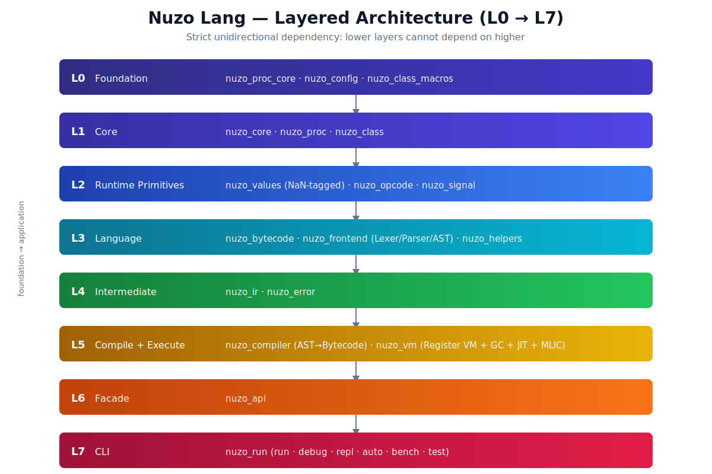
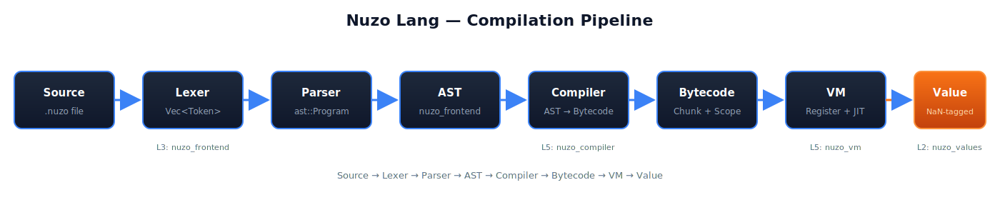

# Nuzo Lang

<div align="center">


**Nuzo** — A lightweight scripting language written in Rust, with NaN-tagged value encoding, JIT compilation, and bilingual (English/中文) keywords.

[](../LICENSE)
[](https://www.rust-lang.org)
[](#)
[](#-workspace-crates)
[](https://doc.rust-lang.org/edition-guide/)
[](https://www.rust-lang.org)

[Getting Started](#-getting-started) · [Language Quick Reference](#-language-quick-reference) · [Architecture](#-architecture) · [Docs](docs/) · [Contributing](#-contributing)

</div>

---

## Table of Contents

- [What is Nuzo?](#what-is-nuzo)
- [Language Quick Reference](#-language-quick-reference)
- [Getting Started](#-getting-started)
- [Architecture](#-architecture)
- [Quick Comparison: English vs Chinese](#-quick-comparison-english-vs-chinese)
- [Ecosystem](#-ecosystem)
- [Development](#-development)
- [Contributing](#-contributing)
- [Acknowledgements](#-acknowledgements)
- [License](#-license)

---

## What is Nuzo?

Nuzo is a lightweight scripting language designed for embedding and experimentation. Built from the ground up in Rust, it features a register-based bytecode VM with hot-trace JIT, incremental GC, and inline caching — all while supporting both English and Chinese keywords.

### Key Features

| Feature | Description |
|---------|-------------|
| **NaN-tagged Value** | 8-byte unified value encoding using IEEE 754 NaN payload space — zero-cost type discrimination |
| **Bilingual Keywords** | English + Chinese: `if`/`如果`, `while`/`当`, `fn`/`函数`, `true`/`真`, `false`/`假` |
| **Register-based VM** | 51 opcodes in three-address code format, optimized for bytecode execution |
| **Incremental GC** | Mark-Sweep with Region-Bump allocation, SoA layout, and ERSA scratch area |
| **Hot Trace JIT** | Runtime hot instruction sequence collection for performance-critical paths |
| **Inline Caching (MLIC)** | Multi-level inline cache for fast property and index access |
| **Elastic Register File** | Windows VEH-based automatic memory expansion for deep call stacks |
| **Frame Paging** | Supports deep recursion without stack overflow |
| **Lazy Module Import** | `OP_INIT_MODULE` with compile-time DAG cycle detection and deferred initialization |
| **Register Spill** | `SpillLoad`/`SpillStore` opcodes for handling register pressure beyond hardware limits |
| **Error Collection** | `ErrorSink` trait + `ErrorCollector` with crossbeam lock-free queue for structured error handling |
| **8 Builtin Modules** | `builtins`, `array`, `convert`, `debug`, `io`, `math`, `string`, `time` |

---

## Language Quick Reference

### Variables & Arithmetic

```nuzo
# 变量赋值与算术运算
a = 10
b = 20
sum = a + b
diff = a - b
product = a * b
quotient = b / a
print(sum)
```

### Functions (English + Chinese Keywords)

```nuzo
# English style
fn factorial(n) {
    if (n <= 1) {
        return 1
    } else {
        return n * factorial(n - 1)
    }
}

# Chinese style
函数 阶乘(n) {
    如果 (n <= 1) {
        返回 1
    } 否则 {
        返回 n * 阶乘(n - 1)
    }
}
```

### Closures & Higher-Order Functions

```nuzo
# Closure capturing
counter = 0
fn make_incrementer() {
    fn increment() {
        counter = counter + 1
        counter
    }
    increment
}
inc = make_incrementer()
print(inc())   # 1
print(inc())   # 2

# Higher-order function
fn apply(f, x) {
    f(x)
}
print(apply(inc, 10))   # 3
```

### Arrays & Dicts

```nuzo
# Arrays
arr = [1, 2, 3, 4, 5]
first = arr[0]     # 1
arr[0] = 99
print(arr[0])          # 99

# Dicts
dict = {
    "name": "Nuzo",
    "version": 0.4,
    "year": 2026
}
print(dict["name"])    # "Nuzo"
```

### Control Flow

```nuzo
# English keywords
if (a > b) {
    print("a is greater")
} else {
    print("b is greater")
}

while (count > 0) {
    count = count - 1
}

# Chinese keywords (fully interchangeable)
如果 (a > b) {
    打印("a is greater")
} 否则 {
    打印("b is greater")
}

当 (count > 0) {
    count = count - 1
}
```

### Logical Operators

```nuzo
# English
result = true and false or true    # true

# Chinese
result = 真 and 假 or 真           # 真
```

---

## Getting Started

### Prerequisites

- **Rust 1.88+** (Edition 2024) — install via [rustup](https://rustup.rs/)
- **Windows** for full JIT support (VEH-based register file expansion)

### Build

```bash
# Clone the workspace
git clone <repository-url>
cd nuzo_lang

# Build release binary
cargo build --release -p nuzo_run
```

### Run

```bash
# Execute a script
target/release/nuzo_run.exe script.nuzo

# Interactive REPL
target/release/nuzo_run.exe repl

# Disassemble bytecode (human-readable)
target/release/nuzo_run.exe compile --disassemble script.nuzo

# Check syntax without running
target/release/nuzo_run.exe check script.nuzo

# Run tests with verbose output
target/release/nuzo_run.exe test -V

# Show usage information
target/release/nuzo_run.exe --help
```

### CLI Options

| Option | Short | Description |
|--------|-------|-------------|
| `--eval <code>` | `-e` | Evaluate inline code |
| `--trace` | — | Enable execution tracing |
| `--verbose` | `-V` | Verbose output (show each test result) |
| `--filter <pat>` | `-k` | Filter tests by name/path (test/e2e commands) |
| `--timeout <ms>` | `-t` | Set per-test timeout in ms (default: 5000) |
| `--std-path <dir>` | — | Path to standard library |
| `--help` | `-h` | Show usage information |
| `--version` | `-v` | Show version |

### Install from Source

```bash
cargo install --path crates/nuzo-run
nuzo_run script.nuzo
```

---

## Architecture

Nuzo is implemented as a Rust workspace with 21 member crates plus the root `nuzo` facade crate (22 packages total), organized in a strict L0→L6 layered pipeline + root facade (lower layers cannot depend on higher).

### Layered Architecture

<p align="center">
  
</p>

<details>
<summary><b>ASCII fallback (click to expand)</b></summary>

```
L0  nuzo_proc_core, nuzo_config, nuzo_class_macros, nuzo_codegen  (foundation)
L1  nuzo_core, nuzo_proc, nuzo_class                    (core)
L2  nuzo_values, nuzo_opcode, nuzo_signal               (runtime primitives)
L3  nuzo_bytecode, nuzo_frontend, nuzo_helpers           (language)
L4  nuzo_ir, nuzo_error                                  (intermediate)
L5  nuzo_compiler, nuzo_vm                               (compile + execute)
L6  nuzo_run                                             (Engine + Session + CLI)
    nuzo                                                 (root facade)
```

</details>

### Compilation Pipeline

<p align="center">
  
</p>

<details>
<summary><b>ASCII fallback (click to expand)</b></summary>

```
Source (.nuzo)
  │
  ▼
┌─────────────────────────────────────────────────────────┐
│  Frontend                                                │
│  ┌─────────────┐  ┌────────────┐  ┌──────────────────┐ │
│  │  Lexer      │─▶│   Parser   │─▶│      AST         │ │
│  └─────────────┘  └────────────┘  └──────────────────┘ │
├─────────────────────────────────────────────────────────┤
│  Compiler                                                │
│  ┌──────────────────────┐  ┌──────────────────────────┐ │
│  │   Bytecode Generation │─▶│   Constant Pool / Scope  │ │
│  └──────────────────────┘  └──────────────────────────┘ │
├─────────────────────────────────────────────────────────┤
│  VM (Register-based)                                     │
│  ┌────────┐ ┌─────┐ ┌──────┐ ┌────────┐ ┌────────────┐ │
│  │Opcode  │ │  GC │ │ JIT  │ │  MLIC  │ │ Signal Bus │ │
│  │Dispatch│ │M-SWP│ │Trace │ │Cache  │ │ + ErrorSink│ │
│  │51 ops  │ │     │ │      │ │        │ │            │ │
│  └────────┘ └─────┘ └──────┘ └────────┘ └────────────┘ │
└─────────────────────────────────────────────────────────┘
```

</details>

### Workspace Crates

| Crate | Layer | Purpose |
|-------|-------|---------|
| **nuzo_proc_core** | L0 | Core utilities for procedural macro development |
| **nuzo_config** | L0 | Unified configuration management (TOML, zero-dep) |
| **nuzo_class_macros** | L0 | Proc-macros for `nuzo_class` |
| **nuzo_core** | L1 | Encoding utilities, BOM detection, value macros |
| **nuzo_proc** | L1 | Procedural macro entry point |
| **nuzo_class** | L1 | Rust-side class syntax sugar |
| **nuzo_values** | L2-L3 | NaN-tagged Value type, GC heap, object model |
| **nuzo_opcode** | L2 | Declarative opcode framework (51 opcodes, three-address code) |
| **nuzo_signal** | L2 | Type-safe signal-slot system |
| **nuzo_bytecode** | L3 | Bytecode chunk, scope management |
| **nuzo_frontend** | L3 | Lexer, Parser, AST, Token definitions |
| **nuzo_helpers** | L3 | Builtin function registry (8 public modules: builtins, array, convert, debug, io, math, string, time) |
| **nuzo_ir** | L4 | Intermediate Representation for the compiler |
| **nuzo_error** | L4 | Unified error types, ErrorSink trait, ErrorCollector (crossbeam lock-free) |
| **nuzo_compiler** | L5 | AST → Bytecode generation, register allocation (DualPool), spill codegen, lazy import |
| **nuzo_vm** | L5 | Register VM (51 ops), spill stack, lazy module init, JIT tracer, inline cache, GC |
| **nuzo_run** | L6 | Unified entry point: Engine (API facade) + Session + CLI + Bench + Test |
| **nuzo** (root) | root | Root facade crate — thin re-export of nuzo_run public API |

> For detailed architecture documentation, see [Architecture](docs/ARCHITECTURE.md).

---

## Quick Comparison: English vs Chinese

Nuzo supports full bilingual syntax. The following are equivalent:

| English | Chinese | Meaning |
|---------|---------|---------|
| `fn` | `函数` | Function definition |
| `if` / `else` | `如果` / `否则` | Conditional |
| `while` | `当` | Loop |
| `for` | `遍历` | Range iteration |
| `true` / `false` | `真` / `假` | Boolean literals |
| `return` | `返回` | Function return |
| `and` / `or` / `not` | `与` / `或` / `非` | Logical operators |
| `print` | `打印` | Output function |

---

## Ecosystem

### Builtin Helper Modules

| Module | Functions |
|--------|-----------|
| **builtins** | `print`, `println`, `打印`, `type_of`, `typeof`, `assert`, `len`, `push`, `pop`, `keys`, `str`, `trampoline` |
| **math** | `abs`, `floor`, `ceil`, `round`, `sqrt`, `pow`, `min`, `max`, `random`, `sin`, `cos`, `tan`, `log`, `pi`, `e` |
| **string** | `split`, `join`, `trim`, `upper`, `lower`, `replace`, `starts_with`, `ends_with`, `reverse`, `repeat`, `substring`, `is_empty` |
| **array** | `index_of`, `slice`, `concat`, `unique`, `sort` |
| **io** | `input`, `read_file`, `write_file`, `append_file` |
| **time** | `now`, `sleep`, `timestamp`, `clock` |
| **convert** | `int`, `float`, `bool`, `num`, `is_nil`, `is_number`, `is_string`, `is_array`, `is_dict`, `is_closure` |
| **debug** | `dump`, `format`, `time`, `time_end` |

### Script Extension: `.nuzo`

Nuzo scripts use the `.nuzo` file extension. Comments start with `#`.

---

## Development

```bash
# Run all tests
cargo test --workspace --all-targets

# Show CLI help
cargo run --package nuzo_run -- --help

# Run VM benchmarks (built-in bench mode)
cargo run --package nuzo_run -- bench

# Build in debug mode
cargo build -p nuzo_run

# Generate call graph
just callgraph
```

---

## Contributing

Contributions are welcome! Before starting work, please read:

- [Contributing Guide](docs/CONTRIBUTING.md) — Development conventions and debugging methodology
- [Architecture](docs/ARCHITECTURE.md) — Detailed compiler/VM pipeline and design decisions

### Development Commands

| Command | Purpose |
|---------|---------|
| `just check` | Full workspace compile check |
| `just test` | Run all tests |
| `just lint` | Run clippy static analysis |
| `just callgraph` | Regenerate `CALL_GRAPH.md` (mandatory after any code change) |

### Hard Constraints

- Strict L0→L6 layer dependency + root facade (reverse dependency = compile failure)
- NaN-tagged value system: use `from_number()`/`from_bool()`, never transmute
- New opcodes: modify `define_opcodes!` macro, sync 4 places (macro → dispatch.rs → dispatch_table.rs → compiler/)
- New `HeapObject` variants must implement `trace()` for GC safety
- `CALL_GRAPH.md` is auto-generated — never edit manually
- Register spill: `SpillLoad`/`SpillStore` use direct bytecode emission (not via `Instruction`)

---

## Acknowledgements

Nuzo Lang stands on the shoulders of giants. We gratefully acknowledge:

- [The Rust Programming Language](https://www.rust-lang.org/) — for a systems language that makes safe low-level code possible
- [serde](https://serde.rs/) — serialization framework (version-pinned for stability)
- [mimalloc](https://github.com/microsoft/mimalloc) — allocator inspiration for the region-bump GC
- [Crafting Interpreters](https://craftinginterpreters.com/) — foundational reference for language implementation
- The many Rustaceans who answered questions on the [users.rust-lang.org](https://users.rust-lang.org/) forum

---

## License

This project is licensed under the **MIT License** — see [LICENSE](./LICENSE) for the full text.

Copyright &copy; 2024–2026 Nuzo Team.

```
MIT License

Copyright (c) 2024-2026 Nuzo Team

Permission is hereby granted, free of charge, to any person obtaining a copy
of this software and associated documentation files (the "Software"), to deal
in the Software without restriction, including without limitation the rights
to use, copy, modify, merge, publish, distribute, sublicense, and/or sell
copies of the Software, and to permit persons to whom the Software is
furnished to do so, subject to the following conditions:

The above copyright notice and this permission notice shall be included in all
copies or substantial portions of the Software.

THE SOFTWARE IS PROVIDED "AS IS", WITHOUT WARRANTY OF ANY KIND, EXPRESS OR
IMPLIED, INCLUDING BUT NOT LIMITED TO THE WARRANTIES OF MERCHANTABILITY,
FITNESS FOR A PARTICULAR PURPOSE AND NONINFRINGEMENT. IN NO EVENT SHALL THE
AUTHORS OR COPYRIGHT HOLDERS BE LIABLE FOR ANY CLAIM, DAMAGES OR OTHER
LIABILITY, WHETHER IN AN ACTION OF CONTRACT, TORT OR OTHERWISE, ARISING FROM,
OUT OF OR IN CONNECTION WITH THE SOFTWARE OR THE USE OR OTHER DEALINGS IN THE
SOFTWARE.
```
